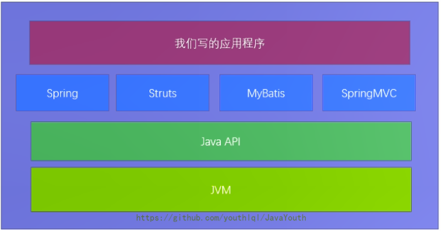
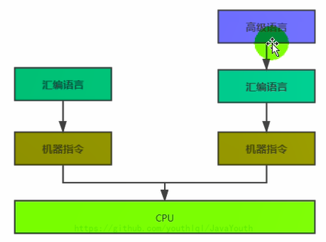
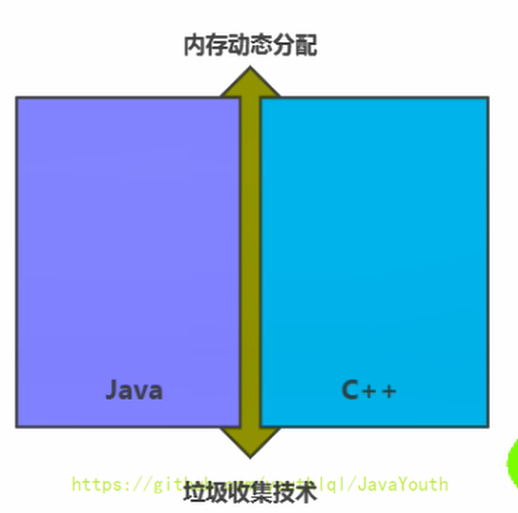
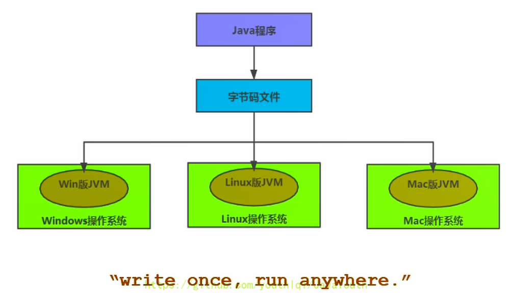
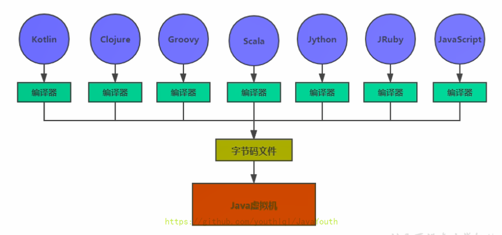
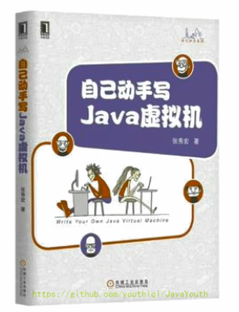

# 
 第一章-JVM和Java体系架构

## 前言
你是否也遇到过这些问题？
1. 运行着的线上系统突然卡死，系统无法访问，甚至直接OOM！
2. 想解决线上JVM GC问题，但却无从下手。
3. 新项目上线，对各种JVM参数设置一脸茫然，直接默认吧然后就JJ了。
4. 每次面试之前都要重新背一遍JVM的一些原理概念性的东西，然而面试官却经常问你在实际项目中如何调优VM参数，如何解决GC、OOM等问题，一脸懵逼。

大部分Java开发人员，除了会在项目中使用到与Java平台相关的各种高精尖技术，对于Java技术的核心Java虚拟机了解甚少。

## 开发人员如何看待上层框架

1. 一些有一定工作经验的开发人员，打心眼儿里觉得SSM、微服务等上层技术才是重点，基础技术并不重要，这其实是一种本末倒置的“病态”。
2. 如果我们把核心类库的API比做数学公式的话，那么Java虚拟机的知识就好比公式的推导过程。

- 计算机系统体系对我们来说越来越远，在不了解底层实现方式的前提下，通过高级语言很容易编写程序代码。但事实上计算机并不认识高级语言。

## 架构师每天都在思考什么？
1. 应该如何让我的系统更快？
2. 如何避免系统出现瓶颈？

**知乎上有条帖子：应该如何看招聘信息，直通年薪50万+**
1. 参与现有系统的性能优化，重构，保证平台性能和稳定性
2. 根据业务场景和需求，决定技术方向，做技术选型
3. 能够独立架构和设计海量数据下高并发分布式解决方案，满足功能和非功能需求
4. 解决各类潜在系统风险，核心功能的架构与代码编写
5. 分析系统瓶颈，解决各种疑难杂症，性能调优等
## 我们为什么要学JVM
1. 面试的需要（BATJ、TMD，PKQ等面试都爱问）
2. 中高级程序员必备技能
   - 项目管理、调优的需要
3. 追求极客的精神
   - 比如：垃圾回收算法、JIT、底层原理
## Java VS C++
1. 垃圾收集机制为我们打理了很多繁琐的工作，大大提高了开发的效率，但是，垃圾收集也不是万能的，懂得JVM内部的内存结构、工作机制，是设计高扩展性应用和诊断运行时问题的基础，也是Java工程师进阶的必备能力。
2. C++语言需要程序员自己来分配内存和回收内存，对于高手来说可能更加舒服，但是对于普通开发者，如果技术实力不够，很容易造成内存泄漏。而Java全部交给JVM进行内存分配和回收，这也是一种趋势，减少程序员的工作量。

## 什么人需要学JVM?
1. 拥有一定开发经验的Java开发人员，希望升职加薪
2. 软件设计师，架构师
3. 系统调优人员
4. 虚拟机爱好者，JVM实践者
## Java生态圈
Java是目前应用最为广泛的软件开发平台之一。随着Java以及Java社区的不断壮大Java 也早已不再是简简单单的一门计算机语言了，它更是一个平台、一种文化、一个社区。
1. 作为一个平台，Java虚拟机扮演着举足轻重的作用
    - Groovy、Scala、JRuby、Kotlin等都是Java平台的一部分
2. 作为一种文化，Java几乎成为了“开源”的代名词
    - 第三方开源软件和框架。如Tomcat、Struts，MyBatis，Spring等。
   - 就连JDK和JVM自身也有不少开源的实现，如openJDK、Harmony。
3. 作为一个社区，Java拥有全世界最多的技术拥护者和开源社区支持，有数不清的论坛和资料。从桌面应用软件、嵌入式开发到企业级应用、后台服务器、中间件，都可以看到Java的身影。其应用形式之复杂、参与人数之众多也令人咋舌。
## Java-跨平台的语言

## JVM-跨语言的平台

1. 随着Java7的正式发布，Java虚拟机的设计者们通过JSR-292规范基本实现在Java虚拟机平台上运行非Java语言编写的程序。
2. Java虚拟机根本不关心运行在其内部的程序到底是使用何种编程语言编写的，它只关心“字节码”文件。也就是说Java虚拟机拥有语言无关性，并不会单纯地与Java语言“终身绑定”，只要其他编程语言的编译结果满足并包含Java虚拟机的内部指令集、符号表以及其他的辅助信息，它就是一个有效的字节码文件，就能够被虚拟机所识别并装载运行。
3. Java不是最强大的语言，但是JVM是最强大的虚拟机
    - 我们平时说的java字节码，指的是用java语言编译成的字节码。准确的说任何能在jvm平台上执行的字节码格式都是一样的。所以应该统称为：jvm字节码。
   - 不同的编译器，可以编译出相同的字节码文件，字节码文件也可以在不同的JVM上运行。
   - Java虚拟机与Java语言并没有必然的联系，它只与特定的二进制文件格式——Class文件格式所关联，Class文件中包含了Java虚拟机指令集（或者称为字节码、Bytecodes）和符号表，还有一些其他辅助信息。
## 多语言混合编程
1. Java平台上的多语言混合编程正成为主流，通过特定领域的语言去解决特定领域的问题是当前软件开发应对日趋复杂的项目需求的一个方向。
2. 试想一下，在一个项目之中，并行处理用Clojure语言编写，展示层使用JRuby/Rails，中间层则是Java，每个应用层都将使用不同的编程语言来完成，而且，接口对每一层的开发者都是透明的，各种语言之间的交互不存在任何困难，就像使用自己语言的原生API一样方便，因为它们最终都运行在一个虚拟机之上。
3. 对这些运行于Java虚拟机之上、Java之外的语言，来自系统级的、底层的支持正在迅速增强，以JSR-292为核心的一系列项目和功能改进（如DaVinci Machine项目、Nashorn引擎、InvokeDynamic指令、java.lang.invoke包等），推动Java虚拟机从“Java语言的虚拟机”向 “多语言虚拟机”的方向发展。
## 如何真正搞懂JVM？
1. Java虚拟机非常复杂，要想真正理解它的工作原理，最好的方式就是自己动手编写一个！
2. 自己动手写一个Java虚拟机，难吗？
3. 天下事有难易乎？为之，则难者亦易矣；不为，则易者亦难矣

## Java发展重大事件
- 1990年，在Sun计算机公司中，由Patrick Naughton、MikeSheridan及James Gosling领导的小组Green Team，开发出的新的程序语言，命名为Oak，后期命名为Java
- 1995年，Sun正式发布Java和HotJava产品，Java首次公开亮相。
- 1996年1月23日Sun Microsystems发布了JDK 1.0。
- 1998年，JDK1.2版本发布。同时，Sun发布了JSP/Servlet、EJB规范，以及将Java分成了J2EE、J2SE和J2ME。这表明了Java开始向企业、桌面应用和移动设备应用3大领域挺进。
- 2000年，JDK1.3发布，Java HotSpot Virtual Machine正式发布，成为Java的默认虚拟机。
- 2002年，JDK1.4发布，古老的Classic虚拟机退出历史舞台。
- 2003年年底，Java平台的scala正式发布，同年Groovy也加入了Java阵营。
- 2004年，JDK1.5发布。同时JDK1.5改名为JavaSE5.0。
- 2006年，JDK6发布。同年，Java开源并建立了OpenJDK。顺理成章，Hotspot虚拟机也成为了OpenJDK中的默认虚拟机。
- 2007年，Java平台迎来了新伙伴Clojure。
- 2008年，oracle收购了BEA，得到了JRockit虚拟机。
- 2009年，Twitter宣布把后台大部分程序从Ruby迁移到Scala，这是Java平台的又一次大规模应用。
- 2010年，Oracle收购了Sun，获得Java商标和最真价值的HotSpot虚拟机。此时，Oracle拥有市场占用率最高的两款虚拟机HotSpot和JRockit，并计划在未来对它们进行整合：HotRockit。JCP组织管理Java语言
- 2011年，JDK7发布。在JDK1.7u4中，正式启用了新的垃圾回收器G1。
- 2017年，JDK9发布。将G1设置为默认GC，替代CMS
- 同年，IBM的J9开源，形成了现在的Open J9社区
- 2018年，Android的Java侵权案判决，Google赔偿Oracle计88亿美元
- 同年，Oracle宣告JavagE成为历史名词JDBC、JMS、Servlet赠予Eclipse基金会
- 同年，JDK11发布，LTS版本的JDK，发布革命性的ZGC，调整JDK授权许可
- 2019年，JDK12发布，加入RedHat领导开发的Shenandoah GC

