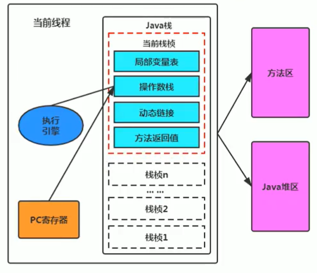
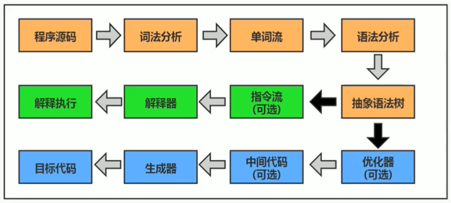

# 执行引擎

## 概述

- 执行引擎是java虚拟机核心的组成部分之一
- “虚拟机”是一个相对于“物理机”的概念，这两种机器都有代码执行能力，其区别是物理机的执行引擎是直接建立在处理器、缓存、指令集和操作系统层面上的，而**虚拟机的执行引擎则是由软件自行实现的**，因此可以不受物理条件制约地定制指令集与执行引擎的结构体系，能够执行那些不被硬件直接支持的指令集格式。
- JVM的主要任务是**负责装载字节码到其内部**，但字节码并不能够直接运行在操作系统之上，因为字节码指令并非等价于本地机器指令，它内部包含的仅仅只是一些能够被JVM所识别的字节码指令、符号表，以及其他辅助信息。
- 那么，如果想要让一个Java程序运行起来，执行引擎（Execution Engine）的任务就是将字节码指令解释/编译为对应平台上的本地机器指令才可以。简单来说，JVM中的执行引擎充当了将高级语言翻译为机器语言的译者。

### 执行引擎执行过程

1. 执行引擎在执行的过程中究竟需要执行什么样的字节码指令完全依赖于PC寄存器。
2. 每当执行完一项指令操作后，PC寄存器就会更新下一条需要被执行的指令地址。
3. 当然方法在执行的过程中，执行引擎有可能会通过存储在局部变量表中的对象引用准确定位到存储在Java堆区中的对象实例信息，以及通过对象头中的元数据指针定位到目标对象的类型信息。
4. 从外观上来看，所有的Java虚拟机的执行引擎输入、处理、输出都是一致的：输入的是字节码二进制流，处理过程是字节码解析执行、即时编译的等效过程，输出的是执行过程。

## Java代码编译和执行的过程

大部分的程序代码转换成物理机的目标代码或虚拟机能执行的指令集之前，都需要经过上图中的各个步骤。

javac编译器（前端编译器）流程图如下所示：

Java字节码的执行是由JVM执行引擎来完成，流程图如下所示

**问题：什么是解释器（Interpreter）。什么是JIT编译器？**

- 解释器：当Java虚拟机启动时会根据预定义的规范对字节码采用逐行解释的方式执行，将每条字节码文件中的内容“翻译”为对应平台的本地机器指令执行。
- JIT（Just In Time Compiler）编译器：就是虚拟机将源代码一次性直接编译成和本地机器平台相关的机器语言，**但并不是马上执行。**

**为什么说Java是半编译半解释型语言？**
- JDK1.0时代，将Java语言定位为“解释执行”还是比较准确的。再后来，Java也发展出可以直接生成本地代码的编译器。
- 现在JVM在执行Java代码的时候，通常都会将解释执行与编译执行二者结合起来进行。
- JIT编译器将字节码翻译成本地代码后，就可以做一个缓存操作，存储在方法区的JIT 代码缓存中（执行效率更高了），并且在翻译成本地代码的过程中可以做优化。

