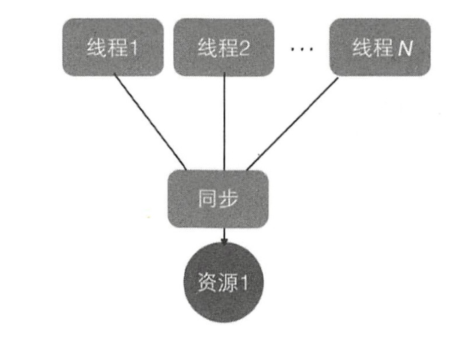
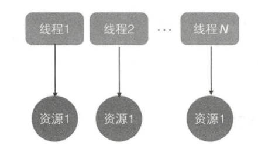
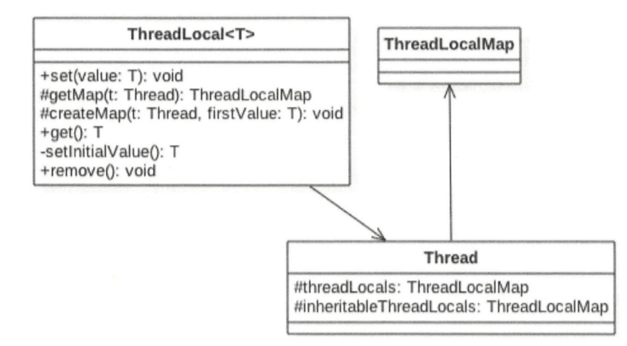

多钱程访问同一个共享变量时特别容易出现并发问题，特别是在多个线程需要对一个共享变量进行写入时。为了保证线程安全，一般使用者在访问共享变量时需要进行适当的同步，如下图所示。

同步的措施一般是加锁，这就需要使用者对锁有一定 的了解， 这显然加重了使用者的负担。那么有没有一种方式可以做到，当创建一个变量后，每个线程对其进行访问的时候访问的是自己线程的变量呢？其实ThreadLocal就可以做这件事情，虽然ThreadLocal并不是为了解决这个问题而出现的。



ThreadLocal 是 JDK 包提供的，它提供了线程本地变量 ，也就是如果你创建了一个ThreadLocal变量，那么访问这个变量 的每个线程都会有这个变量的一个本地副本。当多个线程操作这个变量时，实际操作的是自己本地内存里面的变量，从而避免了线程安全问题。创建一个ThreadLocal变量后，每个线程都会复制一个变量到自己的本地内存 ，如下图。



## ThreadLocal使用
本例开启了两个线程，在每个线程内部都设置了本地变量的值，然后调用 print 函数打印当前本地变量的值。如果打印后调用了本地变量的remove方法， 则会删除本地内存中的该变量，代码如下。
```
public class ThreadLocalTest {

    static ThreadLocal<String> localVariables = new ThreadLocal<>();

    public static void print(String str){
        //打印当前线程的值
        System.out.println(str + ":" +  localVariables);
        //移除线程内的值
//        localVariables.remove();
    }

    public static void main(String[] args) {

        Thread threadOne = new Thread(new Runnable() {
            @Override
            public void run() {
                localVariables.set("ThreadOne value");
                print("threadOne");
                System.out.println("threadONe remove after :" + localVariables.get());
            }
        });

        Thread threadTwo = new Thread(new Runnable() {
            @Override
            public void run() {
                localVariables.set("threadTwo value");
                print("threadTwo");
                System.out.println("threadTwo remove after : " + localVariables.get());
            }
        });

        threadOne.start();
        threadTwo.start();

    }

}
```
执行结果：
```
threadTwo:java.lang.ThreadLocal@6bf344b9
threadOne:java.lang.ThreadLocal@6bf344b9
threadTwo remove after : threadTwo value
threadONe remove after :ThreadOne value
```
将localVariable.remove()注释去掉后结果：
```
threadTwo:java.lang.ThreadLocal@6bf344b9
threadOne:java.lang.ThreadLocal@6bf344b9
threadTwo remove after : null
threadONe remove after :null
```
## ThreadLocal的实现原理
ThreadLocal相关类的类图结构：



Thread 类中有一个 threadLocals 和一个 inheritableThreadLocals ，它们都是ThreadLocalMap类型的变量，而ThreadLocalMap是一个定制化的 Hashmap。在默认情况下，每个线程中的这两个变量都为 null，只有当前线程第一次调用ThreadLocal 的set或者get方法时才会创建它们。其实每个线程的本地变量不是存放在ThreadLocal实例里面，而是存放在调用线程的threadLocals变量里面。也就是说，ThreadLocal 类型的本地变量存放在具体的线程内存空间中。ThreadLocal就是一个工具壳，它通过set方法把value值放入调用线程的threadLocals里面并存放起来，当调用线程调用它的get方法时，再从当 前线程的 threadLocals 变量里面将其拿出来使用。如果调用线程一直不终止，那么这个本地变量会一直存放在调用线程的threadLocals 变量里面，所以当不需要使用本地变量时可以通过调用ThreadLocal变量的remove方法从当前线程的threadLocals里面删除该本地变量。另外，Thread 里面 的 threadLocals 为何被设计为map结构？很明显是因为每个线程可以关联多个ThreadLocal变量。

在每个线程内部都有一个名为threadLocals的成员变量，该变量的类型为HashMap，其中key为我们定义的ThreadLocal变量的this引用，value则为我
们使用set方法设置的值。每个线程的本地变量存放在线程自己的内存变量threadLocals中，如果当前线程一直不消亡，那么这些本地变量会一直存在，所以可能会造成内存溢出，因此使用完毕后要记得调用ThreadLocal的remove方法删除对应线程的threadLocals中的本地变量。在高级篇要讲解 的只JC 包里面 的 ThreadLocalRandom，就是借鉴ThreadLocal的思想实现的，后面会具体讲解。

## ThreadLocal不支持继承

同一个 ThreadLocal 变量在父线程中被设置值后，在子线程中是获取不到的。根据上节的介绍，这应该是正常现象，因为在子线程thread里面调用get方法时当前线程为thread线程，而这里调用set方法设置线程变量的是main线程，两者是不同的线程，自然子线程访问时返回null。

## InheritableThreadLocal类
InheritableThreadLocal继承自ThreadLocal，其提供了一个特性，就是让子线程可以访问在父线程中设置的本地变量。下面看一下 InheritableThreadLocal的源代码。
```
public class InheritableThreadLocal<T> extends ThreadLocal<T> {
    /**
     * Computes the child's initial value for this inheritable thread-local
     * variable as a function of the parent's value at the time the child
     * thread is created.  This method is called from within the parent
     * thread before the child is started.
     * <p>
     * This method merely returns its input argument, and should be overridden
     * if a different behavior is desired.
     *
     * @param parentValue the parent thread's value
     * @return the child thread's initial value
     */
    protected T childValue(T parentValue) {
        return parentValue;
    }

    /**
     * Get the map associated with a ThreadLocal.
     *
     * @param t the current thread
     */
    ThreadLocalMap getMap(Thread t) {
       return t.inheritableThreadLocals;
    }

    /**
     * Create the map associated with a ThreadLocal.
     *
     * @param t the current thread
     * @param firstValue value for the initial entry of the table.
     */
    void createMap(Thread t, T firstValue) {
        t.inheritableThreadLocals = new ThreadLocalMap(this, firstValue);
    }
}
```
