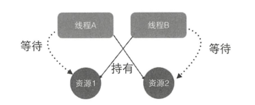

# 什么是线程死锁
死锁是两个或两个以上线程在执行过程中，因争夺资源而造成的互相等待的现象，在无外力作用的情况下，这些线程会一直相互等待而无法继续运行下去，如下图：


## 产生死锁的条件：
- **互斥条件：**指线程对己经获取到的资源进行排它性使用，即该资源同时只由一个线程占用。如果此时还有其他线程请求获取该资源 ，则请求者只能等待，直至占有资源的线程释放该资源。
- **请求并持有条件：**指一个线程己经持有了至少一个资源，但又提出了新的资源请求，而新资源己被其他线程占有，所 以当前线程会被阻塞 ，但阻塞的同时并不释放自己已经获取的资源。
- **不可剥夺条件：**指线程获取到的资源在自己使用完之前不能被其他线程抢占，只有在自己使用完毕后才由自己释放该资源。
- **环路等待条件：**指在发生死锁时，必然存在一个线程——资源的环形链，即线程集合{T0,T1,T2...Tn}中的T0正在等待一个T1占用的资源，T1正在等待T2占用的资源，···Tn正在等待已被T0占用的资源。

**举例：**
```
public class DeadLockTest {

    private static Object resourceA = new Object();
    private static Object resourceB = new Object();

    public static void main(String[] args) {

        Thread threadA = new Thread(new Runnable() {
            @Override
            public void run() {
                synchronized (resourceA){
                    System.out.println(Thread.currentThread() + " get ResourceA");

                    try {
                        Thread.sleep(1000);
                    } catch (InterruptedException e) {
                        e.printStackTrace();
                    }
                    System.out.println(Thread.currentThread() + "waiting get RsourceB");
                    synchronized (resourceB){
                        System.out.println(Thread.currentThread() + "get RsourceB");
                    }
                }
            }
        });

        Thread threadB = new Thread(new Runnable() {
            @Override
            public void run() {
                synchronized (resourceB){
                    System.out.println(Thread.currentThread() + "get ResoruceB");
                    try {
                        Thread.sleep(1000);
                    } catch (InterruptedException e) {
                        e.printStackTrace();
                    }
                    System.out.println(Thread.currentThread() + "waiting get ResourceA");
                    synchronized (resourceA){
                        System.out.println(Thread.currentThread() + "get ResourceA");
                    }
                }
            }
        });

        threadA.start();
        threadB.start();
    }
}
```
运行结果：线程A和线程B陷入了互相等待的状态，也就残生了死锁。
```
Thread[Thread-1,5,main]get ResoruceB
Thread[Thread-0,5,main] get ResourceA
Thread[Thread-1,5,main]waiting get ResourceA
Thread[Thread-0,5,main]waiting get RsourceB
```
产生死锁的原因：
1. resourceA和resourceB都是互斥资源，当线程 A 调用 synchronized(resourceA)方法获取到 resourceA 上 的监视器锁并释放前， 线程 B 再调用 synchronized(resourceA）方法尝试获取该资源会被阻塞，只有线程A主动释放该锁，线程B才能获得，这满足了资源互斥条件 。
2. 线程A首先通过synchronized(resourceA）方法获取到resourceA上的监视器锁资源，然后通过synchronized(resourceB)方法等待获取resourceB 上 的监视器锁资源，这就构成了请求并持有条件。
3. 线程A在获取resourceA上的监视器锁资源后，该资源不会被线程B掠夺走，只有线程A自己主动释放resourceA资源时，它才会放弃对该资源的持有权 ，这构成了资源的不可剥夺条件。
4. 线程A持有objectA资源并等待获取objectB资源，而线程B持有objectB资源并等待objectA资源，这构成了环路等待条件。所以线程A和线程B就进入了死锁状态 。
# 如何避免线程死锁
要想避免死锁，只需要破坏掉至少一个构造死锁的必要条件即可，但是学过操作系统的读者应该都知道，目前只有请求并持有和环路等待条件是可以被破坏的 。

造成死锁的原因其实和申请资源的顺序有很大关系，使用资源申请的有序性原则就可以避免死锁，那么什么是资源申请的有序性呢？我们对上面线程B的代码进行如下修改。
```
        Thread threadB = new Thread(new Runnable() {
            @Override
            public void run() {
                synchronized (resourceA){
                    System.out.println(Thread.currentThread() + "get ResoruceB");
                    try {
                        Thread.sleep(1000);
                    } catch (InterruptedException e) {
                        e.printStackTrace();
                    }
                    System.out.println(Thread.currentThread() + "waiting get ResourceA");
                    synchronized (resourceB){
                        System.out.println(Thread.currentThread() + "get ResourceA");
                    }
                }
            }
        });
```
如上代码让在线程B中获取资源的顺序和在线程A中获取资源的顺序保持一致，其实资源分配有序性就是指，假如线程A和线程B都需要资源1, 2, 3, ..., n 时，对资源进行排序，线程A和线程B只有在获取了资源 n-1 时才能去获取资源n。

