# 什么是多线程并发编程
首先要澄清并发和并行的概念，并发是指同一个时间段内多个任务同时都在执行，并且都没有执行结束，而并行是说在单位时间内多个任务同时在执行。
# 为什么要进行多线程并发
多核CPU时代的到来打破了单核CPU对多线程效能的限制。多个CPU意味着每个线程可以使用自己的CPU运行，这减少了线程上下文切换的开销，但随着对应用系统性能和吞吐量要求的提高，出现了处理海量数据和请求的要求，这些都对高并发编程有着迫切的需求。
# java中的线程安全问题
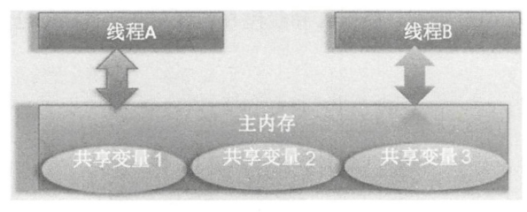

如上图所示：线程A和线程B可以同时操作主内存中的共享变量，那么线程安全问题和共享资源之间是什么关系呢？是不是说多个线程共享了资源，当它们都去访问这个共享资源时就会产生线程安全问题呢？答案是否定的，如果多个线程都只是读取共享资源，而不去修改，那么就不会存在线程安全问题，只有当至少一个线程修改共享资源时才会存在线程安全问题。最典型的就是计数器类的实现，计数变量count本身是一个共享变量，多个线程可以对其进行递增操作，如果不使用同步措施，由于递增操作是获取一计算一保存三步操作，因此可能导致计数不准确。

**注意：**如果放在堆中的共享变量只被一个线程调用，不会出现线程安全的问题，还有就是非线程安全的局部变量如果在方法中没有开启其他线程，并且只存在于方法内部，不作为返回值返回，就不会出现线程安全的问题。
# java中共享变量的内存可见性问题

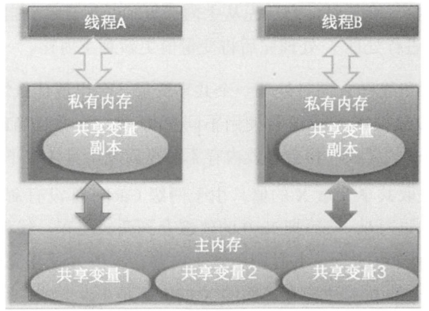
将所有的变量都存放在主内存中，当线程使用变量时，会把主内存里面的变量复制到自己的工作空间或者叫作工作内存，线程读写变量时操作的是自己工作内存中的变量。

JVM的实际工作过程：

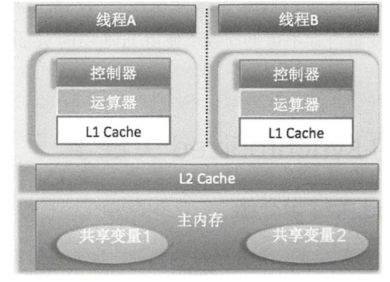

# Java中的synchronized关键字
## 关键字介绍
synchronized块是Java提供的一种原子性内置锁，Java中的每个对象都可以把它当作一个同步锁来使用，这些Java内置的使用者看不到的锁被称为内部锁，也叫作监视器锁。线程的执行代码在进入synchronized代码块前会自动获取内部锁，这时候其他线程访问该同步代码块时会被阻塞挂起。拿到内部锁的线程会在正常退出同步代码块或者抛出异常后或者在同步块内调用了该内置锁资源的wait系列方法时释放该内置锁。内置锁是排它锁，也就是当一个线程获取这个锁后，其他线程必须等待该线程释放锁后才能获取该锁。

另外，由于Java中的线程是与操作系统的原生线程一一对应的，所以当阻塞一个线程时，需要从用户态切换到内核态执行阻塞操作，这是很耗时的操作，而synchronized的使用就会导致上下文切换。

## synchronized的内存语义
进入synchronized块的内存语义是把在synchronized块内使用到的变量从线程的工作内存中清除，这样在synchronized块内使用到该变量时就不会从线程的工作内存中获取，而是直接从主内存中获取。退出synchronized块的内存语义是把在synchronized块内对共享变量的修改刷新到主内存。

其实这也是加锁和释放锁的语义，当获取锁后会清空锁块内本地内存中将会被用到的共享变量，在使用这些共享变量时从主内存进行加载，在释放锁时将本地内存中修改的共享变量刷新到主内存。

除可以解决共享变量内存可见性问题外，synchronized经常被用来实现原子性操作。另外请注意，synchronized关键字会引起线程上下文切换并带来线程调度开销。

## Java中的volatile关键字
对于解决内存可见性问题，Java还提供了一种弱形式的同步，也就是使用volatile关键字。该关键字可以确保对一个变量的更新对其他线程马上可见。当一个变量被声明为volatile时，线程在写入变量时不会把值缓存在寄存器或者其他地方，而是会把值刷新回主内存。当其他线程读取该共享变量时－，会从主内存重新获取最新值，而不是使用当前线程的工作内存中的值。volatile的内存语义和synchronized有相似之处，具体来说就是，当线程写入了volatile变量值时就等价于线程退出synchronized同步块（把写入工作内存的变量值同步到主内存），读取volatile变量值时就相当于进入同步块（先清空本地内存变量值，再从主内存获取最新值）。
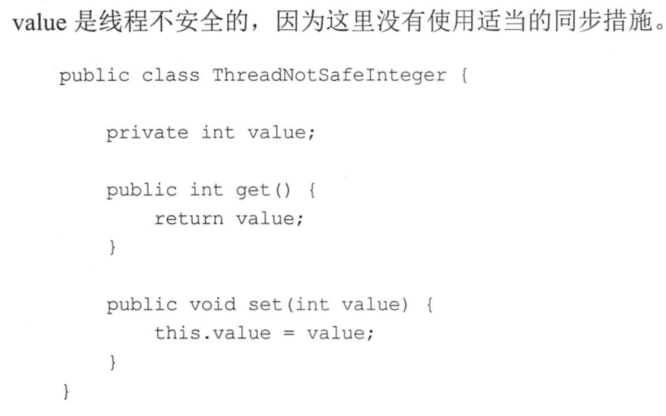
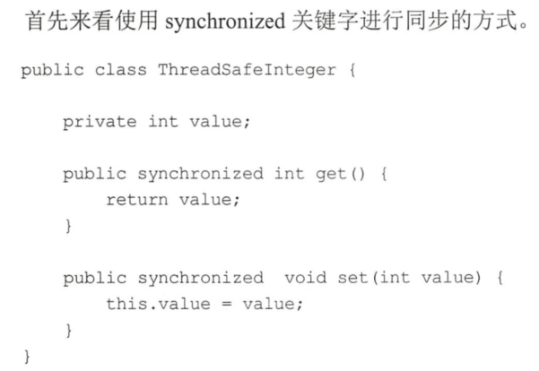
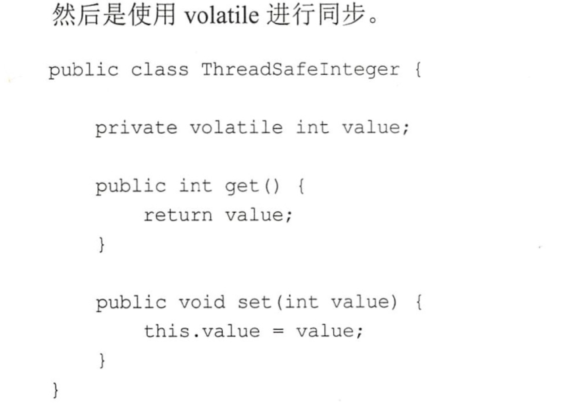

在这里使用synchronized和使用volatile是等价的，都解决了共享变量value的内存可见性问题，但是前者是独占锁，同时只能有一个线程调用get（）方法，其他调用线程会被阻塞，同时会存在线程上下文切换和线程重新调度的开销，这也是使用锁方式不好的地方。而后者是非阻塞算法，不会造成线程上下文切换的开销。

**volatile虽然提供了可见性保证，但并不保证操作的原子性**。在什么情况下才使用volatile关键字：
- 写入变量值不依赖变量的当前值时。因为如果依赖当前值，将是获取一计算一写入三步操作，这三步操作不是原子性的，而volatile不保证原子性。
- 读写变量值时没有加锁。因为加锁本身已经保证了内存可见性，这时候不需要把变量声明为volatile的。
## Java中的原子性操作
所谓原子性操作，是指执行一系列操作时，这些操作要么全部执行，要么全部不执行，不存在只执行其中一部分的情况。
## java中的CAS操作
CAS即CompareandSwap，其是JDK提供的非阻塞原子性操作，它通过硬件保证了比较更新操作的原子性。

boolean compareAndSwapLong(Objectobj,longvalueOffset,longexpect,longupdate）方法：其中compareAndSwap的意思是比较并交换。CAS有四个操作数，分别为：对象内存位置、对象中的变量的偏移量、变量预期值和新的值。其操作含义是，如果对象obj中内存偏移量为valueOffset的变量值为expect，则使用新的值update替换旧的值expect。这是处理器提供的一个原子性指令。

## Unsafe类(建议不要使用）
JDK的此jar包中的Unsafe类提供了硬件级别的原子性操作，Unsafe类中的方法都是native方法，它们使用JNI方式访问本地C＋＋实现库。

下面我们来了解一下Unsafe提供的几个主要的方法以及编程时如何使用Unsafe类做一些事情。
- long objectFieldOffset(Field白eld）方法：返回指定的变量在所属类中的内存偏移地址，该偏移地址仅仅在该Unsafe函数中访问指定宇段时使用。如下代码使用Unsafe类获取变量value在AtomicLong对象中的内存偏移。
- int anayBaseOffset(Class anayClass）方法：获取数组中第一个元素的地址。
- int arraylndexScale(ClassarrayClass）方法：获取数组中一个元素占用的字节。
- boolean compareAndSwapLong(Object obj,long offset,long expect,long update）方法：比较对象obj中偏移量为offset的变量的值是否与expect相等，相等则使用update值更新，然后返回true，否则返回false。
- public native long getLongvolatile(Object obj, long offset） 方法 ：获取对象obj中偏移量为 offset 的变量对应 volatile 语义的值
- void putLongvolatile(Object obj, long offset, long value）方法：设置 obj 对象中offset偏移的类型为long的field的值为value，支持volatile语义。
- void putOrderedLong(Object obj, long offset, long value） 方法 ： 设置 obj 对象 中 offset偏移地址对应的 long 型 field 的值为 value 。 这是一个有延迟的 putLongvolatile 方法 ，并且不保证值修改对其他线程立刻可见 。 只有在变量使用 volatile 修饰并且预计会被意外修改时才使用 该方法 。void park(boolean isAbsolute, long time） 方法 ： 阻塞当前线程，其中参数isAbsolute等于false且time等于0表示一直阻塞。time大于0表示等待指定的time后阻塞线程会被唤醒，这个 time 是个相对值 ， 是个增量值 ， 也就是相对 当前时间 累加 time后当前线程就会被唤醒。如果isAbsolute等于true ，并且 time 大于 0，则表示 阻塞的 线程到 指定的 时 间点后会被唤醒，这里 time 是个绝对时间， 是将某个时间点换算为ms后的值。另外，当其他线程调用了当前阻塞线程的interrupt 方法而中断了当前线程时，当前线程也会返回，而当其他线程调用了unPark方法并且把当前线程作为参数时当前线程也会返回 。
- void unpark(Object thread）方法 ：唤醒调用park后阻塞的线程。
- long getAndSetLong(Object obj , long offset, long update）方法：获取对象obj中偏移量为offset的变量volatile语义的当前值，并设置变量volatile语义的值为update 。
- long getAndAddLong(Object obj, long offset, long addValue） 方法 ： 获取对象obj中偏移量为offset的变量volatile 语义的当前值，并设置变量值为原始值＋addValue。

我们知道Unsafe类是rt.jar包提供的，rt.jar包里面的类是使用Bootstrap类加载器加载的，而我们的启动main函数所在的类是使用AppClassLoader加载的，所以在main函数里面加载Unsafe类时，根据委托机制，会委托给Bootstrap去加载Unsafe类。

而Unsafe类可以直接操作内存，这是不安全的，所以JDK开发组特意做了这个限制，不让开发人员在正规渠道使用Unsafe类，而是在此jar包里面的核心类中使用Unsafe功能。

## Java指令重排序
Java 内存模型允许编译器和处理器对指令重排序以提高运行性能，并且 只 会对不存在数据依赖性的指令重排序。在单线程下重排序可以保证最终执行的结果与程序顺序执行的结果一致，但是在多线程下就会存在问题。

**举例：**
```
int a = 1; （1）
int b = 2;（2）
int c = a + b;（3）
```
在如上代码中，变量c的值依赖a和b的值，所以重排序后能够保证（3）的操作在（2）（1）之后，但是（1）（2）谁先执行就不一定了，这在单线程下不会存在问题，因为并不影响最终结果。

下面看一个多线程的例子：
```
public class ReadThread extends Thread {

    private static boolean ready = false;
    private static int num = 0;

    @Override
    public void run() {
        while (!Thread.currentThread().isInterrupted()){
            if (ready && num == 0){
                System.out.println(num + num);
            }
            System.out.println("read thread ...");
        }
    }

    public static class WriteThread extends Thread{
        @Override
        public void run() {
            num = 2;
            ready = true;
            System.out.println("writeThread set over ...");
        }
    }

    public static void main(String[] args) throws InterruptedException {


//        while (num != 2 && !ready){
            WriteThread writeThread = new WriteThread();
            writeThread.start();
            ReadThread readThread = new ReadThread();
            readThread.start();
            Thread.sleep(10);
            readThread.interrupt();
            System.out.println("main exit");
//            writeThread.join();
//            readThread.join();
//            num = 0;
//            ready = false;
//        }
//        System.out.println("");
        
    }

}
```

如上代码在不考虑内存可见性问题的情况下一定会输出4？答案是不一定，由于代码(1)(2)(3)(4)之间不存在依赖关系,所以写线程的代码(3)(4)可能被重排序为先执行(4)再执行(3)，那么执行（ 4 ）后 ，读线程可能已经执行了 (1 ）操作，并且在（ 3 ）执行前开始执行（ 2 ）操作 ，这时候输出结果为0 而不是4。

**注意：**上述代码经过测试不会出现为0的情况，只有在将ready参数判断去掉之后才会出现上述描述的情况。但是会多打印几次“read thread ...”。

重排序在多线程下会导致非预期的程序执行结果，而使用volatile修饰ready就可以避免重排序和内存可见性问题。

写 volatile变量时，可以确保volatile写之前的操作不会被编译器重排序到volatile写之后 。读 volatile变量时，可以确保 volatile 读之后的操作不会被编译器重排序到 volatile读之前 。
## 伪共享
### 什么是伪共享
为了解决计算机系统中主内存与CPU之间运行速度差问题，会在CPU与主内存之间添加一级或者多级高速缓冲存储器（Cache）。这个Cache一般是被集成到CPU内部的，所以也叫CPUCache，下图所示是两级Cache结构。

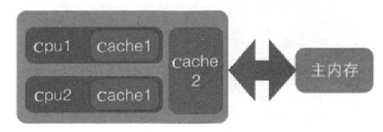

在Cache内部是按行存储的，其中每一行称为一个Cache行。Cache行（如图下所示）是Cache与主内存进行数据交换的单位，Cache行的大小一般为2的幕次数字节。

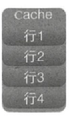

当CPU访问某个变量时，首先会去看CPUCache内是否有该变量，如果有则直接从中获取，否则就去主内存里面获取该变量，然后把该变量所在内存区域的一个Cache行大小的内存复制到Cache中。由于存放到Cache行的是内存块而不是单个变量，所以可能会把多个变量存放到一个Cache行中。当多个线程同时修改一个缓存行里面的多个变量时，由于同时只能有一个线程操作缓存行，所以相比将每个变量放到一个缓存行，性能会有所下降，这就是伪共享，如下图所示。

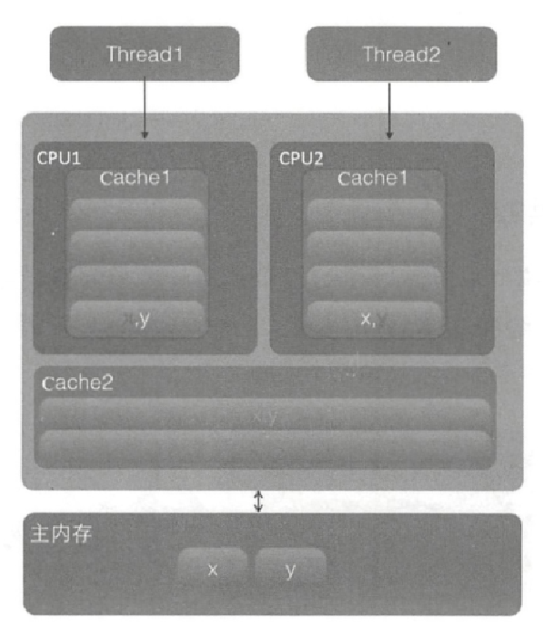

在该图中，变量x和y同时被放到了CPU的一级和二级缓存，当线程l使用CPUl对变量x进行更新时，首先会修改CPUl的一级缓存变量x所在的缓存行，这时候在缓存一致性协议下，CPU2中变量x对应的缓存行失效。那么线程2在写入变量x时就只能去二级缓存里查找，这就破坏了一级缓存。而一级缓存比二级缓存更快，这也说明了多个线程不可能同时去修改自己所使用的CPU中相同缓存行里面的变量。更坏的情况是，如果CPU只有一级缓存，则会导致频繁地访问主内存。

### 为何会出现伪共享
伪共享的产生是因为多个变量被放入了一个缓存行中，并且多个线程同时去写入缓存行中不同的变量。那么为何多个变量会被放入一个缓存行呢？其实是因为缓存与内存交换数据的单位就是缓存行，当CPU要访问的变量没有在缓存中找到时，根据程序运行的局部性原理，会把该变量所在内存中大小为缓存行的内存放入缓存行。

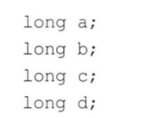

如上代码声明了四个long变量，假设缓存行的大小为32字节，那么当CPU访问变量a时，发现该变量没有在缓存中，就会去主内存把变量a以及内存地址附近的b、c、d放入缓存行。也就是地址连续的多个变量才有可能会被放到一个缓存行中。当创建数组时，数组里面的多个元素就会被放入同一个缓存行。那么在单线程下多个变量被放入同一个缓存行对性能有影响吗？其实在正常情况下单线程访问时将数组元素放入一个或者多个缓存行对代码执行是有利的，因为数据都在缓存中，代码执行会更快。

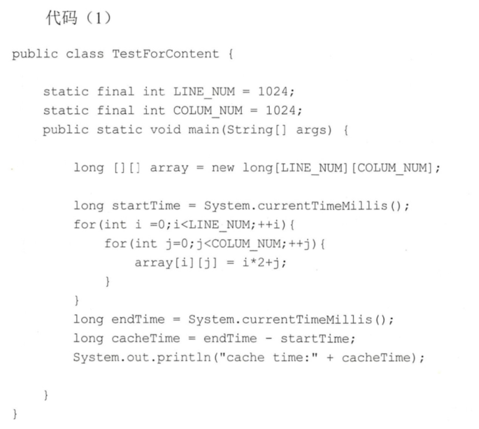

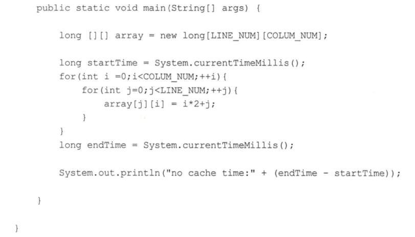

在笔者的mac电脑上执行代码（1）多次，耗时均在lOms以下，执行代码（2）多次，耗时均在lOms以上。显然代码(1）比代码（2）执行得快，这是因为数组内数组元素的内存地址是连续的，当访问数组第一个元素时，会把第一个元素后的若干元素一块放入缓存行，这样顺序访问数组元素时会在缓存中直接命中，因而就不会去主内存读取了，后续访问也是这样。也就是说，当顺序访问数组里面元素时，如果当前元素在缓存没有命中，那么会从主内存一下子读取后续若干个元素到缓存，也就是一次内存访问可以让后面多次访问直接在缓存中命中。而代码（2）是跳跃式访问数组元素的，不是顺序的，这破坏了程序访问的局部性原则，并且缓存是有容量控制的，当缓存满了时会根据一定淘汰算法替换缓存行，这会导致从内存置换过来的缓存行的元素还没等到被读取就被替换掉了。


所以在单个线程下顺序修改一个缓存行中的多个变量，会充分利用程序运行的局部性原则，从而加速了程序的运行。而在多线程下并发修改一个缓存行中的多个变量时就会竞争缓存行，从而降低程序运行性能

### 如何避免伪共享
JDK8提供了一个sun.misc.Contended注解，用来解决伪共享问题。将上面代码修改为如下。

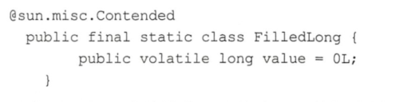

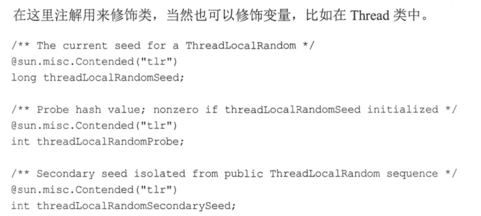

需要注意的是，**在默认情况下，＠Contended注解只用于Java核心类，比如此包下的类**。如果用户类路径下的类需要使用这个注解，则需要添加NM参数：－XX:-RestrictContended。填充的宽度默认为128，要自定义宽度则可以设置－XX:ContendPaddingWidth参数。

## 锁的概述

### 乐观锁与悲观锁
**悲观锁**指对数据被外界修改持保守态度，认为数据很容易就会被其他线程修改，所以在数据被处理前先对数据进行加锁，并在整个数据处理过程中，使数据处于锁定状态。悲观锁的实现往往依靠数据库提供的锁机制，即在数据库中，在对数据记录操作前给记录加排它锁。如果获取锁失败，则说明数据正在被其他线程修改，当前线程则等待或者抛出异常。如果获取锁成功，则对记录进行操作，然后提交事务后释放排它锁。

**乐观锁**是相对悲观锁来说的，它认为数据在一般情况下不会造成冲突，所以在访问记录前不会加排它锁，而是在进行数据提交更新时，才会正式对数据冲突与否进行检测。

### 公平锁与非公平锁
根据线程获取锁的抢占机制，锁可以分为公平锁和非公平锁，公平锁表示线程获取锁的顺序是**按照线程请求锁的时间早晚来决定的**，也就是最早请求锁的线程将最早获取到锁。而非公平锁则在运行时闯入，也就是先来不一定先得。

ReentrantLock提供了公平和非公平锁的实现：
- 公平锁： ReentrantLock pairLock =new ReentrantLock(true） 。
- 非公平锁： ReentrantLock pairLock =new ReentrantLock(false） 。 如果构造函数不传递参数，则默认是非公平锁 。
### 独占锁与共享锁
根据锁只能被单个线程持有还是能被多个线程共同持有，锁可以分为独占锁和共享锁。

 独占锁保证任何时候都只有一个线程能得到锁，ReentrantLock就是以独占方式实现的。共享锁则可以同时由多个线程持有，例如ReadWriteLock读写锁，它允许一个资源可以被多线程同时进行读操作。

独占锁是一种悲观锁，由于每次访问资源都先加上互斥锁，这限制了并发性，因为读操作并不会影响数据的一致性，而独占锁只允许在同一时间由一个线程读取数据，其他线程必须等待当前线程释放锁才能进行读取。

共享锁则是一种乐观锁，它放宽了加锁的条件，允许多个线程同时进行读操作。

### 可重入锁
当一个线程要获取一个被其他线程持有的独占锁时，该线程会被阻塞，那么当一个线程再次获取它自己己经获取的锁时是否会被阻塞呢？如果不被阻塞，那么我们说该锁是可重入的，也就是只要该线程获取了该锁，那么可以无限次数（在高级篇中我们将知道，严格来说是有限次数）地进入被该锁锁住的代码。

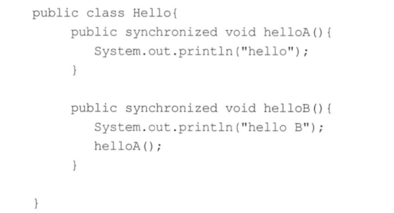

在如上代码中，调用helloB方法前会先获取内置锁，然后打印输出。之后调用helloA方法，在调用前会先去获取内置锁，如果内置锁不是可重入的，那么调用线程将会一直被阻塞。

实际上，synchronized内部锁是可重入锁。可重入锁的原理是在锁内部维护一个线程标示，用来标示该锁目前被哪个线程占用，然后关联一个计数器。一开始计数器值为0,说明该锁没有被任何线程占用。当一个钱程获取了该锁时，计数器的值会变成1，这时其他线程再来获取该锁时会发现锁的所有者不是自己而被阻塞挂起。

但是当获取了该锁的线程再次获取锁时发现锁拥有者是自己，就会把计数器值加＋1,当释放锁后计数器值－1。当计数器值为0时，锁里面的线程标示被重置为null，这时候被阻塞的线程会被唤醒来竞争获取该锁。

### 自旋锁
由于Java中的线程是与操作系统中的线程一一对应的，所以当一个线程在获取锁（比如独占锁）失败后，会被切换到内核状态而被挂起。当该线程获取到锁时又需要将其切换到内核状态而唤醒该线程。而从用户状态切换到内核状态的开销是比较大的，在一定程度上会影响并发性能。自旋锁则是，当前线程在获取锁时，如果发现锁已经被其他线程占有，它不马上阻塞自己，在不放弃CPU使用权的情况下，多次尝试获取（默认次数是10，可以使用－XX:PreBlockSpinsh参数设置该值），很有可能在后面几次尝试中其他线程己经释放了锁。如果尝试指定的次数后仍没有获取到锁则当前线程才会被阻塞挂起。由此看来自旋锁是使用CPU时间换取线程阻塞与调度的开销，但是很有可能这些CPU时间白白浪费了。


