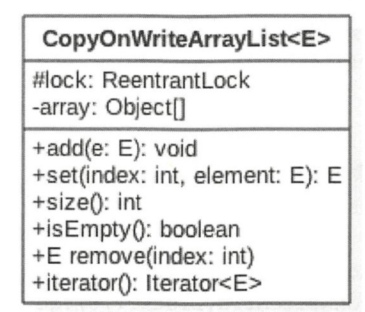
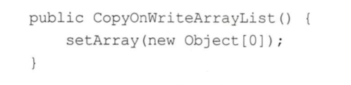
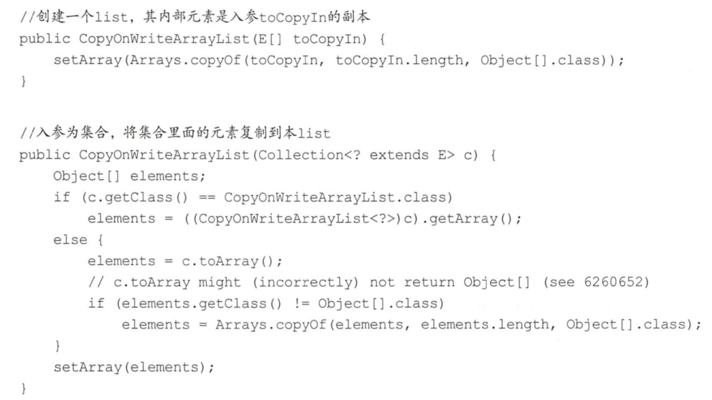
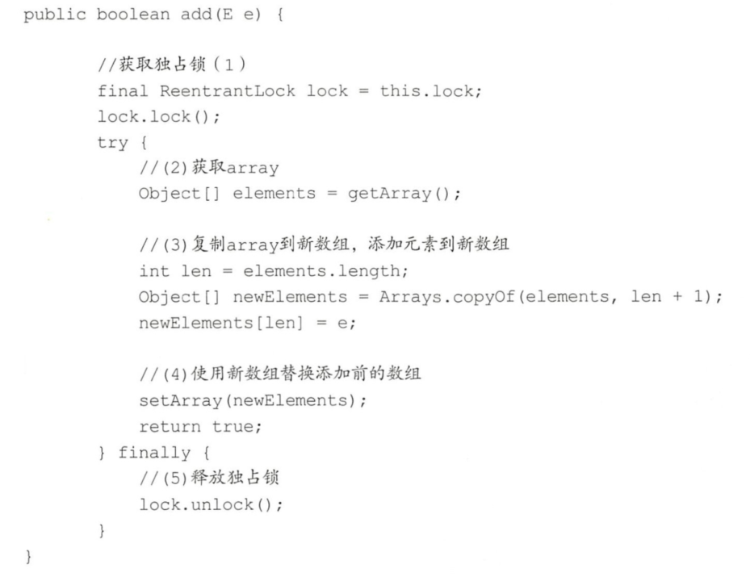
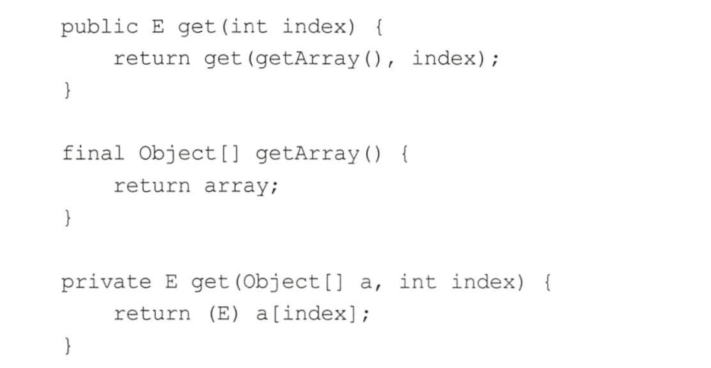
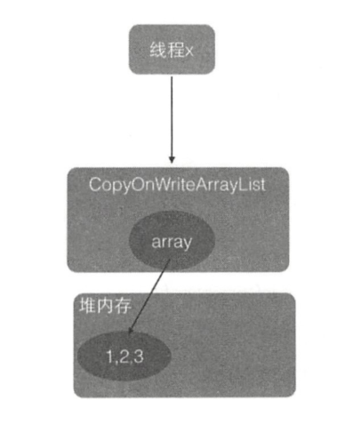
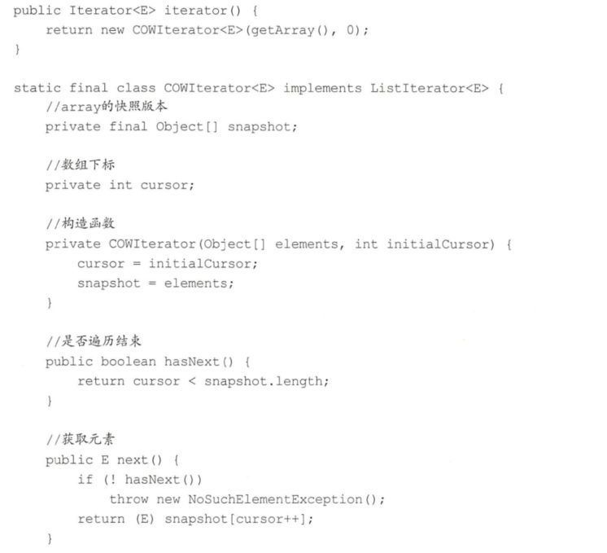

# 介绍
并发集合包含CopyOnWriteArrayList和CopyOnWriteArraySet。

并发包中的并发List只有CopyOnWriteArrayList。CopyOnWriteArrayList是一个线程安全的ArrayList，对其进行的修改操作都是在底层的一个复制的数组（快照）上进行的，也就是使用了写时复制策略。CopyOnWriteArraylist的类图结构如下图所示。



在CopyOnWriteArrayList的类图中，每个CopyOnWriteArrayList对象里面有一个array数组对象用来存放具体元素，ReentrantLock独占锁对象用来保证同时只有一个线程对array进行修改。这里只要记得ReentrantLock是独占锁，同时只有一个线程可以获取就可以了，后面会专门对JUC中的锁进行介绍。

如果让我们自己做一个写时复制的线程安全的list我们会怎么做，有哪些点需要考虑？
- 何时初始化list，初始化的list元素个数为多少，list是有限大小吗？
- 如何保证线程安全，比如多个线程进行读写时如何保证是线程安全的？
- 如何保证使用迭代器遍历list时的数据一致性？

# CopyOnWriteArrayList主要方法源码解析

## 初始化

首先看下无参构造函数，如下代码在内部创建了一个大小为0的Object数组作为array的初始值。



然后看下有参构造函数。



## 添加元素
CopyOnWriteArrayList中用来添加元素的函数有add(E e）、add(int index,E element）、addifAbsent(E e）和addAllAbsent(Collection<?extendsE> c）等，它们的原理类似，所以本节以add(E e）为例来讲解。



在如上代码中，调用add方法的线程会首先执行代码（1)去获取独占锁，如果多个线程都调用add方法则只有一个线程会获取到该锁，其他线程会被阻塞挂起直到锁被释放。所以一个线程获取到锁后，就保证了在该线程添加元素的过程中其他线程不会对array进行修改。

线程获取锁后执行代码（2）获取array，然后执行代码（3）复制array到一个新数组（从这里可以知道新数组的大小是原来数组大小增加1，所以CopyOnWriteArrayList是无界list），并把新增的元素添加到新数组。

然后执行代码（4）使用新数组替换原数组，并在返回前释放锁。由于加了锁，所以整个add过程是个原子性操作。需要注意的是，在添加元素时，首先复制了一个快照，然后在快照上进行添加，而不是直接在原来数组上进行。

## 获取指定位置元素
使用E get(int index）获取下标为index的元素，如果元素不存在则抛出IndexOutOfBoundsException异常。



在如上代码中，当线程x调用get方法获取指定位置的元素时，分两步走，首先获取array数组（这里命名为步骤A），然后通过下标访问指定位置的元素（这里命名为步骤B),这是两步操作，但是在整个过程中并没有进行加锁同步。假设这时候List内容如下图所示，里面有l、2、3三个元素。



由于执行步骤A和步骤B没有加锁，这就可能导致在线程x执行完步骤A后执行步骤B前，另外一个线程y进行了remove操作，假设要删除元素1oremove操作首先会获取独占锁，然后进行写时复制操作，也就是复制一份当前array数组，然后在复制的数组里面删除线程x通过get方法要访问的元素1，之后让array指向复制的数组。而这时候array之前指向的数组的引用计数为l而不是0，因为线程x还在使用它，这时线程x开始执行步骤B，步骤B操作的数组是线程y删除元素之前的数组。

所以，虽然线程y己经删除了index处的元素，但是线程x的步骤B还是会返回index处的元素，这其实就是写时复制策略产生的弱一致性问题。

## 修改执行元素
使用E set(int index,E element）修改list中指定元素的值，如果指定位置的元素不存在则抛出IndexOutOfBoundsException异常，代码如下。
```
public E set(int index, E element) {
    final ReentrantLock lock = this.lock;
    lock.lock();
    try {
        Object[] elements = getArray();
        E oldValue = get(elements, index);

        if (oldValue != element) {
            int len = elements.length;
            Object[] newElements = Arrays.copyOf(elements, len);
            newElements[index] = element;
            setArray(newElements);
        } else {
            // Not quite a no-op; ensures volatile write semantics
            setArray(elements);
        }
        return oldValue;
    } finally {
        lock.unlock();
    }
}
```
如上代码首先获取了独占锁，从而阻止其他线程对array数组进行修改，然后获取当前数组，并调用get方法获取指定位置的元素，如果指定位置的元素值与新值不一致则创建新数组井复制元素，然后在新数组上修改指定位置的元素值并设置新数组到array。如果指定位置的元素值与新值一样，则为了保证volatile语义，还是需要重新设置array，虽然array的内容并没有改变。

## 删除元素
删除list里面指定的元素，可以使用E remove(int index）、boolean remove(Object o）和boolean remove(Object o,Object[] snapshot,int index）等方法，它们的原理一样。下面讲解下remove(int index）方法。

```
public E remove(int index) {
    final ReentrantLock lock = this.lock;
    lock.lock();
    try {
        Object[] elements = getArray();
        int len = elements.length;
        E oldValue = get(elements, index);
        int numMoved = len - index - 1;
        if (numMoved == 0)
            setArray(Arrays.copyOf(elements, len - 1));
        else {
            Object[] newElements = new Object[len - 1];
            System.arraycopy(elements, 0, newElements, 0, index);
            System.arraycopy(elements, index + 1, newElements, index,
                             numMoved);
            setArray(newElements);
        }
        return oldValue;
    } finally {
        lock.unlock();
    }
}
```
如上代码其实和新增元素的代码类似，首先获取独占锁以保证删除数据期间其他线程不能对array进行修改，然后获取数组中要被删除的元素，并把剩余的元素复制到新数组，之后使用新数组替换原来的数组，最后在返回前释放锁。

## 弱一致性的迭代器
CopyOnWriteArrayList中法代器的弱一致性是怎么回事，所谓弱一致性是指返回遥代器后，其他线程对list的增删改对迭代器是不可见的，下面看看这是如何做到的。



为什么说snapshot是list的快照呢？明明是指针传递的引用啊，而不是副本。如果在该线程使用返回的法代器遍历元素的过程中，其他线程没有对list进行增删改，那么snapshot本身就是list的array，因为它们是引用关系。但是如果在遍历期间其他线程对该list进行了增删改，那么snapshot就是快照了，因为增删改后list里面的数组被新数组替换了，这时候老数组被snapshot引用。这也说明获取迭代器后，使用该法代器元素时，其他线程对该list进行的增删改不可见，因为它们操作的是两个不同的数组，这就是弱一致性。

# 总结
CopyOnWriteArrayList使用写时复制的策略来保证list的一致性，而获取一修改一写入三步操作并不是原子性的，所以在增删改的过程中都使用了独占锁，来保证在某个时间只有一个线程能对list数组进行修改。另外CopyOnWriteAn·ayList提供了弱一致性的法代器，从而保证在获取迭代器后，其他线程对list的修改是不可见的，迭代器遍历的数组是一个快照。
