# ConcurrentLinkedQueue原理探究
ConcurrentLinkedQueue是线程安全的无界非阻塞队列，其底层数据结构使用单向链表实现，对于入队和出队操作使用CAS来实现线程安全。下面我们来看具体实现。

## 类图结构
ConcurrentLinkedQueue内部的队列使用单向链表方式实现，其中有两个volatile类型的Node节点分别用来存放队列的首、尾节点。从下面的无参构造函数可知，默认头、尾节点都是指向item为null的哨兵节点。新元素会被插入队列末尾，出队时从队列头部获取一个元素。

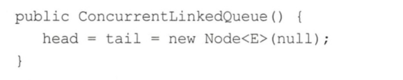

在Node节点内部则维护一个使用volatile修饰的变量item，用来存放节点的值；next用来存放链表的下一个节点，从而链接为一个单向无界链表。其内部则使用UNSafe工具类提供的CAS算法来保证出入队时操作链表的原子性。

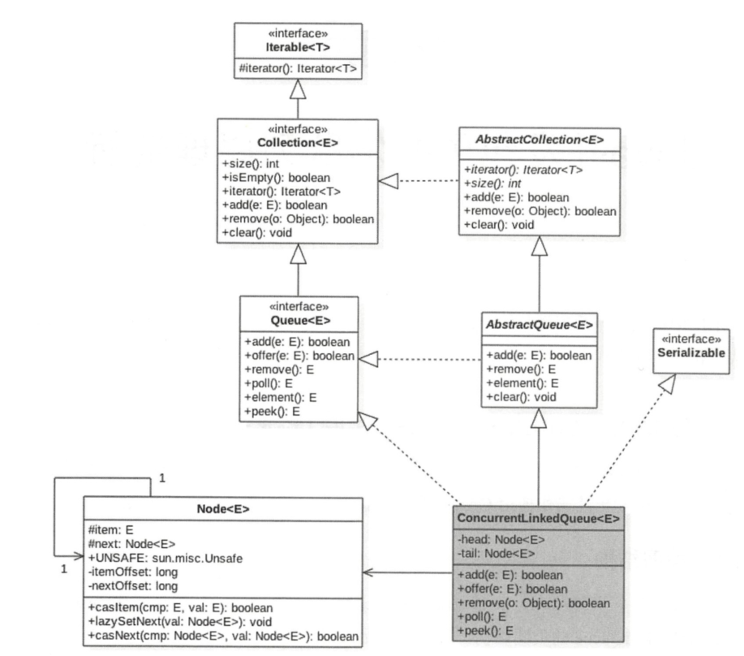

## ConcurrentLinkedQueue原理介绍
[官网jdkConcurrentLinkedQueue](https://docs.oracle.com/en/java/javase/11/docs/api/java.base/java/util/concurrent/ConcurrentLinkedQueue.html)

### offer操作
offer操作是在队列末尾添加一个元素，如果传递的参数是null则抛出NPE异常，否则由于ConcurrentLinkedQueue是无界队列，该方法一直会返回true。另外，由于使用CAS无阻塞算法，因此该方法不会阻塞挂起调用线程。


### add操作
add操作是在链表末尾添加一个元素，其实在内部调用的还是offer操作。

### poll操作
poll操作是在队列头部获取并移除一个元素，如果队列为空则返回null。

### peek操作
peek操作是获取队列头部一个元素（只获取不移除〉，如果队列为空则返回null。下面看下其实现原理。

### size操作
计算当前队列元素个数，在并发环境下不是很有用，因为CAS没有加锁，所以从调用size函数到返回结果期间有可能增删元素，导致统计的元素个数不精确。

### remove操作
如果队列里面存在该元素则删除该元素，如果存在多个则删除第一个，并返回true,否则返回false。

### contains操作
判断队列里面是否含有指定对象，由于是遍历整个队列，所以像size操作一样结果也不是那么精确，有可能调用该方法时元素还在队列里面，但是遍历过程中其他线程才把该元素删除了，那么就会返回false。

## 小结
ConcurrentLinkedQueue的底层使用单向链表数据结构来保存队列元素，每个元素被包装成一个Node节点。队列是靠头、尾节点来维护的，创建队列时头、尾节点指向一个item为null的哨兵节点。第一次执行peek或者自rst操作时会把head指向第一个真正的队列元素。由于使用非阻塞CAS算法，没有加锁，所以在计算size时有可能进行了offer、poll或者remove操作，导致计算的元素个数不精确，所以在并发情况下size函数不是很有用。

如图下所示，入队、出队都是操作使用volatile修饰的tail、head节点，要保证在多线程下出入队线程安全，只需要保证这两个Node操作的可见性和原子性即可。由于volatile本身可以保证可见性，所以只需要保证对两个变量操作的原子性即可。

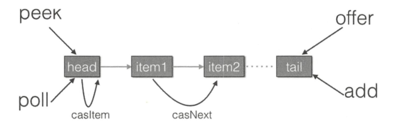

offer操作是在tail后面添加元素，也就是调用tail.casNext方法，而这个方法使用的是CAS操作，只有一个线程会成功，然后失败的线程会循环，重新获取tail，再执行casNext方法。poll操作也通过类似CAS的算法保证出队时移除节点操作的原子性。

# LinkedBlockingQueue原理探究
[官网JDK说明](https://docs.oracle.com/en/java/javase/11/docs/api/java.base/java/util/concurrent/LinkedBlockingQueue.html)

## 类图结构
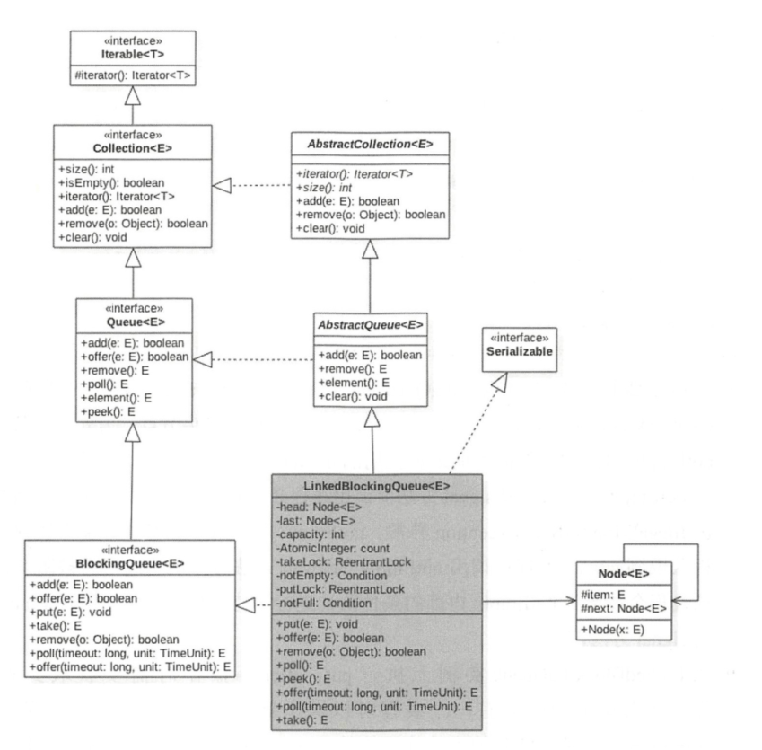

由类图可以看到，LinkedBlockingQueue也是使用单向链表实现的，其也有两个Node，分别用来存放首、尾节点，并且还有一个初始值为0的原子变量count，用来记录队列元素个数。另外还有两个ReentrantLock的实例，分别用来控制元素入队和出队的原子性，其中takeLock用来控制同时只有一个线程可以从队列头获取元素，其他线程必须等待，putLock控制同时只能有一个线程可以获取锁，在队列尾部添加元素，其他线程必须等待。另外，notEmpty和notFull是条件变量，它们内部都有一个条件队列用来存放进队和出队时被阻塞的线程，其实这是生产者一消费者模型。如下是独占锁的创建代码。

- 当调用线程在LinkedBlockingQueue实例上执行take、poll等操作时需要获取到takeLock锁，从而保证同时只有一个线程可以操作链表头节点。另外由于条件变量notEmpty内部的条件队列的维护使用的是takeLock的锁状态管理机制，所以在调用notEmpty的await和signal方法前调用线程必须先获取到takeLock锁，否则会抛出IllegalMonitorStateException异常。notEmpty内部则维护着一个条件队列，当线程获取到takeLock锁后调用notEmpty的await方法时，调用线程会被阻塞，然后该线程会被放到notEmpty内部的条件队列进行等待，直到有线程调用了notEmpty的signal方法。
- 在LinkedBlockingQueue实例上执行put、offer等操作时需要获取到putLock锁，从而保证同时只有一个线程可以操作链表尾节点。同样由于条件变量notFull内部的条件队列的维护使用的是putLock的锁状态管理机制，所以在调用notFull的await和signal方法前调用线程必须先获取到putLock锁，否则会抛出IllegalMonitorStateException异常。notFull内部则维护着一个条件队列，当线程获取到putLock锁后调用notFull的await方法时，调用线程会被阻塞，然后该线程会被放到notFull内部的条件队列进行等待，直到有线程调用了notFull的signal方法。

## LinkedBlockingQueue原理介绍
### offer操作
向队列尾部插入一个元素，如果队列中有空闲则插入成功后返回true，如果队列己满则丢弃当前元素然后返回false。如果e元素为null则抛出Nul!PointerException异常。另外，该方法是非阻塞的。

### put操作
向队列尾部插入一个元素，如果队列中有空闲则插入后直接返回，如果队列己满则阻塞当前线程，直到队列有空闲插入成功后返回。如果在阻塞时被其他线程设置了中断标志，则被阻塞线程会抛出InterruptedException异常而返回。另外，如果e元素为null则抛出NullPointerException异常。

### poll操作
从队列头部获取并移除一个元素，如果队列为空则返回null，该方法是不阻塞的。

### peek操作
获取队列头部元素但是不从队列里面移除它，如果队列为空则返回null。该方法是不阻塞的。

### take操作
获取当前队列头部元素并从队列里面移除它。如果队列为空则阻塞当前线程直到队列不为空然后返回元素，如果在阻塞时被其他线程设置了中断标志，则被阻塞线程会抛出InterruptedException异常而返回。

### size操作
获取当前队列元素个数

## 小结
LinkedBlockingQueue的内部是通过单向链表实现的，使用头、尾节点来进行入队和出队操作，也就是入队操作都是对尾节点进行操作，出队操作都是对头节点进行操作。

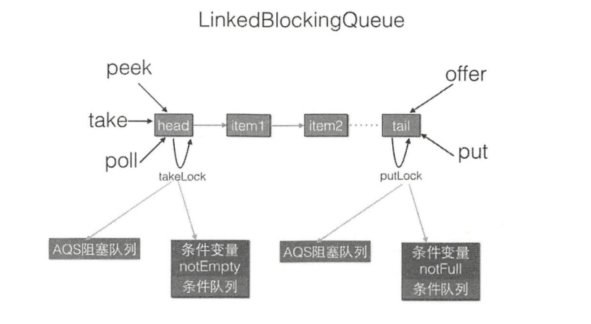

对头、尾节点的操作分别使用了单独的独占锁从而保证了原子性，所以出队和入队操作是可以同时进行的。另外对头、尾节点的独占锁都配备了一个条件队列，用来存放被阻塞的线程，并结合入队、出队操作实现了一个生产消费模型。

# ArrayBlockingQueue原理探究
[JDK11 API中ArrayBlockingQueue](https://docs.oracle.com/en/java/javase/11/docs/api/java.base/java/util/concurrent/ArrayBlockingQueue.html)

## 类图结构
由该图可以看出，ArrayBlockingQueue的内部有一个数组items，用来存放队列元素，putIndex变量表示入队元素下标，takelndex是出队下标，count统计队列元素个数。从定义可知，这些变量并没有使用volatile修饰，这是因为访问这些变量都是在锁块内，而加锁己经保证了锁块内变量的内存可见性了。另外有个独占锁lock用来保证出、入队操作的原子性，这保证了同时只有一个线程可以进行入队、出队操作。另外，notEmpty、notFull条件变量用来进行出、入队的同步。

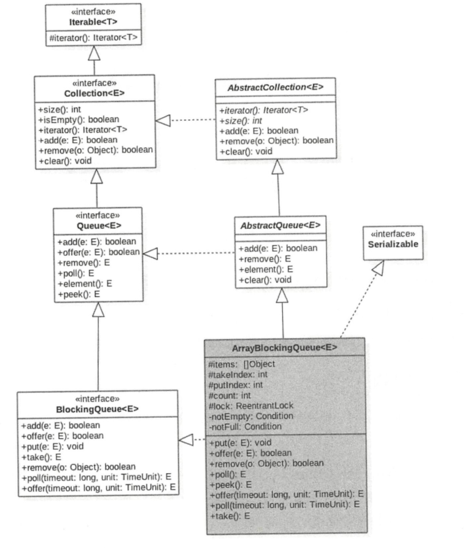

另外，**由于ArrayBlockingQueue是有界队列，所以构造函数必须传入队列大小参数。**

## 原理剖析

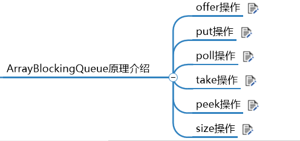

# PriorityBlockingQueue原理探究

[JDK11 api 中priorityBlockingQueue](https://docs.oracle.com/en/java/javase/11/docs/api/java.base/java/util/concurrent/PriorityBlockingQueue.html)

## 类图结构

PriorityBlockingQueue内部有一个数组queue，用来存放队列元素，size用来存放队列元素个数。allocationspinLock是个自旋锁，其使用CAS操作来保证同时只有一个线程可以扩容队列，状态为0或者1，其中0表示当前没有进行扩容，l表示当前正在扩容。

由于这是一个优先级队列，所以有一个比较器comparator用来比较元素大小。lock独占锁对象用来控制同时只能有一个线程可以进行入队、出队操作。notEmpty条件变量用来实现take方法阻塞模式。这里没有notFull条件变量是因为这里的put操作是非阻塞的，为啥要设计为非阻塞的，是因为这是无界队列。

在如下构造函数中，默认队列容量为11，默认比较器为null，也就是使用元素的compareTo方法进行比较来确定元素的优先级，这意味着队列元素必须实现了Comparable接口。

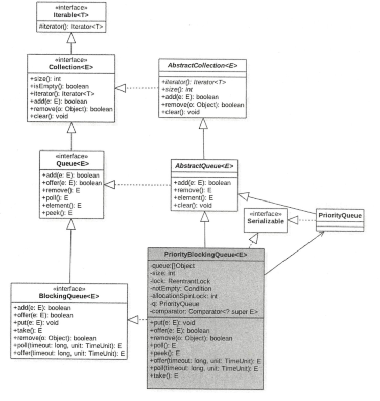

## 原理剖析


PriorityBlockingQueue队列在内部使用二叉树堆维护元素优先级，使用数组作为元素存储的数据结构，这个数组是可扩容的。当当前元素个数＞＝最大容量时会通过CAS算法扩容，出队时始终保证出队的元素是堆树的根节点，而不是在队列里面停留时间最长的元素。使用元素的compareTo方法提供默认的元素优先级比较规则，用户可以自定义优先级的比较规则。

## 案例分析

```
public class TestPriorityBlockingQueue {

    static class Task implements Comparable<Task>{

        public int getPriority(){
            return priority;
        }

        public void setPriority(int priority){
            this.priority = priority;
        }

        public String getTaskName(){
            return taskName;
        }

        public void setTaskName(String taskName){
            this.taskName = taskName;
        }

        private int priority = 0;
        private String taskName;

        @Override
        public int compareTo(Task o) {
            if (this.priority >= o.getPriority()){
                return 1;
            } else {
                return -1;
            }
        }

        public void doSomeThing(){
            System.out.println(taskName + ":" + priority);
        }
    }

    public static void main(String[] args) {
        PriorityBlockingQueue<Task> priorityQueue = new PriorityBlockingQueue<>();
        Random random = new Random();
        for (int i = 0; i < 10; i ++){
            Task task = new Task();
            task.setPriority(random.nextInt(10));
            task.setTaskName("taskName" + i);
            priorityQueue.offer(task);
        }

        while (!priorityQueue.isEmpty()){
            Task task = priorityQueue.poll();
            if (null != task){
                task.doSomeThing();
            }
        }
    }
}
```
如上代码首先创建了一个Task类，该类继承了Comparable方法并重写了compareTo方法，自定义了元素优先级比较规则。然后在main函数里面创建了一个优先级队列，并使用随机数生成器生成10个随机的有优先级的任务，并将它们添加到优先级队列。最后从优先级队列里面逐个获取任务并执行。运行上面代码，一个可能的输出如下所示。

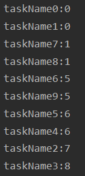

从结果可知，任务执行的先后顺序和它们被放入队列的先后顺序没有关系，而是和它们的优先级有关系。


# DelayQueue原理探究

DelayQueue并发队列是一个无界阻塞延迟队列，队列中的每个元素都有个过期时间，当从队列获取元素时，只有过期元素才会出队列。队列头元素是最快要过期的元素。

[jdk11 DelayQueue](https://docs.oracle.com/en/java/javase/11/docs/api/java.base/java/util/concurrent/DelayQueue.html)

## 类图结构
由该图可知，DelayQueue内部使用PriorityQueue存放数据，使用ReentrantLock实现线程同步。另外，队列里面的元素要实现Delayed接口，由于每个元素都有一个过期时间，所以要实现获知当前元素还剩下多少时间就过期了的接口，由于内部使用优先级队列来实现，所以要实现元素之间相互比较的接口。
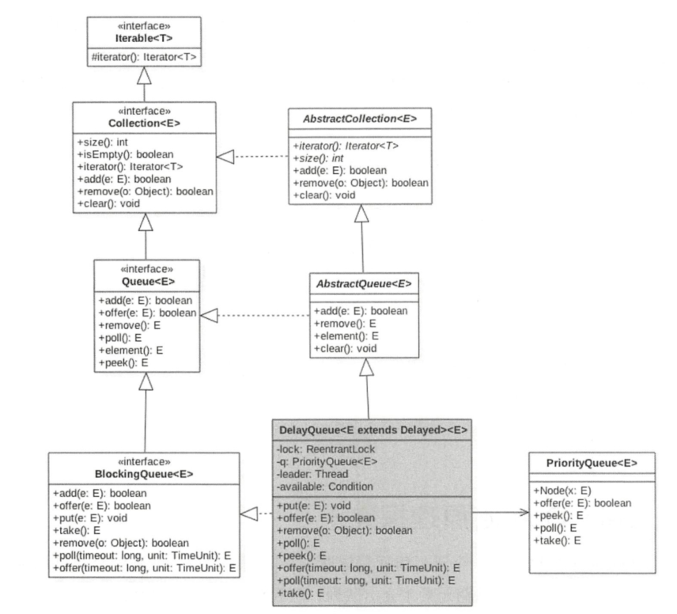

## 主要函数原理讲解


## 案例介绍
```
public class TestDelay {
    static class DelayedEle implements Delayed{

        private final long delayTime;//延迟时间
        private final long expire;//到期时间
        private String taskName;//任务名称

        public DelayedEle(long delay, String taskName){
            this.delayTime = delay;
            this.taskName = taskName;
            expire = System.currentTimeMillis() + delay;
        }

        @Override
        public long getDelay(TimeUnit unit) {
            return unit.convert(this.expire - System.currentTimeMillis(),TimeUnit.MILLISECONDS);
        }


        @Override
        public int compareTo(Delayed o) {
            return (int)(this.getDelay(TimeUnit.MILLISECONDS) - o.getDelay(TimeUnit.MILLISECONDS));
        }

        @Override
        public String toString() {
            StringBuilder sb = new StringBuilder("DelayedEle{");
            sb.append("delay = ").append(delayTime).append(",expire = ").append(expire).append(",taskName = ").append(taskName);
            sb.append("'\'").append("}");
            return sb.toString();
        }
    }

    public static void main(String[] args) {
        DelayQueue<DelayedEle> delayedEles = new DelayQueue<>();
//        ThreadLocalRandom current = ThreadLocalRandom.current();
        Random random = new Random();

        for (int i = 0;i < 10; i ++){
            DelayedEle ele = new DelayedEle(random.nextInt(500),"task:" + i);
            delayedEles.offer(ele);
        }

        //依次取出任务并打印
        DelayedEle del = null;
        try {
            for (;;){
                while ((del = delayedEles.take())!= null){
                    System.out.println(del.toString());
                }
            }
        } catch (InterruptedException e) {
            e.printStackTrace();
        }

    }
}
```
运行结果：
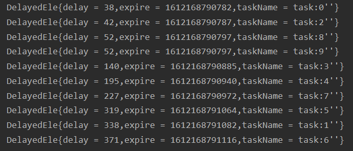

