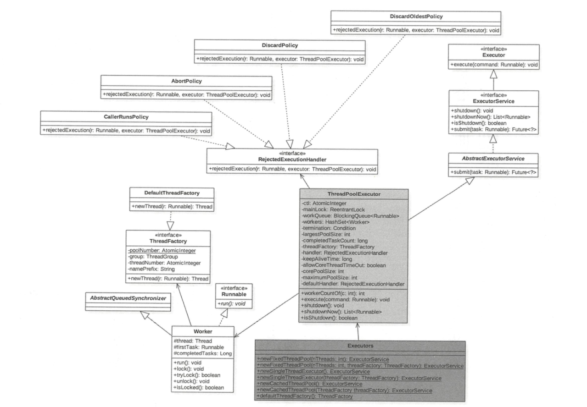
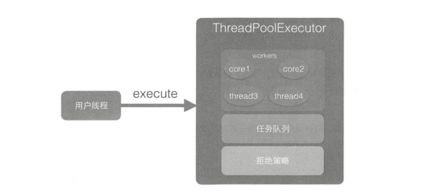
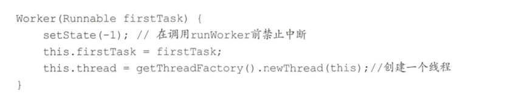

# 类图介绍
Executors其实是个工具类，里面提供了好多静态方法，这些方法根据用户选择返回不同的线程池实例。ThreadPoolExecutor继承了AbstractExecutorService，成员变量ct!是一个Integer的原子变量，用来记录线程池状态和线程池中线程个数，类似于ReentrantReadWriteLock使用一个变量来保存两种信息。

# 源码分析
## public void execute(Runnable command)
execute方法的作用是提交任务command到线程池进行执行。用户线程提交任务到线程池的模型图如图下所示。

从该图可以看出，ThreadPoolExecutor的实现实际是一个生产消费模型，当用户添加任务到线程池时相当于生产者生产元素，workers线程工作集中的线程直接执行任务或者从任务队列里面获取任务时则相当于消费者消费元素。

## 工作线程Worker的执行
用户线程提交任务到线程池后，由Worker来执行。先看下Worker的构造函数。

在构造函数内首先设置Worker的状态为-1，这是为了避免当前Worker在调用rnnWorker方法前被中断（当其他线程调用了线程池的shutdownNow时，如果Worker状态>=0则会中断该线程）。这里设置了线程的状态为-1，所以该线程就不会被中断了。在如下rnnWorker代码中，运行代码（9）时会调用unlock方法，该方法把status设置为了0，所以这时候调用shutdownNow会中断Worker线程。

worker在执行具体任务期间加锁，是为了避免在任务运行期间，其他线程调用了shutdown后正在执行的任务被中断（shutdown只会中断当前被阻塞挂起的线程)。

## shutdown操作
调用shutdown方法后，线程池就不会再接受新的任务了，但是工作队列里面的任务还是要执行的。该方法会立刻返回，并不等待队列任务完成再返回。

## shutdownNow操作
调用shutdownNow方法后，线程池就不会再接受新的任务了，并且会丢弃工作队列里面的任务，正在执行的任务会被中断，该方法会立刻返回，并不等待激活的任务执行完成。返回值为这时候队列里面被丢弃的任务列表。

##  awaitTermination操作

当线程调用awaitTermination方法后，当前线程会被阻塞，直到线程池状态变为TERMINATED才返回，或者等待时间超时才返回。整个过程中独占锁的代码如下。

