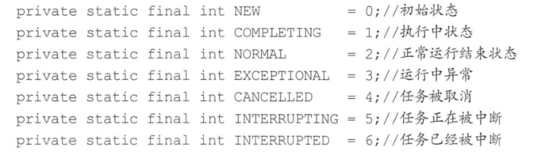
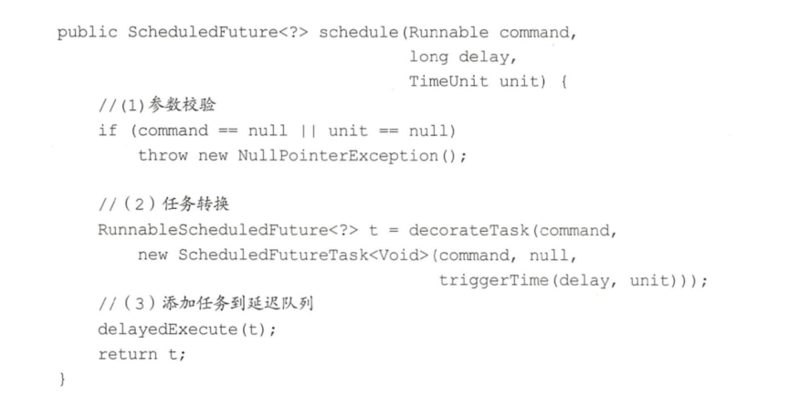
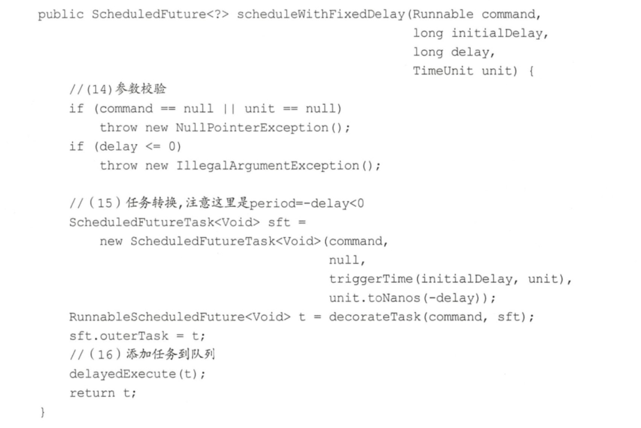
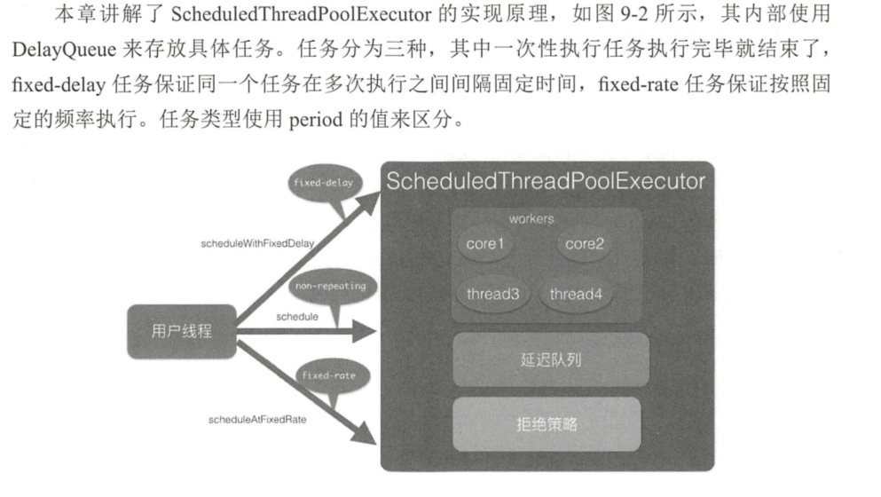

[jdk11 ScheduledThreadPoolExecutor](https://docs.oracle.com/en/java/javase/11/docs/api/java.base/java/util/concurrent/ScheduledThreadPoolExecutor.html)

# 类图介绍
Executors其实是个工具类，它提供了好多静态方法，可根据用户的选择返回不同的线程池实例。ScheduledThreadPoolExecutor继承了ThreadPoolExecutor并实现了ScheduledExecutorService接口。线程池队列是DelayedWorkQueue，其和DelayedQueue类似，是一个延迟队列。

ScheduledFutureTask是具有返回值的任务，继承自FutureTask。FutureTask的内部有一个变量state用来表示任务的状态，一开始状态为NEW，所有状态为

# 原理剖析

## schedule(Runnable command, long delay,TimeUnit unit)方法
该方法的作用是提交一个延迟执行的任务，任务从提交时间算起延迟单位为unit的delay时间后开始执行。提交的任务不是周期性任务，任务只会执行一次，代码如下。

## scheduleWithFixedDelay(Runnable command,long initialDelay,long delay, TimeUnit unit)方法
该方法的作用是，当任务执行完毕后，让其延迟固定时间后再次运行（fixed-delay任务）。其中initia!Delay表示提交任务后延迟多少时间开始执行任务command,delay表示当任务执行完毕后延长多少时间后再次运行command任务，unit是initia!Delay和delay的时间单位。任务会一直重复运行直到任务运行中抛出了异常，被取消了，或者关闭了线程池。scheduleWithFixedDelay的代码如下。

总结：本节介绍的fixed-delay类型的任务的执行原理为，当添加一个任务到延迟队列后，等待initialDelay时间，任务就会过期，过期的任务就会被从队列移除，并执行。执行完毕后，会重新设置任务的延迟时间，然后再把任务放入延迟队列，循环往复。需要注意的是，如果一个任务在执行中抛出了异常，那么这个任务就结束了，但是不影响其他任务的执行。

## scheduleAtFixedRate(Runnable command,long initialDelay, long period, TimeUnit unit)方法
该方法相对起始时间点以固定频率调用指定的任务（fixed-rate任务）。当把任务提交到线程池并延迟initialDelay时间（时间单位为unit）后开始执行任务command。然后从initialDelay+period时间点再次执行，而后在initialDelay+2*period时间点再次执行，循环往复，直到抛出异常或者调用了任务的cancel方法取消了任务，或者关闭了线程池。scheduleAtFixedRate的原理与scheduleWithFixedDelay类似。

总结：相对于fixed-delay任务来说，fixed-rate方式执行规则为，时间为initdelday+n*period时启动任务，但是如果当前任务还没有执行完，下一次要执行任务的时间到了，则不会并发执行，下次要执行的任务会延迟执行，要等到当前任务执行完毕后再执行。

# 总结
