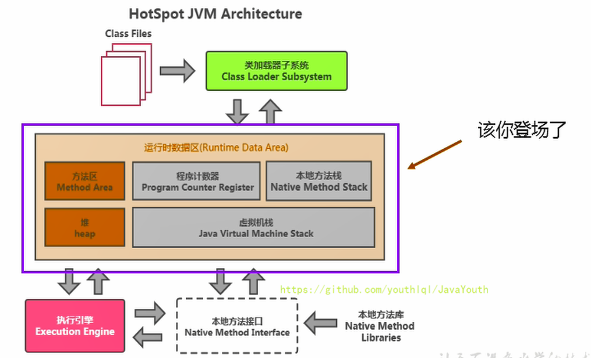
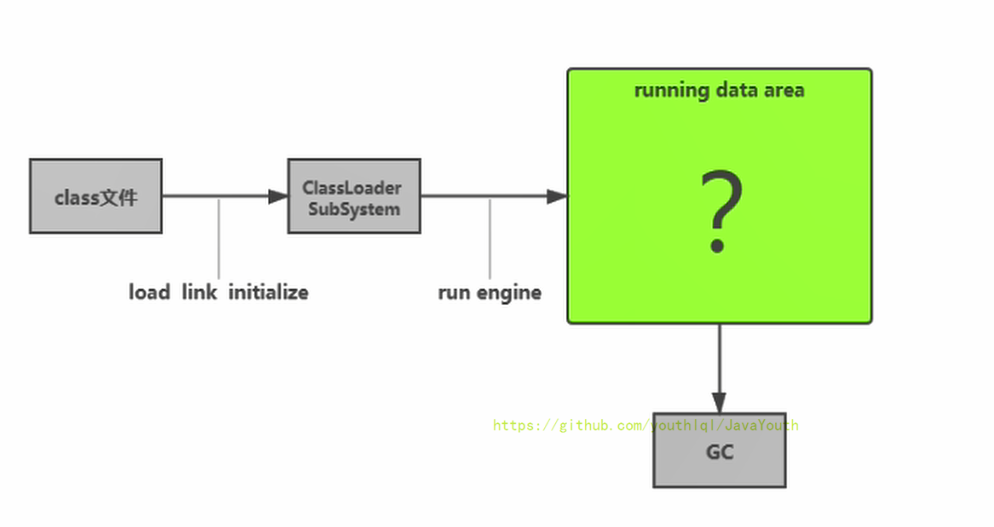
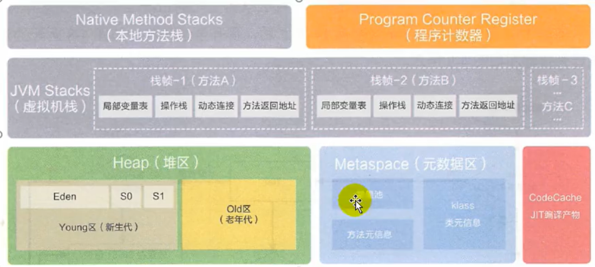
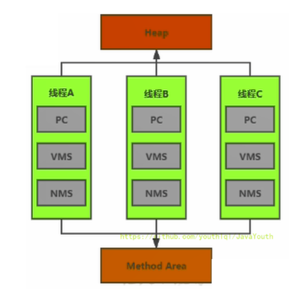

# 第三章-运行时数据区概述及线程
## 前言
本节主要讲的是运行时数据区，也就是下图这部分，它是在类加载完成后的阶段

当我们通过前面的：类的加载 --> 验证 --> 准备 --> 解析 --> 初始化，这几个阶段完成后，就会用到执行引擎对我们的类进行使用，同时执行引擎将会使用到我们运行时数据区

内存是非常重要的系统资源，是硬盘和CPU的中间仓库及桥梁，承载着操作系统和应用程序的实时运行。JVM内存布局规定了Java在运行过程中内存申请、分配、管理的策略，保证了JVM的高效稳定运行。**不同的JVM对于内存的划分方式和管理机制存在着部分差异**。结合JVM虚拟机规范，来探讨一下经典的JVM内存布局。

**具体的内存划分（下图来自阿里巴巴手册JDK8）

**内存空间划分**
- Java虚拟机定义了若干种程序运行期间会使用到的运行时数据区，其中一些会随着虚拟机启动而创建，随着虚拟机退出而销毁。另外一些则是与线程一一对应的，这些与线程对应的数据区域会随着线程开始和结束而创建和销毁。
- 灰色的为单独线程私有的，红色的为多个线程共享的，即：
  - 每个线程：独立包括程序计数器、栈、本地栈。
  - 线程间共享：堆、堆外内存（永久代或元空间、代码缓存）（即是进程包含的区域，被该进程的多个线程共享）

- 大部分的垃圾回收都在堆区，少部分在方法区
- 方法去在jdk8以后在本地内存。
## Runtime （运行时对象）
- 一个JVM实例对应一个Runtime实例，相当于一个运行时数据区。是单例的
- 每个Java应用程序都有一个Runtime类的Runtime ，允许应用程序与运行应用程序的环境进行接口。 当前运行时可以从getRuntime方法获得。 应用程序无法创建自己的此类的实例。
## 线程
- 线程是一个程序里的运行单元。JVM允许一个应用有多个线程并行的执行
- 在Hotspot JVM里，每个线程都与操作系统的本地线程直接映射
  - 当一个Java线程准备好执行以后，此时一个操作系统的本地线程也同时创建。Java线程执行种植后，本地线程也会回收。
- 操作系统负责所有线程的安排调度任何一个可用的CPU上。一旦本地线程初始化成功，它就会调用Java线程中的run（）方法。
- 线程分为守护线程、普通线程
### JVM系统线程
- 如果你使用jconsole或者是任何一个调试工具，都能看到在后台有许多线程在运行。这些后台线程不包括调用public static void main(String[])的main线程以及所有这个main线程自己创建的线程。
- 这些主要的后台系统线程在Hotspot JVM里主要是以下几个：
  - **虚拟机线程**：这种线程的操作是需要JVM达到安全点才会出现。这些操作必须在不同的线程中发生的原因是他们都需要JVM达到安全点，这样堆才不会变化。这种线程的执行类型括"stop-the-world"的垃圾收集，线程栈收集，线程挂起以及偏向锁撤销
  - **周期任务线程**：这种线程是时间周期事件的体现（比如中断），他们一般用于周期性操作的调度执行
  - **GC线程**：这种线程对在JVM里不同种类的垃圾收集行为提供了支持
  - **编译线程**：这种线程在运行时会将字节码编译成到本地代码
  - **信号调度线程**：这种线程接收信号并发送给JVM，在它内部通过调用适当的方法进行处理

