# 第2章-类加载子系统
## 内存结构概述
### 简图
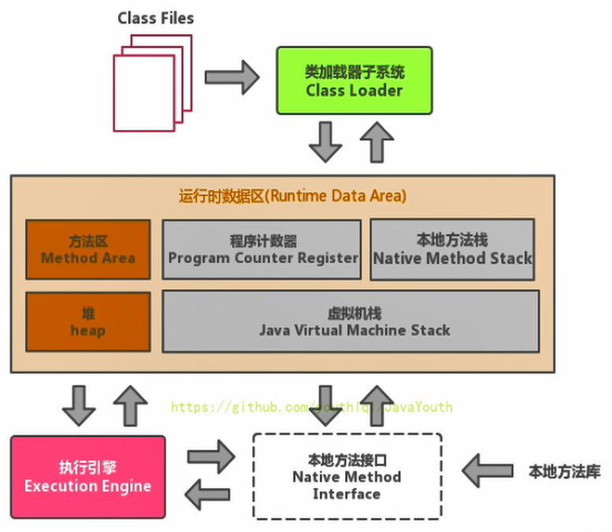
### 详细图
英文版

中文版
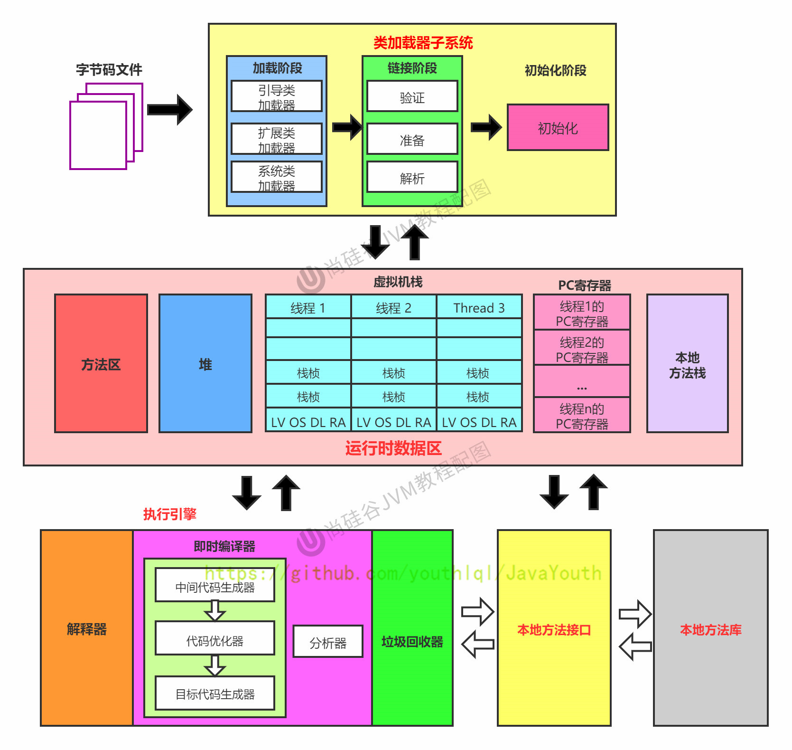
注意：方法区只有HotSpot虚拟机有，J9，JRockit都没有

如果自己想手写一个Java虚拟机的话，主要考虑哪些结构呢？
1. 类加载器
2. 执行引擎
## 类加载器子系统
**类加载器子系统作用：**
1. 类加载器子系统负责从文件系统或者网络中加载Class文件，class文件在文件开头有特定的文件标识。
2. ClassLoader只负责class文件的加载，至于它是否可以运行，则由Execution Engine决定。
3. **加载的类信息存放于一块称为方法区的内存空间。**除了类的信息外，方法区中还会存放运行时常量池信息，可能还包括字符串字面量和数字常量（这部分常量信息是Class文件中常量池部分的内存映射）
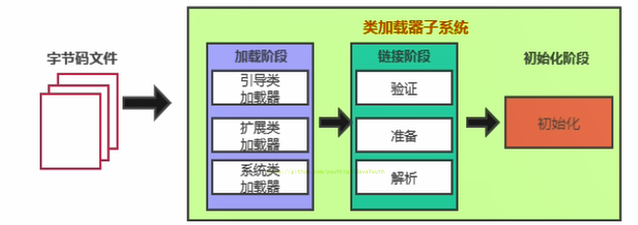
## 类加载器ClassLoader角色
1. class file（在下图中就是Car.class文件）存在于本地硬盘上，可以理解为设计师画在纸上的模板，而最终这个模板在执行的时候是要加载到JVM当中来根据这个文件实例化出n个一模一样的实例。
2. class file加载到JVM中，被称为DNA元数据模板（在下图中就是内存中的Car Class），放在方法区。
3. 在.class文件–>JVM–>最终成为元数据模板，此过程就要一个运输工具（类装载器Class Loader），扮演一个快递员的角色。
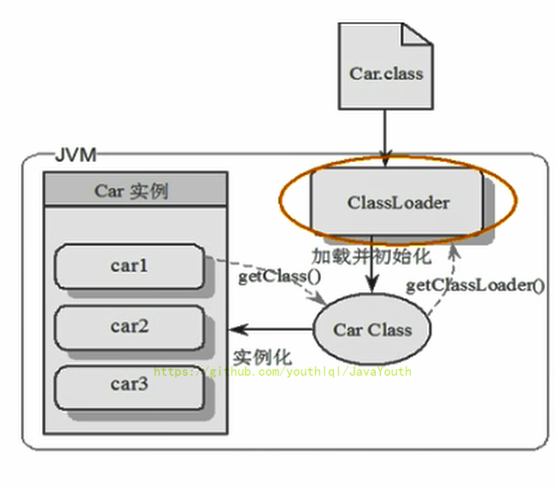
## 类加载过程
### 概述
```
public class HelloLoader {

    public static void main(String[] args) {
        System.out.println("谢谢ClassLoader加载我....");
        System.out.println("你的大恩大德，我下辈子再报！");
    }
}
```
**它的加载过程是怎么样的呢?**
- 执行 main() 方法（静态方法）就需要先加载main方法所在类 HelloLoader
- 加载成功，则进行链接、初始化等操作。完成后调用 HelloLoader 类中的静态方法 main
- 加载失败则抛出异常
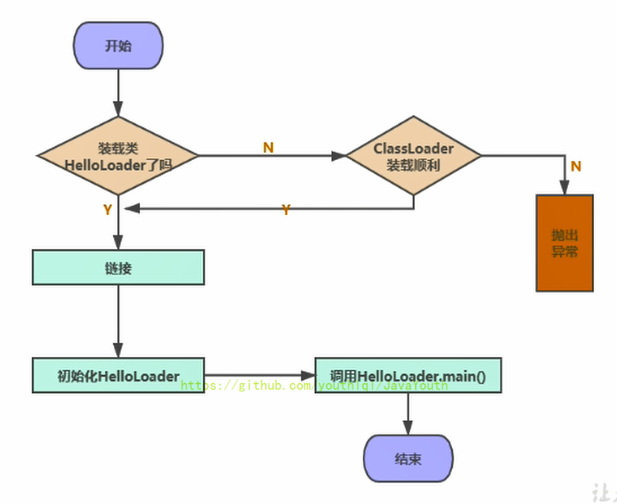
完整的流程图如下所示：
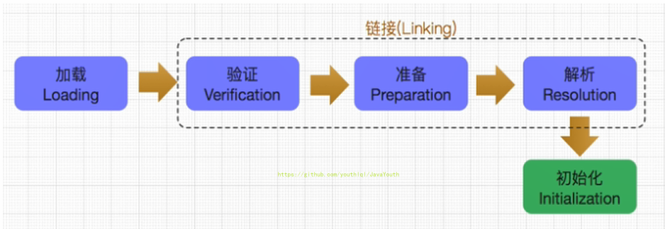
### 加载阶段
**加载**
1. 通过一个类的全限定名获取定义此类的二进制字节流
2. 将这个字节流所代表的静态存储结构转化为方法区的运行时数据结构
3. **在内存中生成一个代表这个类的java.lang.Class对象，**作为方法区这个类的各种数据的访问入口

**补充：加载class文件的方式：
1. 从本地系统中直接加载
2. 通过网络获取，典型场景：Web Applet
3. 从zip压缩包中读取，成为日后jar、war格式的基础
4. 运行时计算生成，使用最多的是：动态代理技术
5. 由其他文件生成，典型场景：JSP应用从专有数据库中提取.class文件，比较少见
6. 从加密文件中获取，典型的防Class文件被反编译的保护措施
### 链接阶段
链接分为三个子阶段：验证-->准备-->解析
#### 验证（verify）
1. 目的在于确保Class文件的字节流中包含信息符合当前虚拟机要求，保证被加载类的正确性，不会危害虚拟机自身安全
2. 主要包括四种验证，文件格式验证，元数据验证，字节码验证，符号引用验证。
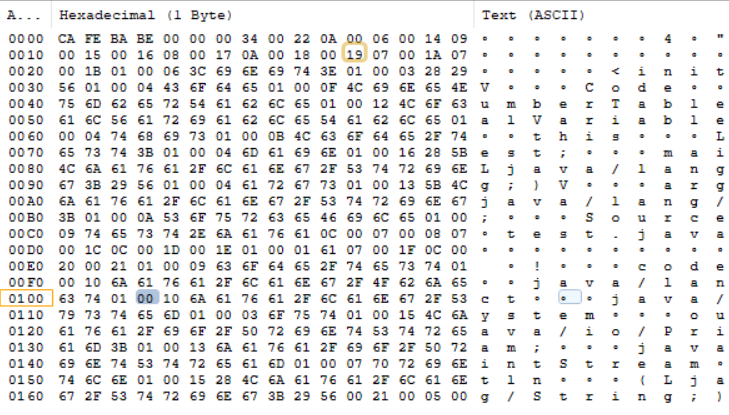
**class字节码都是以 CA FE BA BE开头。如果不合法，会报VerifyError。
#### 准备（Prepare）：
- 为类变量分配内存并且设置该类连梁的默认初始值，即零值。
- **这里不包含用final修饰的static，因为final再编译的时候就会分配了，准备阶段会显示初始化**
- **这里不会为实例变量分配初始化**，类变量会分配再方法去，而实例变量会随着对象一起分配到Java堆中。
```
public class test {
    private static int a = 1;   //在准备环节都是默认的初始值，int类型为0，
                                 //如果为final修饰的static，在编译阶段就会分配
    public static void main(String[] args) {
        System.out.println("a");
    }
}
```
#### 解析阶段（Resolve）
- 将常量池内的符号引用转换为直接引用的过程
- 事实上，解析操作往往会伴随着JVM再执行完初始化之后再执行。
- 符号引用就是一组符号来描述所引用的目标。符号引用的字面量形式明确定义在《Java虚拟机规范》的class文件格式中。直接引用就是直接指向目标的指针、相对pain一辆或一个简介定位到目标的句柄
```
D:\workspace\code\java-tech\out\production\java-tech\code>javap -v test.class

Classfile /D:/workspace/code/java-tech/out/production/java-tech/code/test.class
  Last modified 2021-1-15; size 515 bytes
  MD5 checksum 6747a2f6df0adca4cd80652ef98e3ae4
  Compiled from "test.java"
public class code.test
  minor version: 0
  major version: 52
  flags: ACC_PUBLIC, ACC_SUPER
Constant pool:
   #1 = Methodref          #6.#20         // java/lang/Object."<init>":()V
   #2 = Fieldref           #21.#22        // java/lang/System.out:Ljava/io/PrintStream;
   #3 = String             #23            // a
   #4 = Methodref          #24.#25        // java/io/PrintStream.println:(Ljava/lang/String;)V
   #5 = Class              #26            // code/test
   #6 = Class              #27            // java/lang/Object
   #7 = Utf8               <init>
   #8 = Utf8               ()V
   #9 = Utf8               Code
  #10 = Utf8               LineNumberTable
  #11 = Utf8               LocalVariableTable
  #12 = Utf8               this
  #13 = Utf8               Lcode/test;
  #14 = Utf8               main
  #15 = Utf8               ([Ljava/lang/String;)V
  #16 = Utf8               args
  #17 = Utf8               [Ljava/lang/String;
  #18 = Utf8               SourceFile
  #19 = Utf8               test.java
  #20 = NameAndType        #7:#8          // "<init>":()V
  #21 = Class              #28            // java/lang/System
  #22 = NameAndType        #29:#30        // out:Ljava/io/PrintStream;
  #23 = Utf8               a
  #24 = Class              #31            // java/io/PrintStream
  #25 = NameAndType        #32:#33        // println:(Ljava/lang/String;)V
  #26 = Utf8               code/test
  #27 = Utf8               java/lang/Object         //这些就是符号引用，将这些符号引用转换为真正的引用
  #28 = Utf8               java/lang/System
  #29 = Utf8               out
  #30 = Utf8               Ljava/io/PrintStream;
  #31 = Utf8               java/io/PrintStream
  #32 = Utf8               println
  #33 = Utf8               (Ljava/lang/String;)V
{
  public code.test();
    descriptor: ()V
    flags: ACC_PUBLIC
    Code:
      stack=1, locals=1, args_size=1
         0: aload_0
         1: invokespecial #1                  // Method java/lang/Object."<init>":()V
         4: return
      LineNumberTable:
        line 3: 0
      LocalVariableTable:
        Start  Length  Slot  Name   Signature
            0       5     0  this   Lcode/test;

  public static void main(java.lang.String[]);
    descriptor: ([Ljava/lang/String;)V
    flags: ACC_PUBLIC, ACC_STATIC
    Code:
      stack=2, locals=1, args_size=1
         0: getstatic     #2                  // Field java/lang/System.out:Ljava/io/PrintStream;
         3: ldc           #3                  // String a
         5: invokevirtual #4                  // Method java/io/PrintStream.println:(Ljava/lang/String;)V
         8: return
      LineNumberTable:
        line 5: 0
        line 6: 8
      LocalVariableTable:
        Start  Length  Slot  Name   Signature
            0       9     0  args   [Ljava/lang/String;
}
SourceFile: "test.java"
```
- 解析动作主要针对类或者接口、字段、类方法、接口方法、方法类型等。对应常量池中的CONSTANT_Class_info、CONSTANT_Fieldref_info、CONSTANT_Methodref_info等

### 初始化阶段
- **初始化阶段就是执行类构造器方法<clinit>()的过程**。
- 此方法不需定义，是javac编译器自动收集类中的**所有类变量的赋值动作和静态代码块中的语句合并而来**。如果类中类的赋值或者static属性，就不会有clinit
```
public class test {
    
    static {
        System.out.println(num);    //报错：非法的前向引用。如果在静态代码块中就不能这样去引用
    }
    
    private static int num = 1;

}
```
- 构造方法中指令按语句在源文件中出现的顺序执行
- **<clinit>()不同于类的构造器**。（关联：构造器是迅即视角下的<init>()）
- 若该类具有父类，JVM会保证子类的<clinit>()执行前，父类的<clinit>()已经执行完毕
**举例**
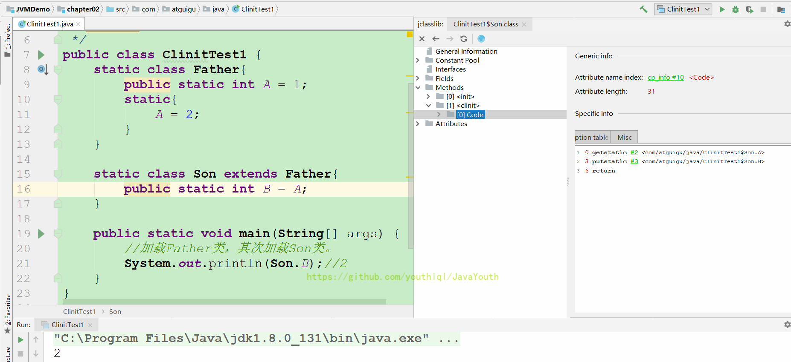
如上代码，加载流程如下：
    - 首先，执行 main() 方法需要加载 ClinitTest1 类
    - 获取 Son.B 静态变量，需要加载 Son 类
    - Son 类的父类是 Father 类，所以需要先执行 Father 类的加载，再执行 Son 类的加载

若该类具有父类，JVM会保证子类的<clinit>()执行前，父类的<clinit>()已经执行完毕

- 虚拟机必须保证一个类的<clinit>()方法在多线程下被同步加锁。
**举例**
虚拟机必须保证一个类的<clinit>()方法在多线程下被同步加锁
```
public class DeadThreadTest {
    public static void main(String[] args) {
        Runnable r = () -> {
            System.out.println(Thread.currentThread().getName() + "开始");
            DeadThread dead = new DeadThread();
            System.out.println(Thread.currentThread().getName() + "结束");
        };

        Thread t1 = new Thread(r,"线程1");
        Thread t2 = new Thread(r,"线程2");

        t1.start();
        t2.start();
    }
}

class DeadThread{
    static{
        if(true){
            System.out.println(Thread.currentThread().getName() + "初始化当前类");
            while(true){

            }
        }
    }
}
```
输出结果：
```
线程2开始
线程1开始
线程2初始化当前类

/然后程序卡死了
```
程序卡死，分析原因：

- 两个线程同时去加载 DeadThread 类，而 DeadThread 类中静态代码块中有一处死循环
- 先加载 DeadThread 类的线程抢到了同步锁，然后在类的静态代码块中执行死循环，而另一个线程在等待同步锁的释放
- 所以无论哪个线程先执行 DeadThread 类的加载，另外一个类也不会继续执行。（一个类只会被加载一次）
## 类加载器分类
- JVM分为两种类型的类加载器，分别为引导类加载器（Bootstrap ClassLoader）和自定义类加载器（User-Defined ClassLoader）。
- 从概念上来讲，自定义类加载器一般指的是程序中由开发人员自定义的一类类加载器，但是Java虚拟机规范却没有这么定义，而是将所有派生于抽象类ClassLoader的类加载器都划分为自定义类加载器。
- 无论类加载器的类型如何划分， 在程序中我们最常见的类加载器始终只有3个，如下所示：
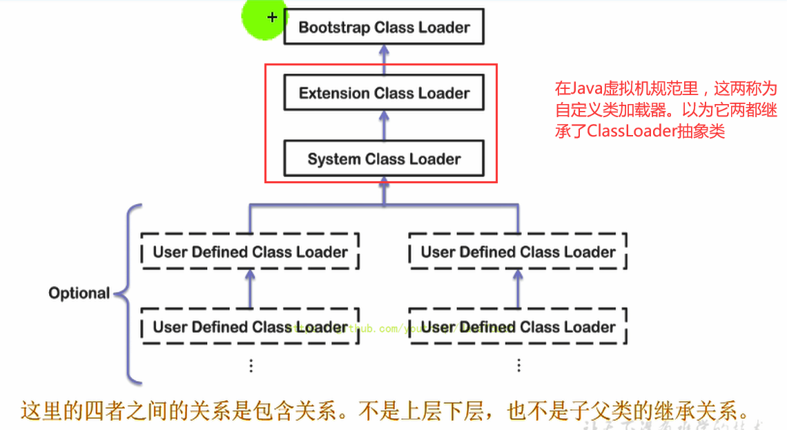
ExtClassLoader
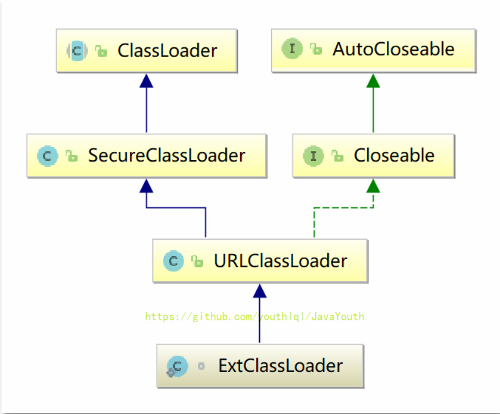
### 虚拟机自带的加载器

```
public static void main(String[] args) {
        ClassLoader systemClassLoader = ClassLoader.getSystemClassLoader();
        System.out.println(systemClassLoader);//sun.misc.Launcher$AppClassLoader@18b4aac2
        ClassLoader extClassLoader = systemClassLoader.getParent();
        System.out.println(extClassLoader);//sun.misc.Launcher$ExtClassLoader@1b6d3586
        ClassLoader bootstrapClassLoader = extClassLoader.getParent();
        System.out.println(bootstrapClassLoader);

        //对于用户自定义类的类加载器
        ClassLoader classLoader = test.class.getClassLoader();
        System.out.println(classLoader);//sun.misc.Launcher$AppClassLoader@18b4aac2
    }
```

#### 启动类加载器（引导类加载器，Bootstrap ClassLoader)
- 这个类加载器使用**C/C++语言实现的**，嵌套在JVM内部
- 它用来加载java的核心库（JAVA_HONE/jre/lib/rt.jar、resources.jar或sun.boot.class.path路径下的内容），用于提供JVM自身需要的类
- 并不继承自java.lang.ClassLoader，没有父加载器
- 加载扩展类和应用程序类加载器，并指定为他们的父类加载器
- 出于安全考虑，Bootstrap启动类加载器只加载包名为java，javax，sun等开头的类
#### 虚拟机自带的加载器
- 扩展类加载器（Extension ClassLoader）
  - **Java语言编写**，由sun.misc.Launcher$ExtClassLoader实现
  - 派生于ClassLoader类
  - 父类加载器为启动类加载器
  - 从java.ext.dirs系统属性所指定的目录中加载类库，或从JDK的安装目录的jre/lib/ext子目录（扩展目录）下加载类库。如果用户创建的JAR放在此目录下，也会自动由扩展类加载器加载。
- 应用程序类加载器（系统类加载器，AppClassLoader）
  - Java语言编写，由sun.misc.Launcher$ExtClassLoader实现
  - 派生于ClassLoader类
  - 父类加载器为启动类加载器
  - 它负责加载环境变量classpath或系统属性 java.class.path指定路径下的类库
  - **该类加载是程序中默认的类加载器**，一般来说，java应用的类都是由它来完成加载
  - 通过ClassLoader#getSystemClassLoader()方法可以获得到该类加载器
```
 public static void main(String[] args) {
        System.out.println("************启动类加载器*********");
        //获取BootstrapClassLoader能够加载的api的路径
        URL[] urLs = Launcher.getBootstrapClassPath().getURLs();
        for (URL url: urLs) {
            System.out.println(url);
        }
        //从商民的路径中随意选择一个类，看一下它的类加载器类型
        System.out.println("*********扩展类加载器ExtClassLoader********");
        String property = System.getProperty("java.ext.dirs");
        for (String str : property.split(";")){
            System.out.println(str);
        }
    }
```
#### 用户自定义类加载器
- 在Java的日常应用程序开发中，了ide加载几乎是由上述三种类加载器相互配合执行的，在必要时，我们还可以自定义类加载器，来定制类的加载方式
- 为什么需要自定义类加载器
  - 隔离加载类
  - 修改类加载的方式
  - 扩展加载源
  - 防止源码泄露
- 用户自定义类加载器实现步骤：
  1. 开发人员可以通过集成抽象的java.lang.ClassLoader类的方式，实现自己的类加载器，以满足一些特殊的需求
  2. 在JDK1.2之前，在自定义类加载器时，总会去继承ClassLoader类并重写loadClass()方法，从而实现自定义的类加载类，但是在JDK1.2之后已不再建议用户去覆盖loadClass()方法，而是建议把自定义的类加载逻辑写在findclass()方法中
  3. 在编写自定义类加载器时，如果没有太过于复杂的需求，可以直接继承URIClassLoader类，这样就可以避免自己去编写findclass()方法及其获取字节码流的方式，使自定义类加载器编写更加简洁。
**示例**
```
import java.io.FileNotFoundException;

/**
 * 自定义类加载器
 */
public class CustomClassLoader extends ClassLoader {
    @Override
    protected Class<?> findClass(String name) throws ClassNotFoundException {
        try {
            byte[] result = getClassFromCustomPath(name);
            if (result == null){
                throw new FileNotFoundException();
            }else{
                return defineClass(name,result,0,result.length);
            }
        } catch (FileNotFoundException e){
            e.printStackTrace();
        }
        return super.findClass(name);
    }

    /**
     * 以二进制的形式读取到方法中
     * @param name
     * @return
     */
    private byte[] getClassFromCustomPath(String name){
        //从自定义路径中加载指定类
        //如果指定路径的字节码文件进行了加密，则需要在这个地方进行解密操作
        return null;
    }

    public static void main(String[] args) {
        CustomClassLoader customClassLoader = new CustomClassLoader();
        try {
            Class<?> clazz = Class.forName("one", true, customClassLoader);
            Object o = clazz.newInstance();
            System.out.println(o.getClass().getClassLoader());
        } catch (ClassNotFoundException | InstantiationException | IllegalAccessException e) {
            e.printStackTrace();
        } 
    }

}
```
### 关于ClassLoader
ClassLoader类，它是一个抽象类，其后所有的类加载器都继承自ClassLoader（不包括启动类加载器）
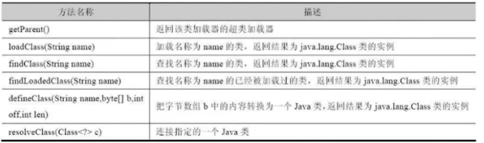
sun.misc.Launcher它是一个Java虚拟机的入口应用。
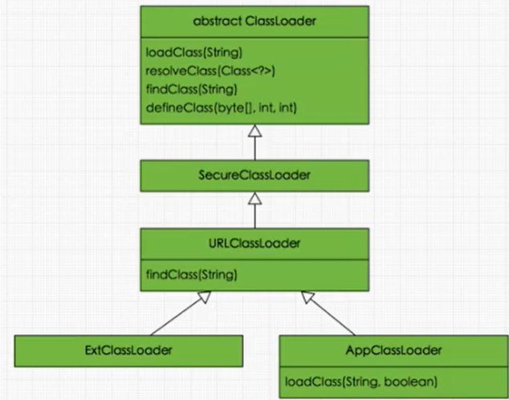
**获取ClassLoader的途径**
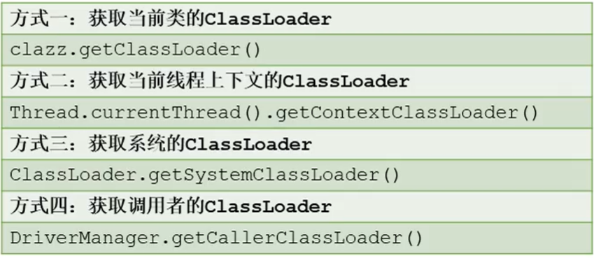
```
//通过class方式获取
ClassLoader classLoader = Class.forName("java.lang.String").getClassLoader();

//通过线程的方式获取
ClassLoader contextClassLoader = Thread.currentThread().getContextClassLoader();
System.out.println(contextClassLoader);
//通过classloader获取
ClassLoader parent = classLoader.getSystemClassLoader().getParent();
System.out.println(parent);
```

## 5-双亲委派机制
Java虚拟机对class文件采用的是按需加载的方式，也就是说当需要使用该类时才会将它的class文件加载到内存生成class对象。而且加载某个类的class文件时，Java虚拟机采用的是双亲委派模式，即把请求交由父类处理，它是一种任务委派模式

- 工作原理
1. 如果一个类加载器收到了类加载请求，它并不会自己先去加载，而是把这个请求委托给父类的加载器去执行；
2. 如果父类加载器还存在其父类加载器，则进一步星尚委托，一次递归，请求最终将到达顶层的启动类加载器；
3. 如果父类加载器可以完成类加载任务，就成功返回，倘若父类加载器无法完成此加载任务，子加载器才会尝试自己去加载， 这就是双亲委派模式
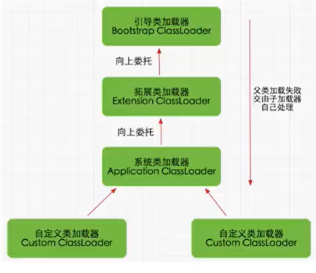
**示例1**
```
package java.lang;

//类的加载过程各自负责某些包下的类，创建的java.lang包的string正好是启动类加载器加载的，它会加载java自带的java.lang包下的String，不会有main方法，导致报错
public class String {   
    //错误：在String类中找不到main方法
    public static void main(String[] args) {
        System.out.println("hello,String");
    }
}
```
由于双亲委派机制一直找父类，所以最后找到了Bootstrap ClassLoader，Bootstrap ClassLoader找到的是 JDK 自带的 String 类，在那个String类中并没有 main() 方法，所以就报了上面的错误。

**示例2**
当我们加载jdbc.jar 用于实现数据库连接的时候
1. 我们现在程序中需要用到SPI接口，而SPI接口属于rt.jar包中Java核心api，使用引导类加载器加载核心rt.jar包
2. 然后使用双亲委派机制，引导类加载器把rt.jar包加载进来，而rt.jar包中的SPI存在一些接口，接口我们就需要具体的实现类了
3. 具体的实现类就涉及到了某些第三方的jar包了，比如我们加载SPI的实现类jdbc.jar包
4. 第三方的jar包中的类属于系统类加载器来加载
5. 从这里面就可以看到SPI核心接口由引导类加载器来加载，SPI具体实现类由系统类加载器来加载
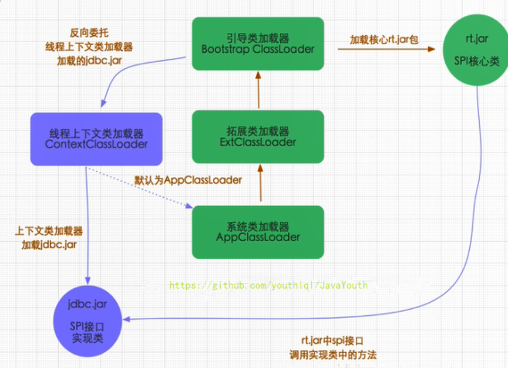
### 双亲委派机制
- 优势
  - 避免类的重复加载
  - 保护程序安全，防止核心API被随意篡改，即使写了包名和核心API一致，也不会加载该类
    - 自定义类：java.lang.String
    - 自定义类：java.lang.ShkStart
**示例**
```
package java.lang;

public class ShkStart {
    public static void main(String[] args) {
        System.out.println("a");
    }
}

运行报错：
Error: A JNI error has occurred, please check your installation and try again
Exception in thread "main" java.lang.SecurityException: Prohibited package name: java.lang  //阻止java.lang包
	at java.lang.ClassLoader.preDefineClass(ClassLoader.java:655)
	at java.lang.ClassLoader.defineClass(ClassLoader.java:754)
	at java.security.SecureClassLoader.defineClass(SecureClassLoader.java:142)
	at java.net.URLClassLoader.defineClass(URLClassLoader.java:468)
	at java.net.URLClassLoader.access$100(URLClassLoader.java:74)
	at java.net.URLClassLoader$1.run(URLClassLoader.java:369)
	at java.net.URLClassLoader$1.run(URLClassLoader.java:363)
	at java.security.AccessController.doPrivileged(Native Method)
	at java.net.URLClassLoader.findClass(URLClassLoader.java:362)
	at java.lang.ClassLoader.loadClass(ClassLoader.java:418)
	at sun.misc.Launcher$AppClassLoader.loadClass(Launcher.java:355)
	at java.lang.ClassLoader.loadClass(ClassLoader.java:351)
	at sun.launcher.LauncherHelper.checkAndLoadMain(LauncherHelper.java:601)

```
### 沙箱安全机制
自定义String类，但是在加载自定义String类的时候会率先使用引导类加载器加载，而引导类加载器在加载的过程中会先加载jdk自带的文件（rt.jar包中java.lang.String.class），报错信息说没有main方法，就是因为加载的是rt.jar包中的String类。这样可以保证堆java核心源代码的保护，这就是**沙箱安全机制。**

## 其它
- 在JVM中表示两个class对象是否为同一个类存在两个必要条件：
  - 类的完整类名必须一致，包括包名
  - 加载这个类的ClassLoader也必须相同。
- 换句话说，在JVM中，即使这两个类对象（class对象）来源同一个Class文件，被同一个虚拟机所加载，但只要加载它们的ClassLoader实例对象不同，那么这两个类对象也是不相等的
### 对类加载器的引用
JVM必须知道一个类型是由启动加载器加载的还是由用户类加载器加载的。如果一个类型是由用户类加载器加载的，那么JVM会**将这个类加载器的一个应用作为类型信息的一部分保存在方法区中。**当解析一个类型到另一个类型的引用的时候，JVM需要保证这两个类型的类加载器是相同的。
### 类的主动使用和被动使用
- 主动使用
  - 创建类的示例
  - 访问某个类或接口的静态变量，或者对该静态变量赋值
  - 调用类的静态方法
  - 反射（比如：Class.forName("com.atguigu.Test")）
  - 初始化一个类的子类
  - Java虚拟机启动时被标明为启动类的类
  - JDK 7开始体哦概念股的动态语言支持：
    - java.lang.invoke.MethodHandleS实例的解析结果，RFG_getStatic、REG_putStatic、REF_invokeStatic句柄对应的类没有初始化，则初始化
- 除了以上七种情况，其他使用Java类的方式都被看作是对类的被动使用，都**不会导致类的初始化**
