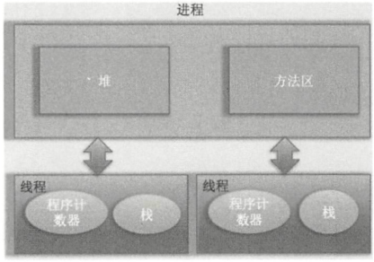
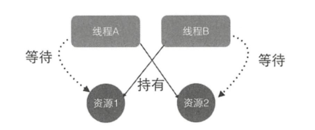

# 并发编程基础

## 什么是线程
线程是进程中的一个实体，线程本身不会独立存在的。 进程是代码在数据集合上的一次运行活动 ， 是系统进行资源分配和调度的基本单位 ， 线程则是进程的一个执行路径， 一个进程中至少有一个线程，进程中的多个线程共享进程的 资源。

操作系统在分配资源时是把资源分配给进程的，但是CPU资源比较特殊，他是被分配到线程的，因为真正要占用CPU运行的是线程，所以说线程是CPU分配的基本单位。


上图可以看到，一个进程中由多个线程，多个线程共享进程的堆和方法区资源，但是每个线程有自己的程序计数器和栈区域。

 程序计数器是一块内存区域，用来记录线程当前要执行的指令地址 。 那么为何要将程序计数器设计为线程私有的呢？前面说了线程是占用 CPU 执行的基本单位，而 CPU 一般是使用时间片轮转方式让线程轮询占用的，所以当前线程 CPU 时间片用完后，要让出CPU ，等下次轮到 自 己的时候再执行 。 那么如何知道之前程序执行到哪里 了呢？其实程序计数器就是为了记录该线程让出 CPU 时的执行地址的，待再次分配到时间片时线程就可以从自己私有的计数器指定地址继续执行 。

  另外需要注意 的是，如果执行的是 native 方法，那么 pc 计数器记录 的是 undefined 地址，只有执行的是 Java 代码时 pc 计数器记录的才是下一条指令的地址 。

 另外每个线程都有自 己的战资源，用于存储该线程的局部变量，这些局部变量是该线程私有的，其他线程是访问不了的，除此之外枝还用来存放线程的调用技帧 。
 堆是一个进程中最大的一块内存，堆是被进程中的所有线程共享的，是进程创建时分配的，堆里面主要存放使用 new 操作创建的对象实例 。

 方法区则用来存放 JVM 加载的类、常量及静态变量等信息，也是线程共享的 。

## 线程的创建和运行

### 继承Thread类
其实调用start方法后线程并没有马上执行而是处于就绪状态， 这个就绪状态是指该线程已经获取了除 CPU 资源外的其他资源，等待获取 CPU 资源后才会真正处于运行状态。一旦 run 方法执行完毕， 该线程就处于终止状态 。

  使用继承方式的好处是 ， 在 run（） 方法 内 获取当前线程直接使用 this 就可 以了，无须使用 Thread. currentThread（） 方法 ； 不好的地方是 Java 不支持多继承，如果继承了 Thread 类，那么就不能再继承其他类。另外任务与代码没有分离 ， 当多个线程执行一样的任务时需要多份任务代码，而 Runable 则没有这个限制 。
```
public class MyThread extends Thread {

    public static int a;

    @Override
    public void run() {
        //打印当前线程
        System.out.println(this);
        System.out.println("实现的多线程方法");
    }

    public static void main(String[] args) {
        //创建线程
        MyThread myThread = new MyThread();
        //开启线程
        myThread.start();
    }
}
```
### 实现Runnable接口
如上面代码所示，两个线程共用一个task代码逻辑，如果需要，可以给RunableTask添加参数进行任务区分。另外 ， RunableTask 可以继承其他类。但是上面介绍的两种方式都有一个缺点，就是任务没有返回值 。
```
public class RunableTask implements Runnable {
    @Override
    public void run() {
        System.out.println("并发编程");
    }

    public static void main(String[] args) {
        //创建线程实例
        RunableTask runableTask = new RunableTask();
        //执行两个相同的线程，使用同一个task逻辑
        new Thread(runableTask).start();
        new Thread(runableTask).start();

    }
}
```
### 使用FutureTask方式
```
//创建任务类，类似于Runable
public class CallerTask implements Callable<String> {
    @Override
    public String call() throws Exception {
        return "hello";
    }

    public static void main(String[] args) throws InterruptedException {

        FutureTask<String> futureTask = new FutureTask<>(new CallerTask());

        new Thread(futureTask).start();
        try {
            String result = futureTask.get();
            System.out.println(result);
        } catch (ExecutionException e) {
            e.printStackTrace();
        }
    }
}
```
如上代码中的CallerTask类实现了Callable接口的call（）方法。

 在 main 函数内首先创建了一个FutrueTask对象（构造函数为 CallerTask的实例），然后使用创建的FutrueTask对象作为任务创建了一个线程并且启动它，最后通过 futureTask.get（） 等待任务执行完毕并返回结果 。

 ### 小结
  使用继承方式的好处是方便传参，你可以在子类里面添加成员变量，通过 set方法设置参数或者通过构造函数进行传递，而如果使用 Runnable 方式，则只能使用主线程里面被声明为 final 的变量。不好的地方是 Java 不支持多继承，如果继承了 Thread 类，那么子类不能再继承其他类，而 Runable 则没有这个限制 。前两种方式都没办法拿到任务的返回结果，但是 Futuretask 方式可以 。
  ---
## 线程通知与等待

### wait函数
#### 当一个线程调用一个共享变量的wait（）方法时，该调用线程会被阻塞挂起，直到发生下面几件事之一才会返回：
1. 其他线程调用了该共享对象的notify（）或者notifyAll（）方法；
3. 其他线程调用了该线程的interrupt（）方法，该线程抛出InterruptedException异常返回
4. 另外注意如果调用wait（）方法的线程没有事先获取该对象的监视器锁，则调用wait（）方法时调用线程会抛出IllegalMonitorStateException异常。

#### 一个线程如何才能获取一个共享变量的监视器锁呢？
1. 执行synchronized同步代码块时，使用该共享变量作为参数
```
    synchronized(共享变量){
        //doSomething
    }
```
2. 调用该共享变量的方法，并且该方法使用了synchronized修饰

```
    synchronized void add (int a, int b){
        //doSomething
    }
```

3. 另外需要注意的是，一个线程可以从挂起状态变为可以运行状态（也就是被唤醒），即使该线程没有被其他线程调用notify（），notifyAll()方法进行通知，或者被中断，或者等待超时，这就是所谓的虚假唤醒。
 虽然虚假唤醒在应用实践中很少发生，但要防患于未然，做法就是不停地去测试该线程被唤醒的条件是否满足，不满足则继续等待，也就是说在一个循环中调用 wait（） 方法进行防范 。退出循环的条件是满足了唤醒该线程的条件 。
```
synchronized(obj){
    while(条件不满足){
        object.wait();
     }
}
```
如上代码是经典的调用共享变量 wait（）方法的实例，首先通过同步块获取 obj 上面的监视器锁，然后在 while 循环 内调用。同的 wait（） 方法。

下面从一个简单的生产者和消费者例子来加深理解。 如下面代码所示，其中 queue 为共享变量，生产者线程在调用 queue 的 wait（） 方法前，使用 synchronized 关键宇拿到了该共享变量queue 的监视器锁，所以调用 wait() 方法才不会抛出 lliega!MonitorStateException 异常。如果当前队列没有空闲容量则会调用 queued 的 wait（） 方法挂起当前线程，这里使用循环就是为了避免上面说的虚假唤醒问题。假如当前线程被虚假唤醒了，但是队列还是没有空余容量 ，那么当前线程还是会调用 wait（）方法把自己挂起 。

```

public class MyWait {


    private RunableTaskOne task;

    private static Integer MAX_SIZE = 10;

    //生产者
    public void productor(){

        synchronized (task){
            while (task.getSize() == MAX_SIZE){
                try {
                    //挂起当前线程，并释放通过同步块获取的queue上的锁，让消费者线程可以获取该所，然后获取队列里面的元素
                    task.wait();
                } catch (InterruptedException e) {
                    e.printStackTrace();
                }
            }
            //空闲则生成元素，并通知消费者线程
            task.add(this);
            task.notify();
        }
    }

    public void customer(){
        synchronized (task){
            while (task.getSize() == 0){
                try {
                    //挂起当前线程，并释放通过同步快获取的queue上的所，让生产者可以获取该所，将生产元素放入队列。
                    task.wait();

                } catch (InterruptedException e) {
                    e.printStackTrace();
                }
            }
            task.take();
            task.notifyAll();
        }
    }

}

class RunableTaskOne implements Runnable {

    private Integer size ;

    private Object obj;
    //获取
    public Integer getSize(){
        return size;
    }
    //添加
    public void add(Object obj){
        this.obj = obj;
    }
    //消费
    public void take(){
        size --;
    }
    //生产
    @Override
    public void run() {
        size ++;
        System.out.println("并发编程");
    }

}
```
在如上代码中假如生产者线程A首先通过synchronized获取到了queue上的锁，那么后续所有企图生产元素的线程和消费线程将会在获取该监视器锁的地方被阻塞挂起。线程A获取锁后发现当前队列己满会调用queue.wait（）方法阻塞自己，然后释放获取的queue上的锁，这里考虑下为何要释放该锁？如果不释放，由于其他生产者线程和所有消费者线程都己经被阻塞挂起，而线程A也被挂起，这就处于了死锁状态。这里线程A挂起自己后释放共享变量上的锁，就是为了打破死锁必要条件之一的持有并等待原则。关于死锁后面的章节会讲。线程A释放锁后，其他生产者线程和所有消费者线程中会有一个线程获取queue上的锁进而进入同步块，这就打破了死锁状态。

另外需要注意的是，当前线程调用共享变量的wait（）方法后只会释放当前共享变量上的锁，如果当前线程还持有其他共享变量的锁，则这些锁是不会被释放的。下面来看一个例子。

```
public class MyWaitTwo {

    private static volatile Object resourceA = new Object();
    private static volatile Object resourceB = new Object();

    public static void main(String[] args) throws InterruptedException {

        Thread threadA = new Thread(new Runnable() {

            @Override
            public void run() {
                try {
                    //获取resourceA共享资源的监视器锁
                    synchronized (resourceA) {
                        System.out.println("threadA get resourceA lock");

                        //获取resourceB共享资源的监视器锁
                        synchronized (resourceB) {
                            System.out.println("threadA get resourceB lock");
                            //线程A阻塞，并释放获取到的resourceA的锁
                            System.out.println("threadA release resourceA lock");
                            resourceA.wait();
                        }
                    }

                } catch (Exception e) {
                    e.printStackTrace();
                }
            }
        });

        Thread threadB = new Thread(new Runnable() {

            @Override
            public void run() {
                try {
                    //线程休眠1s
                    Thread.sleep(1000);
                    //获取resourceA共享资源的监视器锁
                    synchronized (resourceA) {
                        System.out.println("threadB get resourceA lock");
                        System.out.println("threadB try get resourceB lock...");

                        //获取resourceB共享资源的监视器锁
                        synchronized (resourceB) {
                            System.out.println("threadB get resourceA lock");
                            //线程B阻塞，并释放获取到的resourceA的锁
                            System.out.println("threadB release resourceA lock");
                            resourceA.wait();
                        }
                    }


                } catch (Exception e) {
                    e.printStackTrace();
                }
            }
        });
        //启动两个线程
        threadA.start();
        threadB.start();

        //等待两个线程结束
        threadA.join();
        threadB.join();

        System.out.println("main over");

    }
}

```
输出结果：
```
C:\software\java8\bin\java.exe "-javaagent:C:\software\idea\IntelliJ IDEA 2019.3.3\lib\idea_rt.jar=51893:C:\software\idea\IntelliJ IDEA 2019.3.3\bin" -Dfile.encoding=UTF-8 -classpath C:\software\java8\jre\lib\charsets.jar;C:\software\java8\jre\lib\deploy.jar;C:\software\java8\jre\lib\ext\access-bridge-64.jar;C:\software\java8\jre\lib\ext\cldrdata.jar;C:\software\java8\jre\lib\ext\dnsns.jar;C:\software\java8\jre\lib\ext\jaccess.jar;C:\software\java8\jre\lib\ext\jfxrt.jar;C:\software\java8\jre\lib\ext\localedata.jar;C:\software\java8\jre\lib\ext\nashorn.jar;C:\software\java8\jre\lib\ext\sunec.jar;C:\software\java8\jre\lib\ext\sunjce_provider.jar;C:\software\java8\jre\lib\ext\sunmscapi.jar;C:\software\java8\jre\lib\ext\sunpkcs11.jar;C:\software\java8\jre\lib\ext\zipfs.jar;C:\software\java8\jre\lib\javaws.jar;C:\software\java8\jre\lib\jce.jar;C:\software\java8\jre\lib\jfr.jar;C:\software\java8\jre\lib\jfxswt.jar;C:\software\java8\jre\lib\jsse.jar;C:\software\java8\jre\lib\management-agent.jar;C:\software\java8\jre\lib\plugin.jar;C:\software\java8\jre\lib\resources.jar;C:\software\java8\jre\lib\rt.jar;D:\workspace\code\java-tech\out\production\java-tech code.concurrency.chapter1.MyWaitTwo
threadA get resourceA lock
threadA get resourceB lock
threadA release resourceA lock
threadB get resourceA lock
threadB try get resourceB lock...
```
上述代码执行过程：
1. 在main函数里面启动了线程A和线程B，为了让线程A先获取到锁，这里让线程B先休眠了ls，线程A先后获取到共享变量resourceA和共享变量resourceB上的锁，然后调用了resourceA的wait（）方法阻塞自己，阻塞自己后线程A释放掉获取的resourceA上的锁。
2. 线程B休眠结束后会首先尝试获取resourceA上的锁，如果当时线程A还没有调用wait（）方法释放该锁，那么线程B会被阻塞，当线程A释放了resourceA上的锁后，线程B就会获取到resourceA上的锁，然后尝试获取resourceB上的锁。由于线程A调用的是resourceA上的wait（）方法，所以线程A挂起自己后并没有释放获取到的resourceB上的锁，所以线程B尝试获取resourceB上的锁时会被阻塞。
3. 这就证明了当线程调用共享对象的wait（）方法时，当前线程只会释放当前共享对象的锁，当前线程持有的其他共享对象的监视器锁并不会被释放 。

再举例说明：当一个线程调用共享对象的wait（）方法被阻塞挂起后，如果其他线程中断了该线程，则该线程会抛出InterruptedException异常并返回。
```
/**
 * interupt结束进程
 */
public class WaitNotifyInterupt {
    static Object obj = new Object();

    public static void main(String[] args) throws InterruptedException {

        Thread threadA = new Thread(new Runnable() {
            @Override
            public void run() {
                try {
                    System.out.println("开始");
                    synchronized (obj){
                        System.out.println("开始执行等待");
                        obj.wait();
                        System.out.println("结束执行等待");
                    }
                    System.out.println("结束");
                } catch (InterruptedException e) {
                    e.printStackTrace();
                }
            }
        });

        threadA.start();

        Thread.sleep(1000);

        System.out.println("开始 interrupt threadA");
        //终端线程
        threadA.interrupt();
        System.out.println("结束 interrupt threadA");
    }
}

```
执行结果：
```
开始
开始执行等待
开始 interrupt threadA
结束 interrupt threadA
java.lang.InterruptedException
	at java.lang.Object.wait(Native Method)
	at java.lang.Object.wait(Object.java:502)
	at code.concurrency.chapter1.WaitNotifyInterupt$1.run(WaitNotifyInterupt.java:18)
	at java.lang.Thread.run(Thread.java:748)
```
在如上代码中，threadA调用共享对象obj的wait()方法后阻塞挂起了自己，然后主线程在休眠1s后终端了threadA线程，中断后threadA在obj.wait()处抛出java.lang.InterruptedException异常而返回并终止。

### wait(long timeout)函数
相比wait（）方法多了一个超时参数，它的不同之处在于，如果一个线程调用共享的对象该方法挂起后，没有在指定的timeout ms时间内被其他线程调用该共享变量的notify（）或者notifyAll(）方法唤醒，那么该函数还是会因为超时而返回。如果将timeout设置为0则和wati方法效果一样，因为在wait方法内部调用的是wait（0）。需要注意的是，如果在调用该函数时，传递了一个负的timeout则会抛出Illega!ArgumentException 异常 。
### wait（long timeout, int nanos)函数
在其内部调用的时wait(long timeout)函数，如下代码只有在nanos>0时才使参数timeout递增1。

参见源码：
```
public final void wait(long timeout, int nanos) throws InterruptedException {
    if (timeout < 0) {
        throw new IllegalArgumentException("timeout value is negative");
    }

    if (nanos < 0 || nanos > 999999) {
        throw new IllegalArgumentException(
                            "nanosecond timeout value out of range");
    }

    if (nanos > 0) {
        timeout++;
    }

    wait(timeout);
}
```
### notify()函数
一个线程调用共享对象的notify()方法后，会唤醒一个在该共享变量上调用 wait 系列方法后被挂起的线程。 一个共享变量上可能会有多个线程在等待，具体唤醒哪个等待的线程是随机的。

 此外，被唤醒的线程不能马上从 wait 方法返回并继续执行，它必须在获取了共享对象的监视器锁后才可以返回也就是唤醒它的线程释放了共享变量上的监视器锁后，被唤醒的线程也不一定会获取到共享对象的监视器锁，这是因为该线程还需要和其他线程一起竞争该锁， 只有该线程竞争到了共享变量的监视器锁后才可 以继续执行。

 类似 wait 系列方法，**只有当前线程获取到了共享变量的监视器锁后，才可以调用共享变量的 notify（） 方法**，否则会抛出 IllegalMonitorStateException 异常。

### notifyAll()函数
不同于在共享变量上调用 notify（）函数会唤醒被阻塞到该共享变量上 的 一 个线程，notifyAll（） 方法则会唤醒所有在该共享变量上由于调用 wait 系列方法而被挂起的线程。下面举一个例子来说明 notify（） 和 notifyAll（） 方法的具体含义及一些需要注意的地方，代码如下。
```
public class MyWaitTask {


    private static volatile Object resourceA = new Object();

    public static void main(String[] args) throws InterruptedException {

        //创建线程
        Thread threadA = new Thread(new Runnable() {
            @Override
            public void run() {
                synchronized (resourceA){
                    System.out.println("threadA get resourceA lock");
                    try {
                        System.out.println("threadA begin wait");
                        resourceA.wait();
                        System.out.println("threadA end wait");
                    } catch (InterruptedException e) {
                        e.printStackTrace();
                    }

                }
            }
        });

        Thread threadB = new Thread(new Runnable() {
            @Override
            public void run() {
                synchronized (resourceA) {
                    System.out.println("threadB get resourceA lock");
                    try {
                        System.out.println("threadB begin wait");
                        resourceA.wait();
                        System.out.println("threadB end wait");
                    } catch (InterruptedException e) {
                        e.printStackTrace();
                    }

                }
            }
        });

        Thread threadC = new Thread(new Runnable() {
            @Override
            public void run() {
                synchronized (resourceA){
                    System.out.println("threadC begin notify");
                    resourceA.notify();
                }
            }
        });

        threadA.start();
        threadB.start();

        Thread.sleep(1000);

        threadC.start();

        threadA.join();
        threadB.join();
        threadC.join();

        System.out.println("main over");
    }
}
```
结果如下：
```
threadA get resourceA lock
threadA begin wait
threadB get resourceA lock
threadB begin wait
threadC begin notify
threadA end wait
```
如上代码结果显示之有一个线程A被唤醒，点成B没有被唤醒：

从输出就俄国可知线程调度器这次先调度了线程A占用CPU来运行，线程A首先获取resourceA上面的锁，然后调用resourceA的wait()方法改期当前线程并释放获取到的锁，然后线程B获取到resourceA上的锁并调用resourceA的wait()方法，此时线程B也被阻塞挂起并释放了resourceA上的锁，到这里线程A和线程B都被放到了resourceA的阻塞集合里面。线程C休眠结束后在共享资源resourceA上调用了notify()方法，这回激活resource A的阻塞集合里卖弄的一个线程，这里激活了线程A，所以线程A调用的wait()方法返回了，线程A执行完毕。而线程B还处于阻塞状态。如果把线程C调用的notify()方法改为调用notifyAll()方法，则执行结果如下。
```
threadA get resourceA lock
threadA begin wait
threadB get resourceA lock
threadB begin wait
threadC begin notify
threadB end wait
threadA end wait
main over
```

线程A和线程B都被挂起后，线程C调用notifyAll()方法会唤醒resoureA的等待集合里面所有线程。但是notifyAll方法只会唤醒调用这个方法前调用了wait系列函数而被放入共享变量等待集合里面的线程。也就是在线程B调用共享变量的wait()方法前线程C调用了共享变量的notifyAll方法，这样，只有线程A被唤醒，而线程B并没有被唤醒，还是处于阻塞状态。

## 等待线程执行终止的join方法

在项目实践中经常会遇到一个场景，就是需要等待某几件事情完成后才能继续往下执行 ， 比如多个线程加载资源 ， 需要等待多个线程全部加载完毕再汇总处理。 Thread 类中有一个 join 方法就可以做这个事情，前面介绍的等待通知方法是 Object 类中的方法 ， 而 join方法则 是 Thread 类直接提供的 。 join 是无参且返回值为 void 的方法 。 下面来看一个简单的例子。
```
public class JoinTask {
    public static void main(String[] args) throws InterruptedException {

        Thread threadOne = new Thread(new Runnable() {
            @Override
            public void run() {
                try {
                    Thread.sleep(1000);
                } catch (InterruptedException e) {
                    e.printStackTrace();
                }
                System.out.println("child threadOne over");
            }
        });

        Thread threadTwo = new Thread(new Runnable() {
            @Override
            public void run() {
                try {
                    Thread.sleep(1000);
                } catch (InterruptedException e) {
                    e.printStackTrace();
                }
                System.out.println("chlid threadTwo over!");
            }
        });

        //启动子线程
        threadOne.start();
        threadTwo.start();

        //等待子线程执行完毕，返回
        threadOne.join();
        threadTwo.join();

        System.out.println("all child thread over!");
    }
}
```
如上代码在主线程里面启动了两个子线程，然后分别调用了它们的join（）方法，那么主线程首先会在调用 threadOne.join（） 方法后被阻塞 ， 等待 threadOne 执行完毕后返回。threadOne 执行完毕后 threadOne.join（） 就会返回 ， 然后主线程调用 threadTwo.join（） 方法后再次被阻塞 ， 等待threadTwo执行完毕后返回。这里只是为了演示join方法的作用，在这种情况下使用后面会讲到的CountDownLatch是个不锚的选择 。

另外，线程 A 调用线程 B 的 join 方法后会被阻塞 ， 当其他线程调用了线程 A 的inte rrupt（）方法中断了线程 A 时，线程 A调用join方法会抛出 InterruptedException 异常而返回。 下 面通过一个例子来加深理解。
```
public class JoinTaskTwo {
    public static void main(String[] args) throws InterruptedException {

        Thread threadOne = new Thread(new Runnable() {
            @Override
            public void run() {
                System.out.println("threadOne begin run!");
                while (true) {

                }
            }
        });

        Thread mainThread = Thread.currentThread(); //获取的线程

        System.out.println("mainthread:"+mainThread);
        Thread threadTwo = new Thread(new Runnable() {
            @Override
            public void run() {
                try {
                    Thread.sleep(1000);
                } catch (InterruptedException e) {
                    e.printStackTrace();
                }
                mainThread.interrupt();
            }
        });

        threadOne.start();
        ThreadGroup threadGroup = threadOne.getThreadGroup();
        System.out.println("threadGroup:" + threadGroup);
        System.out.println("threadTwo:"+ threadTwo.getThreadGroup());
        threadTwo.start();

        try {
            threadOne.join();
        } catch (InterruptedException e) {
            System.err.println("main thread:" + e);
        }
    }
}
```
结果：其中threadOne、threadTwo和currentthread使用的线程都是main线程
```
mainthread:Thread[main,5,main]
threadGroup:java.lang.ThreadGroup[name=main,maxpri=10]
threadTwo:java.lang.ThreadGroup[name=main,maxpri=10]
threadOne begin run!
main thread:java.lang.InterruptedException
```
如上代码在 threadOne 线程里面执行死循环，主线程调用 threadOne 的 join 方法阻 塞 自己 等 待线程 threadOne 执行完毕，待 threadTwo 休眠 ls 后会调用主线程的interrupt （） 方法设置主线程的中断标志，从结果看在 主 线程中的 threadOne.join（）处会抛出 InterruptedException 异常 。 这里需要注意的是 ， 在 threadTwo 里面调用的是主线程的interrupt（） 方法，而不是线程threadOne 的 。
## 让线程睡眠的sleep方法
Thread 类 中有 一个静态的 sleep 方法，当 一个执行中的线程调用了 Thread 的 sleep 方法后，调用线程会暂时让出指定时间的执行权，也就是在这期间不参与 CPU 的调度，但是该线程所拥有的监视器资源，比如锁还是持有不让出的 。指定的睡眠时间到了后该函数会正常返回，线程就处于就绪状态，然后参与 CPU的调度，获取到CPU资源后就可以继续运行了。如果在睡眠期间其他线程调用了该线程的 interrupt（）方法中断了该线程，则该线程会在调用sleep方法的地方抛出 InterruptedException 异常而返回。

下面举个例子来说明，线程在睡眠时拥有的监视器资源不会被释放。
```
import java.util.concurrent.locks.Lock;
import java.util.concurrent.locks.ReentrantLock;

public class SleepTest2 {

    private static final Lock lock = new ReentrantLock();

    public static void main(String[] args) {

        //创建线程A
        Thread threadA = new Thread(new Runnable() {
            @Override
            public void run() {
                //获取独占锁
                lock.lock();
                try {
                    System.out.println("child threadA is sleep");
                    Thread.sleep(10000);
                    System.out.println("child threadB is in awaked");
                } catch (InterruptedException e) {
                    e.printStackTrace();
                } finally {
                    lock.unlock();
                }
            }
        });

        Thread threadB = new Thread(new Runnable() {
            @Override
            public void run() {
                lock.lock();
                try {
                    System.out.println("child threadB is in sleep");
                    Thread.sleep(10000);
                    System.out.println("child threadB is in awaked");
                } catch (InterruptedException e) {
                    e.printStackTrace();
                }finally {
                    lock.unlock();
                }
            }
        });

        threadA.start();
        threadB.start();
    }
}
```
执行结果如下：
```
child threadA is sleep
child threadB is in awaked
child threadB is in sleep
child threadB is in awaked
```
如上代码首先创建了一个独占锁，然后创建了两个线程，每个线程在内部先获取锁，然后睡眠，睡眠结束后会释放锁。首先，无论你执行多少遍上面的代码都是线程A先输出或者线程B先输出，不会出现线程A和线程B交叉输出的情况。从执行结果来看，线程A先获取了锁，那么线程A会先输出一行，然后调用sleep方法让自己睡眠10s，在线程A睡眠的这10s内那个独占锁lock还是线程A自己持有，线程B会一直阻塞直到线程A醒来后执行unlock释放锁。下面再来看一下，当一个线程处于睡眠状态时，如果另外一个线程中断了它，会不会在调用 sleep方法处抛出异常。

```
public class SleepTest3 {

    public static void main(String[] args) throws InterruptedException {

        Thread thread = new Thread(new Runnable() {
            @Override
            public void run() {
                try {
                    System.out.println("child thread is in sleep");
                    Thread.sleep(10000);
                    System.out.println("child thread is in awaked");
                } catch (InterruptedException e) {
                    e.printStackTrace();
                }
            }
        });

        thread.start();

        Thread.sleep(2000);
        thread.interrupt();
    }
}
```
执行结果如下：
```
child thread is in sleep
java.lang.InterruptedException: sleep interrupted
	at java.lang.Thread.sleep(Native Method)
	at code.concurrency.chapter1.waittimeout.SleepTest3$1.run(SleepTest3.java:12)
	at java.lang.Thread.run(Thread.java:748)
```
子线程在睡眠期间，主线程中断了它，所以子线程在调用sleep方法处抛出了InterruptedException异常。

## 让出CPU执行权的yield方法
Thread 类中有一个静态的yield方法，当一个线程调用yield方法时，实际就是在暗示线程调度器当前线程请求让出自己的CPU使用，但是线程调度器可以无条件忽略这个暗示。我们知道操作系统是为每个线程分配一个时间片来占有 CPU 的，正常情况下当一个线程把分配给自己的时间片使用完后，线程调度器才会进行下一轮的线程调度，而当一个线程调用了 Thread 类的静态方法 yield 时，是在告诉线程调度器自己占有的时间片中还没有使用完的部分自己不想使用了，这暗示线程调度器现在就可以进行下一轮的线程调度。

当一个线程调用yield方法时，当前线程会让出CPU使用权，然后处于就绪状态，线程调度器会从线程就绪队列里面获取一个线程优先级最高的线程，当然也有可能会调度到刚刚让出CPU的那个线程来获取CPU执行权。下面举一个例子来加深对yield方法的理解。

```
/**
 * yield让出CPU执行权
 */
public class YieldTest implements Runnable {

    YieldTest(){
        Thread t = new Thread(this);
        t.start();
    }

    @Override
    public void run() {
        for (int i = 0;i < 5; i ++){
            if (i%5 == 0){
                System.out.println(Thread.currentThread() + "yield cpu...");

                //当前线程让出CPU执行权，放弃时间片，进行下一轮调度
//                Thread.yield();
            }
        }
        System.out.println(Thread.currentThread() + "is over");
    }

    public static void main(String[] args) {
        new YieldTest();
        new YieldTest();
        new YieldTest();
    }
}
```
执行结果：(每次执行的结果都不一样)
```
Thread[Thread-2,5,main]yield cpu...
Thread[Thread-2,5,main]is over
Thread[Thread-0,5,main]yield cpu...
Thread[Thread-1,5,main]yield cpu...
Thread[Thread-0,5,main]is over
Thread[Thread-1,5,main]is over
```
如上代码开启了三个线程，每个线程的功能都一样，都是在 for 循环中执行 5 次打印 。运行多次后，每次执行的结果都不一样。解开Thread。yield()注释后再执行，结果如下：
```
Thread[Thread-2,5,main]yield cpu...
Thread[Thread-0,5,main]yield cpu...
Thread[Thread-1,5,main]yield cpu...
Thread[Thread-0,5,main]is over
Thread[Thread-2,5,main]is over
Thread[Thread-1,5,main]is over
```
从结果可知，Thread .yield（）方法生效了，三个线程分别在 i=O 时调用了 Thread.yield()方法，所以三个线程自己的两行输出没有在－起，因为输出了第一行后当前线程让出了CPU 执行权 。

**总结 ：** sleep 与 yield 方法的区别在于，当线程调用 sleep 方法时调用线程会被阻塞挂起指定的时间，在这期间线程调度器不会去调度该线程。而调用 yield 方法时，线程只是让出自己剩余的时间片，并没有被阻塞挂起，而是处于就绪状态，线程调度器下一次调度时就有可能调度到当前线程执行 。

## 线程中断interrupt
**Java 中的线程中断是一种线程间的协作模式，通过设置线程的中断标志并不能直接终止该线程的执行，而是被中断的线程根据中断状态自行处理。**

- **void interrupt()方法**：中断线程，例如，当线程A运行时，线程B可以调用线程A的 interrupt（）方法来设置线程A的中断标志为 true 并立即返回。设置标志仅仅是设置标志，线程A实际并没有被中断，它会继续往下执行。如果线程A因为调用了wait系列函数、join方法或者sleep方法而被阻塞挂起，这 时候若线程B调用线程A的interrupt（）方法，线程A会在调用这些方法的地方抛出InterruptedException异常而返回。
- **boolean isInterrupted()方法**：检测当前线程是否被中断，如果是返回true，否则返回false。
```
public boolean isInterrupted() {
    //传递false，说明不清楚中断标志
    return isInterrupted(false);
}
```
- **boolean interrupted()方法**：检测当前线程是否被中断，如果是返回true，否则返回false。与isInterrupted不同的是，该方法如果发现当前线程被中断，则会清除中断标志(将中断状态变为false)，并且该方法是 static 方法，可以通过 Thread类直接调用。另外从下面的代码可以知道，在interrupted()内部是获取当前调用线程的中断标志而不是调用interrupted()方法的实例对象的中断标志。
```
public static boolean interrupted() {
        //清除中断标志
        return currentThread().isInterrupted(true);
    }
```
下面是一个线程使用Interrupted优雅退出的经典例子，代码如下：
```
public void run() {
        try {
            //线程退出条件
            while (!Thread.currentThread().isInterrupted() && more work to do){
                //do more work;
            }
        } catch (Exception e) {
            //thread was interrupted during sleep or wait
            e.printStackTrace();
        }finally {
            //cleanup,if required
        }
    }
    
    //其中Thread.currentThread().isInterrupted() 等价于 Thread.interrupted()
```
下面看一个根据中断标志判断线程是否终止的例子：
```
public class InterruptedTask{

    public static void main(String[] args) throws InterruptedException {
        Thread thread = new Thread(new Runnable() {
            @Override
            public void run() {
                //如果当前线程被中断则退出循环
                while (!Thread.currentThread().isInterrupted())
                    System.out.println(Thread.currentThread() + "hello");
            }
        });

        //启动子线程
        thread.start();

        //主线程休眠1s以便于中断前让子线程输出
        Thread.sleep(100);

        //z中断子线程
        System.out.println("main thread interrupt thread");
        thread.interrupt();

        //等待线程执行结束
        thread.join();
        System.out.println("main is over");
    }
}
```
结果是：
```
Thread[Thread-0,5,main]hello
Thread[Thread-0,5,main]hello
Thread[Thread-0,5,main]hello
Thread[Thread-0,5,main]hello
Thread[Thread-0,5,main]hello
Thread[Thread-0,5,main]hello
main thread interrupt thread
Thread[Thread-0,5,main]hello
main is over
```
在如上代码中，子线程 thread 通过检查当前线程中断标志来控制是否退出循环，主线程在休眠ls后调用thread的interrupt（方法设置了中断标志 ，所以线程 thread退出了循环。

下面再来看一种情况。当线程为了等待一些特定条件的到来时，一般会调用sleep函数、wait系列函数或者join（）函数来阻塞挂起当前线程。比如一个线程调用了 Thread.sleep(3000），那么调用线程会被阻塞 ，直到3s后才会从阻塞状态变为激活状态。但是有可能在3s内条件己被满足，如果一直等到3s后再返回有点浪费时间，这时候可以调用该线程的interrupt（）方法，强制sleep方法抛出InterruptedException异常而返回，线程恢复到激活状态。下面看一个例子。
```
public class InterruptedTask1 {
    public static void main(String[] args) throws InterruptedException {

        Thread threadOne = new Thread(new Runnable() {
            @Override
            public void run() {
                try {
                    System.out.println("threadOne begin sleep for 2000 seconds");
                    Thread.sleep(200000);
                    System.out.println("threadOne awaking");
                } catch (InterruptedException e) {
                    System.out.println("threadOne is interrupted while sleeping");
                    return;
                }
                System.out.println("threadOne-leaving normally");
            }
        });

        threadOne.start();

        //确保线程进入休眠
        Thread.sleep(1000);

        //打断子线程的休眠，让子线程冲sleep函数返回
        threadOne.interrupt();

        //等待子线程执行完毕
        threadOne.join();

        System.out.println("main thread is over");
    }
}
```
执行结果：
```
threadOne begin sleep for 2000 seconds
threadOne is interrupted while sleeping
main thread is over
```
在如上代码中，threadOne线程休眠了2000s，在正常情况下该线程需要等到2000s后才会被唤醒，但是本例通过调用 threadOne . interrupt（） 方法打断了该线程的休眠，该线程会在调用sleep方法处抛出InterruptedException异常后返回。

下面例子区别interrupted()与isInterrupted()方法的不同之处：
```
public class InterruptedTask2 {

    public static void main(String[] args) throws InterruptedException {

       Runnable runnable = () -> {
         while (true){

         }
       };

       //启动线程
        Thread threadOne = new Thread(runnable);
        threadOne.start();

       //设置中断标志
        threadOne.interrupt();

        //获取中断标志
        System.out.println("isInterrupted:" + threadOne.isInterrupted());

        //获取中断标志并重设
        System.out.println("isInterrupted:" + threadOne.interrupted());
        
        //获取中断标志并重设
        System.out.println("isInterrupted:" + Thread.interrupted());

        //获取中断标志
        System.out.println("isInterrupted:" + threadOne.isInterrupted());

        threadOne.join();

        System.out.println("main thread is over");
    }
}

```
执行结果：
```
isInterrupted:true
isInterrupted:false
isInterrupted:false
isInterrupted:true
```
第一行输出true这个大家应该都可以想到 ， 但是下面三行为何是 false 、 false 、 true 呢，不应该是 true 、 false 、 false 吗？如果你有这个疑问， 则说明你对这两个函数的区别还是不太清楚。上面我们介绍了在 interrupted（）方法内部是获取当前线程的中断状态，这里虽然调用了 thr巳adOne 的 interrupted（）方法，但是获取的是主线程的中断标志，因为主线程是当前线程。 threadOne.intem1pted（）和 Thread.interrupted（）方法的作用是 一样的，目的都是获取当前线程的中断标志。修改上面的例子为如下:
```
public class InterruptedTask{

    public static void main(String[] args) throws InterruptedException {
        Thread thread = new Thread(new Runnable() {
            @Override
            public void run() {
                //如果当前线程被中断则退出循环,没有中断获取的是false，非false为true
                while (!Thread.currentThread().interrupted()){
                    System.out.println("hello");

                }
                System.out.println("Thread.currentThread().isInterrupted():" +Thread.currentThread().isInterrupted());
            }
        });

        //启动子线程
        thread.start();

        Thread.sleep(10);
        System.out.println("thread is interrupt");
        thread.interrupt();

        //等待线程执行结束
        thread.join();
        System.out.println("main is over");
    }
}
```
由输出结果可知，调用 interrupted（）方法后中断标志被清除了。即再thread.interrupt()中断线程后，再次执行判断interrupted()方法的时候，再次将中断状态变为了false(即将中断标志清除了)。

## 理解上下文切换
在多线程编程中，线程个数一般都大于CPU个数，而每个CPU同一时刻只能被一个线程使用，为了让用户感觉多个线程是在同时执行的，CPU资源的分配采用了时间片轮转的策略，也就是给每个线程分配一个时间片，线程在时间片内占用CPU执行任务。当前线程使用完时间片后 ，就会处于就绪状态并让出 CPU 让其他线程占用 ， 这就是上下文切换 ，从当前线程的上下文切换到了其他线程 。 那么就有一个问题，让出 CPU 的线程等下次轮到自己占有 CPU 时如何知道自己之前运行到哪里了？所以在切换线程上下文时需要保存当前线程的执行现场 ， 当再次执行时根据保存的执行现场信息恢复执行现场 。（程序计数器，线程内）

 线程上下文切换时机有 ： 当前线程的 CPU 时 间片使用完处于就绪状态时，当前线程被其他线程中断时 。

## 线程死锁

### 什么是线程死锁
死锁是两个或两个以上线程在执行过程中，因争夺资源而造成的互相等待的现象，在无外力作用的情况下，这些线程会一直相互等待而无法继续运行下去，如下图：


#### 产生死锁的条件：
- **互斥条件：**指线程对己经获取到的资源进行排它性使用，即该资源同时只由一个线程占用。如果此时还有其他线程请求获取该资源 ，则请求者只能等待，直至占有资源的线程释放该资源。
- **请求并持有条件：**指一个线程己经持有了至少一个资源，但又提出了新的资源请求，而新资源己被其他线程占有，所 以当前线程会被阻塞 ，但阻塞的同时并不释放自己已经获取的资源。
- **不可剥夺条件：**指线程获取到的资源在自己使用完之前不能被其他线程抢占，只有在自己使用完毕后才由自己释放该资源。
- **环路等待条件：**指在发生死锁时，必然存在一个线程——资源的环形链，即线程集合{T0,T1,T2...Tn}中的T0正在等待一个T1占用的资源，T1正在等待T2占用的资源，···Tn正在等待已被T0占用的资源。

**举例：**
```
public class DeadLockTest {

    private static Object resourceA = new Object();
    private static Object resourceB = new Object();

    public static void main(String[] args) {

        Thread threadA = new Thread(new Runnable() {
            @Override
            public void run() {
                synchronized (resourceA){
                    System.out.println(Thread.currentThread() + " get ResourceA");

                    try {
                        Thread.sleep(1000);
                    } catch (InterruptedException e) {
                        e.printStackTrace();
                    }
                    System.out.println(Thread.currentThread() + "waiting get RsourceB");
                    synchronized (resourceB){
                        System.out.println(Thread.currentThread() + "get RsourceB");
                    }
                }
            }
        });

        Thread threadB = new Thread(new Runnable() {
            @Override
            public void run() {
                synchronized (resourceB){
                    System.out.println(Thread.currentThread() + "get ResoruceB");
                    try {
                        Thread.sleep(1000);
                    } catch (InterruptedException e) {
                        e.printStackTrace();
                    }
                    System.out.println(Thread.currentThread() + "waiting get ResourceA");
                    synchronized (resourceA){
                        System.out.println(Thread.currentThread() + "get ResourceA");
                    }
                }
            }
        });

        threadA.start();
        threadB.start();
    }
}
```
运行结果：线程A和线程B陷入了互相等待的状态，也就残生了死锁。
```
Thread[Thread-1,5,main]get ResoruceB
Thread[Thread-0,5,main] get ResourceA
Thread[Thread-1,5,main]waiting get ResourceA
Thread[Thread-0,5,main]waiting get RsourceB
```
产生死锁的原因：
1. resourceA和resourceB都是互斥资源，当线程 A 调用 synchronized(resourceA)方法获取到 resourceA 上 的监视器锁并释放前， 线程 B 再调用 synchronized(resourceA）方法尝试获取该资源会被阻塞，只有线程A主动释放该锁，线程B才能获得，这满足了资源互斥条件 。
2. 线程A首先通过synchronized(resourceA）方法获取到resourceA上的监视器锁资源，然后通过synchronized(resourceB)方法等待获取resourceB 上 的监视器锁资源，这就构成了请求并持有条件。
3. 线程A在获取resourceA上的监视器锁资源后，该资源不会被线程B掠夺走，只有线程A自己主动释放resourceA资源时，它才会放弃对该资源的持有权 ，这构成了资源的不可剥夺条件。
4. 线程A持有objectA资源并等待获取objectB资源，而线程B持有objectB资源并等待objectA资源，这构成了环路等待条件。所以线程A和线程B就进入了死锁状态 。
### 如何避免线程死锁
要想避免死锁，只需要破坏掉至少一个构造死锁的必要条件即可，但是学过操作系统的读者应该都知道，目前只有请求并持有和环路等待条件是可以被破坏的 。

造成死锁的原因其实和申请资源的顺序有很大关系，使用资源申请的有序性原则就可以避免死锁，那么什么是资源申请的有序性呢？我们对上面线程B的代码进行如下修改。
```
        Thread threadB = new Thread(new Runnable() {
            @Override
            public void run() {
                synchronized (resourceA){
                    System.out.println(Thread.currentThread() + "get ResoruceB");
                    try {
                        Thread.sleep(1000);
                    } catch (InterruptedException e) {
                        e.printStackTrace();
                    }
                    System.out.println(Thread.currentThread() + "waiting get ResourceA");
                    synchronized (resourceB){
                        System.out.println(Thread.currentThread() + "get ResourceA");
                    }
                }
            }
        });
```
如上代码让在线程B中获取资源的顺序和在线程A中获取资源的顺序保持一致，其实资源分配有序性就是指，假如线程A和线程B都需要资源1, 2, 3, ..., n 时，对资源进行排序，线程A和线程B只有在获取了资源 n-1 时才能去获取资源n。

## 守护线程与用户线程
Java中的线程分为两种，分别为daemon线程（守护线程）和user线程（用户线程）。在JVM启动时会调用main函数，main函数所在的线程就是一个用户线程，其实在JVM内部同时还启动了好多守护线程，比如垃圾回收线程。那么守护线程和用户线程有什么区别呢？区别之一是当最后一个非守护线程结束时，JVM 会正常退出，而不管当前是否有守护线程，也就是说守护线程是否结束并不影响JVM的退出。言外之意，只要有一个用户线程还没结束，正常情况下JVM就不会退出。

在Java中创建守护线程：
```
public class DaemonThread {
    public static void main(String[] args) {
        Thread thread = new Thread(new Runnable() {
            @Override
            public void run() {

            }
        });
        
        thread.setDaemon(true);
        thread.start();
    }
}
```
只需要设置线程的daemon参数为true即可。

**守护线程和用户线程的区别：**
```
public class DaemonThreadTest {

    public static void main(String[] args) {

        Thread thread = new Thread(new Runnable() {
            @Override
            public void run() {
                for(;;){
                }
            }
        });

        thread.start();
        System.out.println("main thread is over");
    }
}
```
输出结果：
```
main thread is over
```
如上代码在main线程中创建了一个thread线程，在thread线程里面是一个无限循环。从运行代码的结果看，main线程已经运行结束了,那么JVM进程己经退出了吗？在IDE的输出结果右上侧的红色方块说明，JVM进程并没有退出。另外，在mac上执行jps会输出如下结果。
```
D:\workspace\code\java-tech\out\production\java-tech\code\JVM\chapterFour>jps
13968
13316 KotlinCompileDaemon
3460 Launcher
13864 Jps
13036 DaemonThreadTest
```
这个结果说明了当父线程结束后，子线程还是可以继续存在的，也就是子线程的生命周期并不受父线程的影响。这也说明了在用户线程还存在的情况下jvM进程并不会终止。那么我们把上面的thread线程设置为守护线程后，JVM进程已经结束了：
`thread.setDaemon(true);`

在启动线程前将线程设置为守护线程，执行后的输出结果显示，川TM 进程己经终止了 ，执行 ps -eaf Jgrep java也看不到JVM进程了。在这个例子中， main函数是唯一的用户线程，thread线程是守护线程，当main线程运行结束后，jvM发现当前己经没有用户线程了，就会终止JVM进程。由于这里的守护线程执行的任务是一个死循环，这也说明了如果当前进程中不存在用户线程，但是还存在正在执行任务的守护线程，则JVM不等守护线程运行完毕就会结束JVM 进程。

main线程运行结束后，JMM会自动启动一个叫作DestroyJavaVM 的线程，该线程会等待所有用户线程结束后终止JVM进程。下面通过简单的JVM代码来证明这个结论 。

总结 ： 如果你希望在主线程结束后 NM 进程马上结束，那么在创建线程时可以将其设置为守护线程，如果你希望在主线程结束后子线程继续工作，等子线程结束后再让口fM 进程结束，那么就将子线程设置为用户线程。
