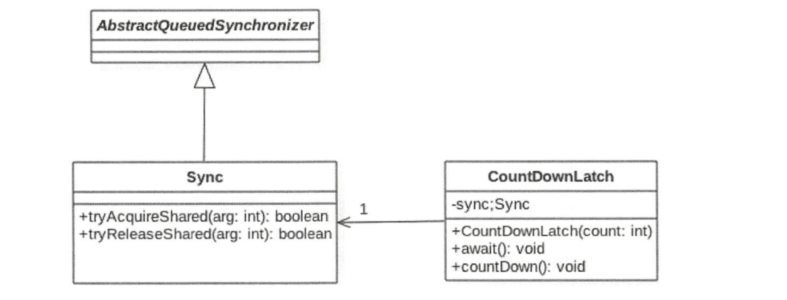
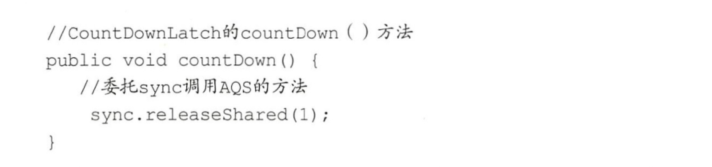
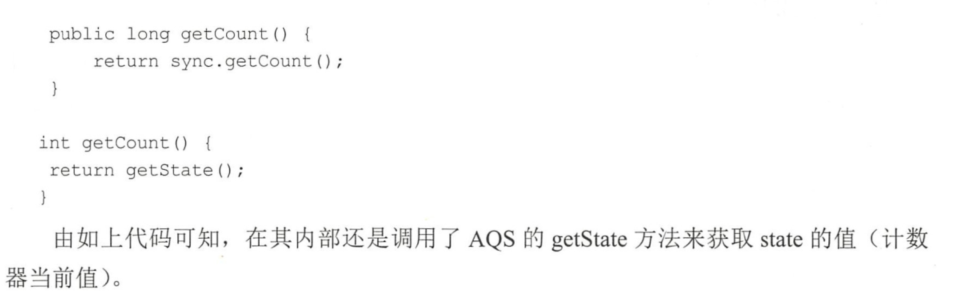
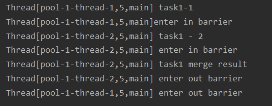
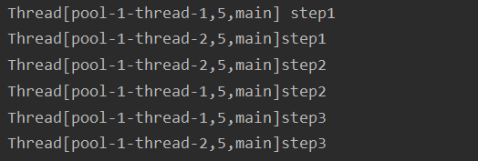
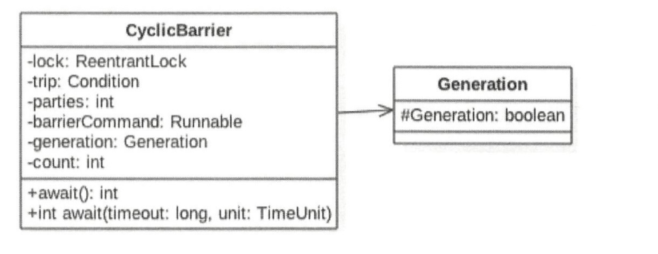
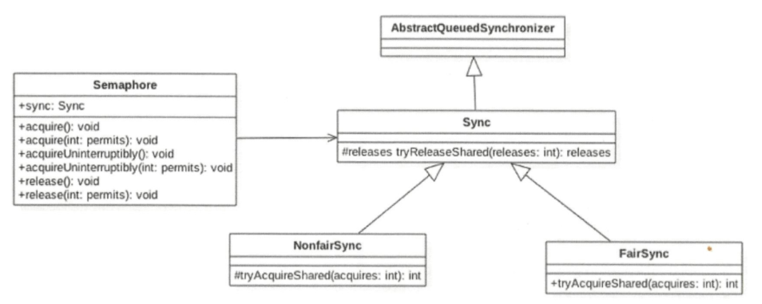
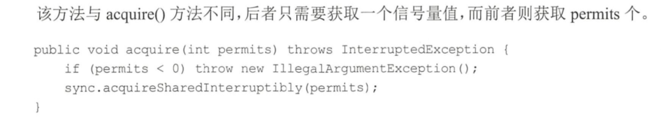

# CountDownLatch原理剖析

[jdk11 CountDownLatch](https://docs.oracle.com/en/java/javase/11/docs/api/java.base/java/util/concurrent/CountDownLatch.html)

## 案例介绍
在日常开发中经常会遇到需要在主线程中开启多个线程去并行执行任务，并且主线程需要等待所有子线程执行完毕后再进行汇总的场景。在CountDownLatch出现之前一般都使用线程的join（）方法来实现这一点，但是join方法不够灵活，不能够满足不同场景的需要，所以JDK开发组提供了CountDownLatch这个类，我们前面介绍的例子使用CountDownLatch会更优雅。使用CountDownLatch的代码如下：

```
public class JoinCountDownLatch {

    private static volatile CountDownLatch countDownLatch = new CountDownLatch(2);

    public static void main(String[] args) throws InterruptedException {
        Thread threadOne = new Thread(new Runnable() {
            @Override
            public void run() {
                try {
                    Thread.sleep(1000);
                } catch (InterruptedException e) {
                    e.printStackTrace();
                } finally {
                    countDownLatch.countDown();
                }
                System.out.println("threadOne over");
            }
        });

        Thread threadTwo = new Thread(new Runnable() {
            @Override
            public void run() {
                try {
                    Thread.sleep(2000);
                } catch (InterruptedException e) {
                    e.printStackTrace();
                } finally {
                    countDownLatch.countDown();
                }
                System.out.println("threadTwo over");
            }
        });

        threadOne.start();
        threadTwo.start();
        System.out.println("wait all thread over");
        countDownLatch.await();
        System.out.println("all child thread over!");
    }

}
```
在如上代码中，创建了一个CountDownLatch实例，因为有两个子线程所以构造函数的传参为2。主线程调用countDownLatch.await(）方法后会被阻塞。子线程执行完毕后调用countDownLatch.countDown（）方法让countDownLatch内部的计数器减1，所有子线程执行完毕并调用countDown(）方法后计数器会变为0，这时候主线程的await（）方法才会返回。

其实上面的代码还不够优雅，在项目实践中一般都避免直接操作线程，而是使用ExecutorService线程池来管理。使用ExecutorService时传递的参数是Runable或者Callable对象，这时候你没有办法直接调用这些线程的join（）方法，这就需要选择使用CountDownLatch了。将上面代码修改为如下：

```
public class JoinCountDownLatch2 {
    private static CountDownLatch countDownLatch = new CountDownLatch(2);

    public static void main(String[] args) throws InterruptedException {

        ExecutorService executorService = Executors.newFixedThreadPool(2);

        executorService.submit(new Runnable() {
            @Override
            public void run() {
                try {
                    Thread.sleep(1000);
                } catch (InterruptedException e) {
                    e.printStackTrace();
                } finally {
                    countDownLatch.countDown();
                }
                System.out.println("threadOne over");
            }
        });

        executorService.submit(new Runnable() {
            @Override
            public void run() {
                try {
                    Thread.sleep(2000);
                } catch (InterruptedException e) {
                    e.printStackTrace();
                } finally {
                    countDownLatch.countDown();
                }
                System.out.println("threadTwo over");
            }
        });

        System.out.println("wait all thread over");

        countDownLatch.await();
        System.out.println("all thread over");

        executorService.shutdownNow();
    }
}
```
这里总结下CountDownLatch与join方法的区别。一个区别是，调用一个子线程的join()方法后，该线程会一直被阻塞直到子线程运行完毕，而CountDownLatch则使用计数器来允许子线程运行完毕或者在运行中递减计数，也就是CountDownLatch可以在子线程运行的任何时候让await方法返回而不一定必须等到线程结束。另外，使用线程池来管线程时一般都是直接添加Runable到线程池，这时候就没有办法再调用线程的join方法了，就是说countDownLatch相比join方法让我们对线程同步有更灵活的控制。

## 实现原理探究
从CountDownLatch的名字就可以猜测其内部应该有个计数器，并且这个计数器是递减的。下面就通过源码看看JDK开发组在何时初始化计数器，在何时递减计数器，当计数器变为0日才做了什么操作，多个线程是如何通过计时器值实现同步的。



### void await()方法
当线程调用CountDownLatch对象的await方法后，当前线程会被阻塞，直到下面的情况之一发生才会返回：当所有线程都调用了CountDownLatch对象的countDown方法后，也就是计数器的值为0时；其他线程调用了当前线程的interrupt（）方法中断了当前线程，当前线程就会抛出InterruptedException异常，然后返回。

### void countDown方法
线程调用该方法后，计数器的值递减，递减后如果计数器值为0则唤醒所有因调用await方法而被阻塞的线程，否则什么都不做。下面看下countDown（）方法是如何调用AQS的方法的。



### long getCount()方法
获取当前计数器的值，也就是AQS的state的值，一般在测试时使用该方法。下面看下代码。



### 小结
本节首先介绍了CountDownLatch的使用，相比使用join方法来实现线程间同步，前者更具有灵活性和方便性。另外还介绍了CountDownLatch的原理，CountDownLatch是使用AQS实现的。使用AQS的状态变量来存放计数器的值。首先在初始化CountDownLatch时设置状态值（计数器值），当多个线程调用countdown方法时实际是原子性递减AQS的状态值。当线程调用await方法后当前线程会被放入AQS的阻塞队列等待计数器为0再返回。其他线程调用countdown方法让计数器值递减l，当计数器值变为0时，当前线程还要调用AQS的doReleaseShared方法来激活由于调用await（）方法而被阻塞的线程。

## 总结
本章介绍了并发包中关于线程协作的一些重要类。首先CountDownLatch通过计数器提供了更灵活的控制，只要检测到计数器值为0，就可以往下执行，这相比使用join必须等待线程执行完毕后主线程才会继续向下运行更灵活。另外，CyclicBarrier也可以达到CountDownLatch的效果，但是后者在计数器值变为0后，就不能再被复用，而前者则可以使用reset方法重置后复用，前者对同一个算法但是输入参数不同的类似场景比较适用。而Semaphore采用了信号量递增的策略，一开始并不需要关心同步的线程个数，等调用aquire方法时再指定需要同步的个数，并且提供了获取信号量的公平性策略。使用本章介绍的类会大大减少你在Java中使用wait、notify等来实现线程同步的代码量，在日常开发中当需要进行线程同步时使用这些同步类会节省很多代码并且可以保证正确性。

# 回环屏障CyclicBarrier原理探究
上节介绍的CountDownLatch在解决多个线程同步方面相对于调用线程的join方法己经有了不少优化，但是CountDownLatch的计数器是一次性的，也就是等到计数器值变为0后，再调用CountDownLatch的await和countdown方法都会立刻返回，这就起不到线程同步的效果了。所以为了满足计数器可以重置的需要，JDK开发组提供了CyclicBarrier类，并且CyclicBarrier类的功能并不限于CountDownLatch的功能。从字面意思理解，CyclicBarrier是回环屏障的意思，它可以让一组线程全部达到一个状态后再全部同时执行。这里之所以叫作回环是因为当所有等待线程执行完毕，并重置CyclicBarrier的状态后它可以被重用。之所以叫作屏障是因为线程调用await方法后就会被阻塞，这个阻塞点就称为屏障点，等所有线程都调用了await方法后，线程们就会冲破屏障，继续向下运行。

## 案例介绍
```
public class CycleBarrierTest1 {

    private static CyclicBarrier cyclicBarrier = new CyclicBarrier(2,new Runnable(){

        @Override
        public void run() {
            System.out.println(Thread.currentThread() + " task1 merge result");
        }
    });

    public static void main(String[] args) {
        ExecutorService executorService = Executors.newFixedThreadPool(2);

        executorService.submit(new Runnable() {
            @Override
            public void run() {
                try {
                    System.out.println(Thread.currentThread() + " task1-1");
                    System.out.println(Thread.currentThread() + "enter in barrier");
                    cyclicBarrier.await();
                    System.out.println(Thread.currentThread() + " enter out barrier");
                } catch (Exception e) {
                    e.printStackTrace();
                }
            }
        });

        executorService.submit(new Runnable() {
            @Override
            public void run() {
                try {
                    System.out.println(Thread.currentThread() + " task1 - 2");
                    System.out.println(Thread.currentThread() + " enter in barrier");
                    cyclicBarrier.await();
                    System.out.println(Thread.currentThread() + " enter out barrier");
                } catch (Exception e) {
                    e.printStackTrace();
                }
            }
        });

        executorService.shutdown();
    }

}
```
输出结果如下：

如上代码创建了一个CyclicBanier对象，其第一个参数为计数器初始值，第二个参数Runable是当计数器值为0时需要执行的任务。在main函数里面首先创建了一个大小为2的线程池，然后添加两个子任务到线程池，每个子任务在执行完自己的逻辑后会调用await方法。一开始计数器值为2，当第一个线程调用await方法时，计数器值会递减为1。由于此时计数器值不为0，所以当前线程就到了屏障点而被阻塞。然后第二个线程调用await时，会进入屏障，计数器值也会递减，现在计数器值为0，这时就会去执行CyclicBanier构造函数中的任务，执行完毕后退出屏障点，并且唤醒被阻塞的第二个线程，这时候第一个线程也会退出屏障点继续向下运行。

假设一个任务由阶段1、阶段2和阶段3组成，每个线程要串行地执行阶段1、阶段2和阶段3，当多个线程执行该任务时，必须要保证所有线程的阶段1全部完成后才能进入阶段2执行，当所有线程的阶段2全部完成后才能进入阶段3执行。下面使用CyclicBanier来完成这个需求。

```
public class CycleBarrierTest2 {

    private static CyclicBarrier cyclicBarrier = new CyclicBarrier(2);

    public static void main(String[] args) {
        ExecutorService executorService = Executors.newFixedThreadPool(2);

        executorService.submit(new Runnable() {
            @Override
            public void run() {
                try {
                    System.out.println(Thread.currentThread() + " step1");
                    cyclicBarrier.await();
                    System.out.println(Thread.currentThread() + "step2");
                    cyclicBarrier.await();
                    System.out.println(Thread.currentThread() + "step3");
                } catch (Exception e) {
                    e.printStackTrace();
                }
            }
        });

        executorService.submit(new Runnable() {
            @Override
            public void run() {
                try {
                    System.out.println(Thread.currentThread() + "step1");
                    cyclicBarrier.await();
                    System.out.println(Thread.currentThread() + "step2");
                    cyclicBarrier.await();
                    System.out.println(Thread.currentThread() + "step3");
                } catch (Exception e) {
                    e.printStackTrace();
                }
            }
        });

        executorService.shutdown();
    }

}
```
输出结果如下：



在如上代码中，每个子线程在执行完阶段1后都调用了await方法，等到所有线程都到达屏障点后才会一块往下执行，这就保证了所有线程都完成了阶段1后才会开始执行阶段2。然后在阶段2后面调用了await方法，这保证了所有线程都完成了阶段2后，才能开始阶段3的执行。这个功能使用单个CountDownLatch是无法完成的。

## 实现原理探究


由以上类图可知，CyclicBanier基于独占锁实现，本质底层还是基于AQS的。parties用来记录线程个数，这里表示多少线程调用await后，所有线程才会冲破屏障继续往下运行。而count一开始等于parties，每当有线程调用await方法就递减1，当count为0时就表示所有线程都到了屏障点。你可能会疑惑，为何维护parties和count两个变量，只使用count不就可以了？别忘了CycleBarier是可以被复用的，使用两个变量的原因是，parties始终用来记录总的线程个数，当count计数器值变为0后，会将parties的值赋给count,从而进行复用。

### int await()方法
当前线程调用CyclicBarrier的该方法时会被阻塞，直到满足下面条件之一才会返回：parties个线程都调用了await（）方法，也就是线程都到了屏障点；其他线程调用了当前线程的interrupt(）方法中断了当前线程，则当前线程会抛出Intem1ptedException异常而返回；与当前屏障点关联的Generation对象的broken标志被设置为true时，会抛出BrokenBarrierException异常，然后返回。

### boolean await(long timeout,TimeUnit unit)方法
当前线程调用CyclicBarrier的该方法时会被阻塞，直到满足下面条件之一才会返回：parties个线程都调用了await（）方法，也就是线程都到了屏障点，这时候返回true；设置的超时时间到了后返回false；其他线程调用当前线程的interrupt(）方法中断了当前线程，则当前线程会抛出InterruptedException异常然后返回；与当前屏障点关联的Generation对象的broken标志被设置为true时，会抛出BrokenBarrierException异常，然后返回。

### int dowait(boolean timed, long nanos)方法
该方法实现了CyclicBarrier的核心功能。

## 小结
本节首先通过案例说明了CycleBarrier与CountDownLatch的不同在于，前者是可以复用的，并且前者特别适合分段任务有序执行的场景。然后分析了CycleBaJTier，其通过独占锁ReentrantLock实现计数器原子性更新，并使用条件变量队列来实现线程同步。

# 信号量Semaphore原理探究
Semaphore信号量也是Java中的一个同步器，与CountDownLatch和CycleBarrier不同的是，它内部的计数器是递增的，并且在一开始初始化Semaphore时可以指定一个初始值，但是并不需要知道需要同步的线程个数，而是在需要同步的地方调用acquire方法时指定需要同步的线程个数。

## 案例介绍
同样下面的例子也是在主线程中开启两个子线程让它们执行，等所有子线程执行完毕后主线程再继续向下运行。**信号量Semaphore可以重复使用。**

```
public class SemaphoreTest {

    private static Semaphore semaphore = new Semaphore(0);

    public static void main(String[] args) throws InterruptedException {
        ExecutorService executorService = Executors.newFixedThreadPool(2);

        executorService.submit(new Runnable() {
            @Override
            public void run() {
                try {
                    System.out.println(Thread.currentThread() + " over");
                    semaphore.release();
                } catch (Exception e){
                    e.printStackTrace();
                }
            }
        });

        executorService.submit(new Runnable() {
            @Override
            public void run() {
                try {
                    System.out.println(Thread.currentThread() + " over");
                    semaphore.release();
                } catch (Exception e){
                    e.printStackTrace();
                }

            }
        });

        semaphore.acquire(2);
        System.out.println("all child thread over");

        executorService.shutdown();
    }

}
```
输出结果如下：


如上代码首先创建了一个信号量实例，构造函数的入参为0，说明当前信号量计数器的值为0。然后main函数向线程池添加两个线程任务，在每个线程内部调用信号量的release方法，这相当于让计数器值递增l。最后在main线程里面调用信号量的acquire方法，传参为2说明调用acquire方法的线程会一直阻塞，直到信号量的计数变为2才会返回。看到这里也就明白了，如果构造Semaphore时传递的参数为N，并在M个线程中调用了该信号量的release方法，那么在调用acquire使M个线程同步时传递的参数应该是M+N。

## 实现原理探究

为了能够一览Semaphore的内部结构，首先看下Semaphore的类图



### void acquire()方法
当前线程调用该方法的目的是希望获取一个信号量资源。如果当前信号量个数大于0,则当前信号量的计数会减1，然后该方法直接返回。否则如果当前信号量个数等于0，则当前线程会被放入AQS的阻塞队列。当其他线程调用了当前线程的interrupt（）方法中断了当前线程时，则当前线程会抛出InterruptedException异常返回。

### void acquire(int permits)方法


### void acquireUninterruptiblu方法
该方法与acquire（）类似，不同之处在于该方法对中断不响应，也就是当当前线程调用了acquireUninterruptibly获取资源时（包含被阻塞后），其他线程调用了当前线程的interrupt（）方法设置了当前线程的中断标志，此时当前线程并不会抛出InterruptedException异常而返回。

### void acquireUninterruptiblu(int permits)方法
该方法与acquire(intpermits）方法的不同之处在于，该方法对中断不响应。

### void release方法
该方法的作用是把当前Semaphore对象的信号量值增加1，如果当前有线程因为调用aquire方法被阻塞而被放入了AQS的阻塞队列，则会根据公平策略选择一个信号量个数能被满足的线程进行激活，激活的线程会尝试获取刚增加的信号量，下面看代码实现。

### void release(int permits)方法
该方法与不带参数的release方法的不同之处在于，前者每次调用会在信号量值原来的基础上增加permits，而后者每次增加1。


# 总结

本章介绍了并发包中关于线程协作的一些重要类。首先CountDownLatch通过计数器提供了更灵活的控制，只要检测到计数器值为0，就可以往下执行，这相比使用join必须等待线程执行完毕后主线程才会继续向下运行更灵活。另外，CyclicBarrier也可以达到CountDownLatch的效果，但是后者在计数器值变为0后，就不能再被复用，而前者则可以使用reset方法重置后复用，前者对同一个算法但是输入参数不同的类似场景比较适用。而Semaphore采用了信号量递增的策略，一开始并不需要关心同步的线程个数，等调用aquire方法时再指定需要同步的个数，并且提供了获取信号量的公平性策略。使用本章介绍的类会大大减少你在Java中使用wait、notify等来实现线程同步的代码量，在日常开发中当需要进行线程同步时使用这些同步类会节省很多代码并且可以保证正确性。


