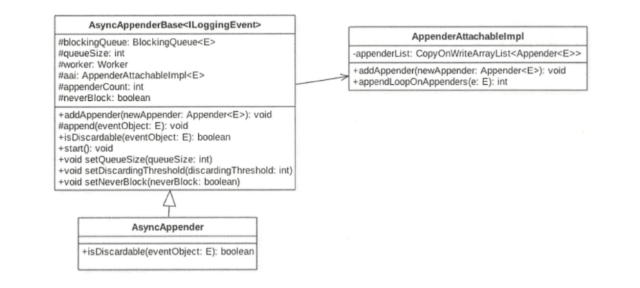
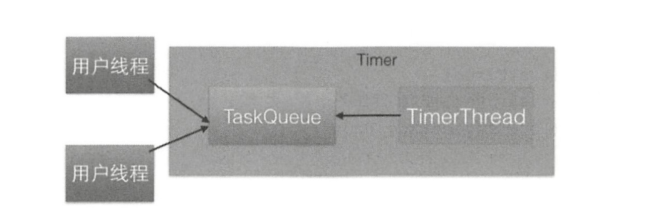

# ArrayBlockingQueue的使用
这一节我们讲解logback异步日志打印中ArrayBlockingQueue的使用。

## 异步日志打印模型概述
在高并发、高流量并且响应时间要求比较小的系统中同步打印日志已经满足不了需求了，这是因为打印日志本身是需要写磁盘的，写磁盘的操作会暂时阻塞调用打印日志的业务线程，这会造成调用线程的口增加。如下图所示为同步日志打印模型。


同步日志打印模型的缺点是将日志写入磁盘的操作是业务线程同步调用完成的，那么是否可以让业务线程把要打印的日志任务放入一个队列后直接返回，然后使用一个线程专门负责从队列中获取日志任务并将其写入磁盘呢？这样的话，业务线程打印日志的耗时就仅仅是把日志任务放入队列的耗时了，其实这就是logback提供的异步日志打印模型要做的事，具体如下图所示。


## 异步日志与具体实现
异步日志的xml配置中添加如下设置：


## 异步日志实现原理

首先从AsyncAppender的类图结构来认识下AsyncAppender的组件构成：



AsyncAppender继承自AsyncAppenderBase，其中后者具体实现了异步日志模型的主要功能，前者只是重写了其中的一些方法。由该图可知，logback中的异步日志队列是一个阻塞队列，其实就是有界阻塞队列ArrayBlockingQueue，其中queueSize表示有界队列的元素个数，默认为256个。

worker是个线程，也就是异步日志打印模型中的单消费者线程。aai是一个appender的装饰器，里面存放同步日志的appender，其中appenderCount记录aai里面附加的同步appender的个数。neverBlock用来指示当日志队列满时是否阻塞打印日志的线程。discardingThreshold是一个阀值，当日志队列里面的空闲元素个数小于该值时，新来的某些级别的日志会被直接丢弃，下面会具体讲。

首先我们来看何时创建日志队列，以及何时启动消费线程，这需要看AsyncAppenderBase的start方法。该方法在解析完配置AsyncAppenderBase的xml的节点元素后被调用。


由以上代码可知，logback使用的是有界队列ArrayBlockingQueue，之所以使用有界队列是考虑内存溢出问题。在高并发下写日志的QPS会很高，如果设置为无界队列，队列本身会占用很大的内存，很可能会造成OOM。

这里消费日志队列的worker线程被设置为守护线程，这意味着当主线程运行结束并且当前没有用户线程时，该worker线程会随着JVM的退出而终止，而不管日志队列里面是否还有日志任务未被处理。另外，这里设置了线程的名称，这是个很好的习惯，因为在查找问题时会很有帮助，根据线程名字就可以定位线程。

既然是有界队列，那么肯定需要考虑队列满的问题，是丢弃老的日志任务，还是阻塞日志打印线程直到队列有空余元素呢？要回答这个问题，我们需要看看具体进行日志打印的AsyncAppenderBase的append方法。


结合代码（5）和代码（7）可知，如果当前日志的级别小于等于INFO_INT并且当前队列的剩余容量小于discardingThreshold则会直接丢弃这些日志任务。


如果neverBlock被设置为false（默认为false）则会调用阻塞队列的put方法，而put是阻塞的，也就是说如果当前队列满，则在调用put方法向队列放入一个元素时调用线程会被阻塞直到队列有空余空间。这里可以看下put方法的实现。


到这里我们己经分析完了日志生产线程把日志任务放入日志队列的实现，下面一起来看消费线程是如何从队列里面消费日志任务并将其写入磁盘的。由于消费线程是一个线程，所以就从worker的run方法开始。


其中代码（11）使用take方法从日志队列获取一个日志任务，如果当前队列为空则当前线程会被阻塞直到队列不为空才返回。获取到日志任务后会调用AppenderAttachablelmpl的aai.appendLoopOnAppenders方法，该方法会循环调用通过addAppender注入的同步日志，appener具体实现把日志打印到磁盘。

## 小结
本节结合logback中异步日志的实现介绍了并发组件ArrayBlockingQueue的使用，包括put、offer方法的使用场景以及它们之间的区别，take方法的使用，同时也介绍了如何使用ArrayBlockingQueue来实现一个多生产者－单消费者模型。另外使用ArrayBlockingQueue时需要注意合理设置队列的大小以免造成OOM，队列满或者剩余元素比较少时，要根据具体场景制定一些抛弃策略以避免队列满时业务线程被阻塞。


# Tomcat的NioEndPoint中ConcurrentLinkedQueue的使用
先介绍Tomcat的容器结构以及NioEndPoint的作用，如下图所示是Tomcat的容器结构。


其中，Connector是一个桥梁，它把Server和Engine连接了起来，Connector的作用是接受客户端的请求，然后把请求委托给Engine容器处理。在Connector的内部具体使用Endpoint进行处理，根据处理方式的不同Endpoint可分为NioEndpoint、JloEndpoint、AprEndpoint。本节介绍NioEndpoint中的并发组件队列的使用。为了让读者更好地理解，有必要先说下NioEndpoint的作用。首先来看NioEndpoint中的三大组件的关系图：

- Acceptor是套接宇接受线程CSocketacceptorthread），用来接受用户的请求，并把请求封装为事件任务放入Poller的队列，一个Connector里面只有一个Acceptor。
- Poller是套接字处理线程（Socketpollerthread），每个Poller内部都有一个独有的队列，Poller线程则从自己的队列里面获取具体的事件任务，然后将其交给Worker进行处理。Poller线程的个数与处理器的核数有关，代码如下。


- Worker是实际处理请求的线程，Worker只是组件名字，真正做事情的是SocketProcessor，它是Poller线程从自己的队列获取任务后的真正任务执行者。

可见，Tomcat使用队列把接受请求与处理请求操作进行解耦，实现异步处理。其实Tomcat中NioEndPoint中的每个Poller里面都维护一个ConcurrentLinkedQueue，用来缓存请求任务，其本身也是一个多生产者，单消费者模型。

## 生产者-Acceptor线程
Acceptor线程的作用是接受客户端发来的连接请求并将其放入Poller的事件队列。首先看下Acceptor处理请求的简明时序图：


## 消费者-Poller线程

Poller线程的作用是从事件队列里面获取事件并进行处理。首先我们从时序图来全局了解下Poller线程的处理逻辑：


# 并发组件ConcurrentHashMap使用注意事项
ConcurrentHashMap虽然为并发安全的组件，但是使用不当仍然会导致程序错误。本通过简单的案例来复现这些问题，并给出开发时如何避免的策略。

这里借用直播的一个场景，在直播业务中，每个直播间对应一个topic，每个用户进入直播间时会把自己设备的ID绑定到这个topic上，也就是一个topic对应一堆用户设备。可以使用map来维护这些信息，其中key为topic,value为设备的list。下面使用代码来模拟多用户同时进入直播间时map信息的维护。
```
public class TestMap {

    //(1)创建map，key为topic，value为设备列表
    static ConcurrentHashMap<String, List<String>> map = new ConcurrentHashMap<>();

    public static void main(String[] args) {

        Thread threadOne = new Thread(new Runnable() {
            @Override
            public void run() {
                List<String> list1 = new ArrayList<>();
                list1.add("device1");
                list1.add("device2");

                map.put("topic1", list1);
                System.out.println(JSONObject.valueToString(map));
            }
        });

        Thread threadTwo = new Thread(new Runnable() {
            @Override
            public void run() {
                List<String> list2 = new ArrayList<>();
                list2.add("device11");
                list2.add("device22");
                map.put("topic1", list2);
                System.out.println(JSONObject.valueToString(map));
            }
        });

        Thread threadThree = new Thread(new Runnable() {
            @Override
            public void run() {
                List<String> list3 = new ArrayList<>();
                list3.add("device111");
                list3.add("device222");
                map.put("topic3", list3);
                System.out.println(JSONObject.valueToString(map));
            }
        });

        threadOne.start();
        threadTwo.start();
        threadThree.start();
    }

}
```


可见，topic1房间中的用户会丢失一部分，这是因为put方法如果发现map里面存在这个key，则使用value覆盖该key对应的老的value值。而putlfAbsent方法则是，如果发现己经存在该key则返回该key对应的value，但并不进行覆盖，如果不存在则新增该key，并且判断和写入是原子性操作。使用putlfAbsent替代put方法后的代码如下。

```
public class TestMap {

    //(1)创建map，key为topic，value为设备列表
    static ConcurrentHashMap<String, List<String>> map = new ConcurrentHashMap<>();

    public static void main(String[] args) {

        Thread threadOne = new Thread(new Runnable() {
            @Override
            public void run() {
                List<String> list1 = new ArrayList<>();
                list1.add("device1");
                list1.add("device2");

                List<String> oldList = map.putIfAbsent("topic1", list1);
//                map.put("topic1", list1);
                if (oldList != null){
                    oldList.addAll(list1);
                }
                System.out.println(JSONObject.valueToString(map));
            }
        });

        Thread threadTwo = new Thread(new Runnable() {
            @Override
            public void run() {
                List<String> list2 = new ArrayList<>();
                list2.add("device11");
                list2.add("device22");
//                map.put("topic1", list2);
                List<String> oldList = map.putIfAbsent("topic1", list2);
                if (oldList != null){
                    oldList.addAll(list2);
                }
                System.out.println(JSONObject.valueToString(map));
            }
        });

        Thread threadThree = new Thread(new Runnable() {
            @Override
            public void run() {
                List<String> list3 = new ArrayList<>();
                list3.add("device111");
                list3.add("device222");
//                map.put("topic3", list3);
                List<String> oldList = map.putIfAbsent("topic3", list3);
                if (oldList != null){
                    oldList.addAll(list3);
                }
                System.out.println(JSONObject.valueToString(map));
            }
        });

        threadOne.start();
        threadTwo.start();
        threadThree.start();
    }

}
```
运行结果：


总结：put(K key,V value）方法判断如果key己经存在，则使用value覆盖原来的值并返回原来的值，如果不存在则把value放入并返回null。而putlfAbsent(K key,V value）方法则是如果key己经存在则直接返回原来对应的值并不使用value覆盖，如果key不存在则放入value并返回null，另外要注意，判断key是否存在和放入是原子性操作。

# SimpleDateFormat是线程不安全的
SimpleDateFom1at是Java提供的一个格式化和解析日期的工具类，在日常开发中经常会用到，但是由于它是线程不安全的，所以多线程共用一个SimpleDateFormat实例对日期进行解析或者格式化会导致程序出错。本节来揭示它为何是线程不安全的，以及如何避免该问题。

## 问题复现
```
public class TestSimpleDateFormate {
    static SimpleDateFormat sdf = new SimpleDateFormat("yyyy-MM-dd HH:mm:ss");

    public static void main(String[] args) {
        //创建多个线程并启动
        for (int i = 0; i < 10; i ++){
            Thread thread = new Thread(new Runnable() {
                @Override
                public void run() {
                    try {
                        System.out.println(sdf.parse("2017-12-13 15:17:27"));
                    } catch (ParseException e) {
                        e.printStackTrace();
                    }
                }
            });
            thread.start();
        }
    }
}
```
执行结果：


代码(1）创建了SimpleDateFormat的一个实例，代码（2）创建10个线程，每个线程都共用同一个sdf对象对文本日期进行解析。多运行几次代码就会抛出java.lang.NumberFormatException异常，增加线程的个数有利于复现该问题。

## 问题分析
SimpleDateFormat的类图结构：


可以看到，每个SimpleDateFormat实例里面都有一个Calendar对象，后面我们就会知道，SimpleDateFormat之所以是线程不安全的，就是因为Calendar是线程不安全的。后者之所以是线程不安全的，是因为其中存放日期数据的变量都是线程不安全的，比如fields、time等。


解决办法：
- 第一种方式：每次使用时new一个SimpleDateFormat的实例，这样可以保证每个实例使用自己的Calendar实例，但是每次使用都需要new一个对象，并且使用后由于没有其他引用，又需要回收，开销会很大。
- 第二种方式：出错的根本原因是因为多线程下代码（3）、代码（4）和代码（5）三个步骤不是一个原子性操作，那么容易想到的是对它们进行同步，让代码(3）、代码（4）和代码（5）成为原子性操作。可以使用synchronized进行同步，具体如下。
```
public class TestSimpleDateFormate {
    static SimpleDateFormat sdf = new SimpleDateFormat("yyyy-MM-dd HH:mm:ss");

    public static void main(String[] args) {
        //创建多个线程并启动
        for (int i = 0; i < 10; i ++){
            Thread thread = new Thread(new Runnable() {
                @Override
                public void run() {
                    try {
                        synchronized (sdf){
                            System.out.println(sdf.parse("2017-12-13 15:17:27"));
                        }
                    } catch (ParseException e) {
                        e.printStackTrace();
                    }
                }
            });
            thread.start();
        }
    }
}
```
进行同步意味着多个线程要竞争锁，在高并发场景下这会导致系统响应性能下降。

- 第三种方式：使用ThreadLocal，这样每个线程只需要使用一个SimpleDateFormat实例，这相比第一种方式大大节省了对象的创建销毁开销，并且不需要使多个线程同步。使用ThreadLocal方式的代码如下。
```
public class TestSimpleDateFormate {
//    static SimpleDateFormat sdf = new SimpleDateFormat("yyyy-MM-dd HH:mm:ss");
    static ThreadLocal<DateFormat> safesdf = new ThreadLocal<DateFormat>(){
        @Override
        protected SimpleDateFormat initialValue() {
            return new SimpleDateFormat("yyyy-MM-dd HH:mm:ss");
        }
    };
    public static void main(String[] args) {
        //创建多个线程并启动
        for (int i = 0; i < 10; i ++){
            Thread thread = new Thread(new Runnable() {
                @Override
                public void run() {
                    try {
                        synchronized (safesdf){
                            System.out.println(safesdf.get().parse("2017-12-13 15:17:27"));
                        }
                    } catch (ParseException e) {
                        e.printStackTrace();
                    }
                }
            });
            thread.start();
        }
    }
    
    
}
```
代码(1）创建了一个线程安全的SimpleDateFormat实例，代码(3）首先使用get()方法获取当前线程下SimpleDateFormat的实例。在第一次调用ThreadLocal的get（）方法时，会触发其initialValue方法创建当前线程所需要的SimpleDateFormat对象。另外需要注意的是，在代码（4）中，使用完线程变量后，要进行清理，以避免内存泄漏。

# 使用Timer时需要注意的事情
当一个Timer运行多个TimerTask时，只要其中一个TimerTask在执行中向run方法外抛出了异常，则其他任务也会自动终止。

## 问题的产生
```
public class TestTimer {
    static Timer timer = new Timer();

    public static void main(String[] args) {
        timer.schedule(new TimerTask() {
            @Override
            public void run() {
                System.out.println("one task");
                try {
                    Thread.sleep(1000);
                } catch (InterruptedException e) {
                    e.printStackTrace();
                }
                throw new RuntimeException("error");
            }
        },500);

        timer.schedule(new TimerTask() {
            @Override
            public void run() {
                System.out.println("two task");

                    for (;;){
                        System.out.println("two task");
                        try {
                            Thread.sleep(1000);
                        } catch (InterruptedException e) {
                            e.printStackTrace();
                        }
                    }
            }
        },1000);

    }

}
```
输出结果如下：


## Timer实现原理分析



- TaskQueue是一个由平衡二叉树堆实现的优先级队列，每个Timer对象内部有一个TaskQueue队列。用户线程调用Timer的schedule方法就是把TimerTask任务添加到TaskQueue队列。在调用schedule方法时，longdelay参数用来指明该任务延迟多少时间执行。
- TimerThread是具体执行任务的线程，它从TaskQueue队列里面获取优先级最高的任务进行执行。需要注意的是，只有执行完了当前的任务才会从队列里获取下一个任务，而不管队列里是否有任务己经到了设置的delay时间。一个Timer只有一个TimerThread线程，所以可知Timer的内部实现是一个多生产者－单消费者模型。

```
 public void run() {
        try {
            mainLoop();
        } finally {
            // Someone killed this Thread, behave as if Timer cancelled
            synchronized(queue) {
                newTasksMayBeScheduled = false;
                queue.clear();  // Eliminate obsolete references
            }
        }
    }

    /**
     * The main timer loop.  (See class comment.)
     */
    private void mainLoop() {
        while (true) {
            try {
                TimerTask task;
                boolean taskFired;
                synchronized(queue) {
                    // Wait for queue to become non-empty
                    while (queue.isEmpty() && newTasksMayBeScheduled)
                        queue.wait();
                    if (queue.isEmpty())
                        break; // Queue is empty and will forever remain; die

                    // Queue nonempty; look at first evt and do the right thing
                    long currentTime, executionTime;
                    task = queue.getMin();
                    synchronized(task.lock) {
                        if (task.state == TimerTask.CANCELLED) {
                            queue.removeMin();
                            continue;  // No action required, poll queue again
                        }
                        currentTime = System.currentTimeMillis();
                        executionTime = task.nextExecutionTime;
                        if (taskFired = (executionTime<=currentTime)) {
                            if (task.period == 0) { // Non-repeating, remove
                                queue.removeMin();
                                task.state = TimerTask.EXECUTED;
                            } else { // Repeating task, reschedule
                                queue.rescheduleMin(
                                  task.period<0 ? currentTime   - task.period
                                                : executionTime + task.period);
                            }
                        }
                    }
                    if (!taskFired) // Task hasn't yet fired; wait
                        queue.wait(executionTime - currentTime);
                }
                if (taskFired)  // Task fired; run it, holding no locks
                    task.run();
            } catch(InterruptedException e) {
            }
        }
    }
}
```

 当任务在执行过程中抛出InterruptedException之外的异常时，唯一的消费线程就会因为抛出异常而终止，那么队列里的其他待执行的任务就会被清除。所以在TimerTask的run方法内最好使用try-catch结构捕捉可能的异常，不要把异常抛到run方法之外。其实要实现Timer功能，使用ScheduledThreadPoo!Executor的schedule是比较好的选择。如果ScheduledThreadPoolExecutor中的一个任务抛出异常，其他任务则不受影响。

```
public class TestScheduleThreadPoolExecutor {
    static ScheduledThreadPoolExecutor scheduledThreadPoolExecutor = new ScheduledThreadPoolExecutor(1);

    public static void main(String[] args) {

        scheduledThreadPoolExecutor.schedule(new Runnable() {
            @Override
            public void run() {
                System.out.println("one task");
                try {
                    Thread.sleep(1000);
                } catch (InterruptedException e) {
                    e.printStackTrace();
                }
                throw new RuntimeException("error");
            }
        },500, TimeUnit.MILLISECONDS);

        scheduledThreadPoolExecutor.schedule(new Runnable() {
            @Override
            public void run() {
                for (int i = 0; i < 2; i ++){
                    System.out.println("two task");
                    try {
                        Thread.sleep(1000);
                    } catch (InterruptedException e) {
                        e.printStackTrace();
                    }
                }
            }
        },1000,TimeUnit.MILLISECONDS);

        scheduledThreadPoolExecutor.shutdown();
    }
}
```
运行结果如下：


之所以ScheduledThreadPoolExecutor的其他任务不受抛出异常的任务的影响，是因为在ScheduledThreadPoolExecutor中的ScheduledFutureTask任务中catch掉了异常，但是在线程池任务的run方法内使用catch捕获异常并打印日志是最佳实践。

## 小结
ScheduledThreadPoolExecutor是并发包提供的组件，其提供的功能包含但不限于TimeroTimer是固定的多线程生产单线程消费，但是ScheduledThreadPoolExecutor是可以配置的，既可以是多线程生产单线程消费也可以是多线程生产多线程消费，所以在日常开发中使用定时器功能时应该优先使用ScheduledThreadPoolExecutor。


# 对需要复用但是会被下游修改的参数要进行深复制

本节通过一个简单的消息发送例子说明了需要复用但是会被下游修改的参数要进行深复制 ， 否则会导致出现错误 的结果 ； 另外引 用类型作为集合元素时 ，如果使用这个集合作为另外一个集合的构造函数参数，会导致两个集合里面的同一个位置的元素指向的是同一个 引 用，这会导致对引 用的修改在两个集合中都可见，所 以这时候需要对引用元素进行深复制。

#  创建线程和线程池时要指定与业务相关的名称

在日常开发中，当在一个应用中需要创建多个钱程或者线程池时最好给每个线程或者线程池根据业务类型设置具体的名称，以便在出现问题时方便进行定位。下面就通过实例来说明不设置为何难以定位问题，以及如何进行设置 。
## 创建线程需要有线程名称

```
public class TestNoNameThread {
    public static void main(String[] args) {
        Thread threadOne = new Thread(new Runnable() {
            @Override
            public void run() {
                System.out.println("保存订单的线程");
                try {
                    Thread.sleep(500);
                } catch (InterruptedException e) {
                    e.printStackTrace();
                }
                throw new NullPointerException();
            }
        });

        Thread threadTwo = new Thread(new Runnable() {
            @Override
            public void run() {
                System.out.println("保存收货地址的线程");
            }
        });
        
        threadOne.start();
        threadTwo.start();
    }
}
```
运行结果如下：


从运行结果可知，不能确定产生异常的线程是哪个。如果调用没有指定线程名称的方法创建线程，其内部会使用”Thread-" + nextThreadNum（）作为线程的默认名称。

当一个系统 中有多个业务模块而每个模块又都使用自己的线程时，除非抛出与业务相关的异常，否则你根本没法判断是哪一个模块出现了问题 。现在修改代码给线程创建的时候定义好名称。

`new Thread(new Runnable(){},"ThreadName")`

## 创建线程池时也需要指定线程池的名称

创建线程池指定名称方法：

`static ThreadPoolExecutor executor = new ThreadPoolExecutor(5, 5, 1, TimeUnit.MILLISECONDS, new LinkedBlockingDeque<>(), new ThreadFactory() );`

## 小结
本节通过简单的例子介绍 了为何不为线程或者线程池起名字会给 问题排查带来麻烦 ，然后通过源码分析介绍了线程和线程池名称及默认名称是如何来 的， 以及如何定义线程池名称以便追溯问题。另外，在run方法内使用try-catch块，避免将异常抛到run方法之外，同时打印日志也是一个最佳实践。

# 使用线程池的情况下当程序结束时记得调用shutdown关闭线程池
在日常开发中为了便于线程的有效复用，经常会用到线程池，然而使用完线程池后如果不调用shutdown关闭线程池，则会导致线程池资源一直不被释放。下面通过简单的例子来说明该问题。

## 问题复现
下面通过一个例子说明如果不调用线程池对象的shutdown方法关闭线程池，则当线程池里面的任务执行完毕并且主线程已经退出后，JNM仍然存在。

```
public class TestShutDown {

    static void asynExecuteOne(){
        ExecutorService executor = Executors.newSingleThreadExecutor();
        executor.execute(new Runnable() {
            @Override
            public void run() {
                System.out.println("--async execute one ---");
            }
        });
    }

    static void asynExecuteTwo(){
        ExecutorService executor = Executors.newSingleThreadExecutor();
        executor.execute(new Runnable() {
            @Override
            public void run() {
                System.out.println("-async execute two -");
            }
        });
        
    }

    public static void main(String[] args) {
        System.out.println("---sync execute ---");
        asynExecuteOne();
        asynExecuteTwo();
        System.out.println("over");
    }
}
```
执行结果：显示系统还在运行，说明JVM还未退出，需要执行线程池的关闭。


## 问题分析
大家或许还记得在基础篇讲解的守护线程与用户线程，JVM退出的条件是当前不存在用户线程，而线程池默认的ThreadFactory创建的线程是用户线程。


由如上代码可知，线程池默认的ThreadFactory创建的都是用户线程。而线程池里面的核心线程是一直存在的，如果没有任务则会被阻塞，所以线程池里面的用户线程一直存在。而shutdown方法的作用就是让这些核心线程终止，下面简单看下shutdown的主要代码。


## 小结
本节通过一个简单的使用线程池异步执行任务的案例介绍了使用完线程池后如果不调用shutdown方法，则会导致线程池的线程资源一直不会被释放，并通过源码分析了没有被释放的原因。所以在日常开发中使用线程池后一定不要忘记调用shutdown方法关闭 。

# 线程池使用FutureTask时需要注意的事情
线程池使用FutureTask时如果把拒绝策略设置为DiscardPolicy和DiscardOldestPolicy,并且在被拒绝的任务的Fu阳re对象上调用了无参get方法，那么调用线程会一直被阻塞。
# 使用ThreadLocal不当可能会导致内存泄露
在基础篇己经讲解了 ThreadLocal 的原理，本节着重介绍使用 ThreadLocal 会导致内存泄漏的原因，并给出使用 ThreadLocal 导致内存泄漏的案例 。

## 为何会出现内存泄露
在基础篇我们讲了，ThreadLocal只是一个工具类，具体存放变量的是线程的threadLocals变量。threadLocals是一个ThreadLocalMap类型的变量，该类型如下图所示。


ThreadLocalMap内部是一个Entry数组，Entry继承自WeakReference,Entrγ内部的value用来存放通过ThreadLocal的set方法传递的值，那么ThreadLocal对象本身存放到哪里了呢？下面看看Entry的构造函数。


k被传递给WeakReference的构造函数，也就是说ThreadLoca!Map里面的key为ThreadLocal对象的弱引用，具体就是referent变量引用了ThreadLocal对象，value为具体调用ThreadLocal的set方法时传递的值。

考虑这个ThreadLocal变量没有其他强依赖，而当前线程还存在的情况，由于线程的ThreadLocalMap里面的key是弱依赖，所以当前线程的ThreadLoca!Map里面的ThreadLocal变量的弱引用会在gc的时候被回收，但是对应的value还是会造成内存泄漏，因为这时候ThreadLocalMap里面就会存在key为null但是value不为null的entry项。

**总结：**ThreadLocalMap的Entry中的key使用的是对ThreadLocal对象的弱引用，这在避免内存泄漏方面是一个进步，因为如果是强引用，即使其他地方没有对ThreadLocal对象的引用，ThreadLocalMap中的ThreadLocal对象还是不会被回收，而如果是弱引用则ThreadLocal引用是会被回收掉的。但是对应的value还是不能被回收，这时候ThreadLocalMap里面就会存在key为null但是value不为null的entry项，虽然ThreadLocalMap提供了set、get和remove方法，可以在一些时机下对这些Entry项进行清理，但是这是不及时的，也不是每次都会执行，所以在一些情况下还是会发生内存漏，因此在使用完毕后及时调用remove方法才是解决内存泄漏问题的王道。

[Thread ThreadLocal和ThreadLocalMap，用法+原理](https://zhuanlan.zhihu.com/p/158033837)

## 在线程池中使用ThreadLocal导致的内存泄漏

**举例**
```
public class ThreadPoolTest {

    static class LocalVariable{
        private long[] a = new long[1024*1024];
    }

    //(1)
    final static ThreadPoolExecutor pooleExecutor = new ThreadPoolExecutor(5,5,1, TimeUnit.MILLISECONDS,new LinkedBlockingDeque<>());
    //(2)
    final static ThreadLocal<LocalVariable> localvariable = new ThreadLocal<>();

    public static void main(String[] args) throws InterruptedException {
        //(3)
        for (int i = 0; i < 50; i ++){
            pooleExecutor.execute(new Runnable() {
                @Override
                public void run() {
                    //(4)
                    localvariable.set(new LocalVariable());
                    //(5)
                    System.out.println("use local variable");
                    //localVariable.remove();
                }
            });
            Thread.sleep(1000);
        }

        //(6)
        System.out.println("pool execute over");

    }
}
```
- 代码（l）创建了一个核心线程数和最大线程数都为5的线程池。
- 代码（2）创建了一个ThreadLocal的变量，泛型参数为LocalVariable,LocalVariable内部是一个Long数组。
- 代码(3）向线程池里面放入50个任务。
- 代码（4）设置当前线程的loca!Variable变量，也就是把new的LocalVariable变量放入当前线程的threadLocals变量中。
- 由于没有调用线程池的shutdown或者shutdownNow方法，所以线程池里面的用户线程不会退出，进而只fM进程也不会退出。

第一次运行代码时，在设置线程的localVariable变量后没有调用localvariable.remove()方法，这导致线程池里面5个核心线程的threadLocals变量里面的newLocalVariable（）实例没有被释放。虽然线程池里面的任务执行完了，但是线程池里面的5个线程会一直存在直到JVM进程被杀死。这里需要注意的是，由于localVariable被声明为了static变量，虽然在线程的ThreadLocalMap里面对localVariable进行了弱引用，但是localVariable不会被回收。第二次运行代码时，由于线程在设置localVariable变量后及时调用了localVariable.remove（）方法进行了清理，所以不会存在内存泄漏问题。

**总结：**如果在线程池里面设置了ThreadLocal变量，则一定要记得及时清理，因为线程池里面的核心线程是一直存在的，如果不清理，线程池的核心线程的threadLocals变量会一直持有ThreadLocal变量。

# 在Tomcat的Servlet中使用ThreadLocal导致内存泄露

**举例**


如果在访问该Servlet的同时打开jconsole观察堆内存，会发现内存飘升，究其原因是因为工作线程在调用Serviet的doGet方法时，工作线程的threadLocals变量里面被添加了LocalVariable实例，但是后来没有清除。另外多次访问该Servlet可能使用的不是工作线程池里面的同一个线程，这会导致工作线程池里面多个线程都会存在内存泄漏问题。