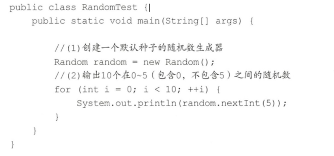
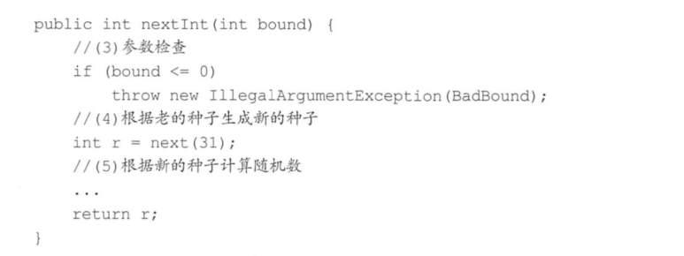
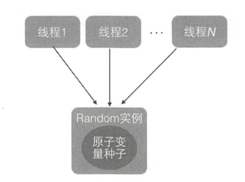
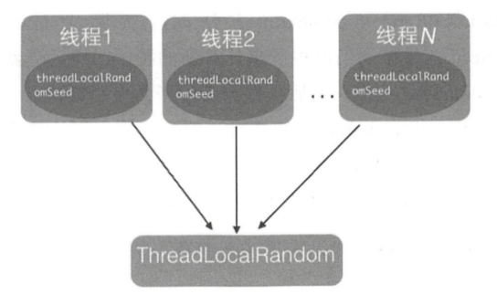
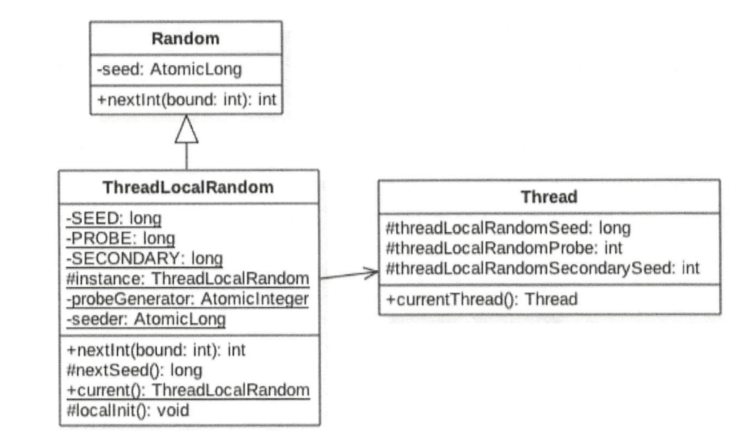

# Random类及其局限性
在JDK7之前包括现在，java.util.Random都是使用比较广泛的随机数生成工具类，而且java.Iang.Math中的随机数生成也使用的是java.util.Random的实例。下面先看看java.util.Random的使用方法。



随机数的生成需要一个默认的种子，这个种子其实是一个long类型的数字，你可以在创建Random对象时通过构造函数指定，如果不指定则在默认构造函数内部生成一个默认的值。有了默认的种子后，如何生成随机数呢？

随机数的生成需要一个默认的种子，这个种子其实是一个long类型的数字，你可以在创建Random对象时通过构造函数指定，如果不指定则在默认构造函数内部生成一个默认的值。有了默认的种子后，如何生成随机数呢？



由此可见，新的随机数的生成需要两个步骤：
- 首先根据老的种子生成新的种子
- 然后根据新的种子来计算新的随机数

其中步骤（4）我们可以抽象为seed=f(seed），其中f是一个固定的函数，比如seed=f(seed)=a*seed+b：步骤（5）也可以抽象为g(seed,bound），其中g是一个固定的函数，比如g(seed,bound)=(int)((bound*(long)seed)>>31）。在单线程情况下每次调用nextlnt都是根据老的种子计算出新的种子，这是可以保证随机数产生的随机性的。但是在多线程下多个线程可能都拿同一个老的种子去执行步骤（4）以计算新的种子，这会导致多个线程产生的新种子是一样的，由于步骤（5）的算法是固定的，所以会导致多个线程产生相同的随机值，这并不是我们想要的。所以步骤（4）要保证原子性，也就是说当多个线程根据同一个老种子计算新种子时，第一个线程的新种子被计算出来后，第二个线程要丢弃自己老的种子，而使用第一个线程的新种子来计算自己的新种子，依此类推，只有保证了这个，才能保证在多线程下产生的随机数是随机的。Random函数使用一个原子变量达到了这个效果，在创建Random对象时初始化的种子就被保存到了种子原子变量里面。

```
protected int next(int bits) {
    long oldseed, nextseed;
    AtomicLong seed = this.seed;
    do {
        oldseed = seed.get();
        nextseed = (oldseed * multiplier + addend) & mask;
    } while (!seed.compareAndSet(oldseed, nextseed));
    return (int)(nextseed >>> (48 - bits));
}
```
代码中`!seed.compareAndSet(oldseed, nextseed)`是CAS操作，保证只有一个线程可以更新老的种子为新的，失败的线程会通过循环重新获取更新后的种子作为当前种子去计算老的种子，这就解决了上面提到的问题，保证了随机数的随机性。

# ThreadLocalRandom
为了弥补多线程高并发情况下Random的缺陷，在JUC包下新增了ThreadLocalRandom类。

下面来分析下ThreadLocalRandom的实现原理。从名字上看它会让我们联想到在基础篇中讲解的ThreadLocal;ThreadLocal通过让每一个线程复制一份变量，使得在每个线程对变量进行操作时实际是操作自己本地内存里面的副本，从而避免了对共享变量进行同步。实际上ThreadLocalRandom的实现也是这个原理，Random的缺点是多个线程会使用同一个原子性种子变量，从而导致对原子变量更新的竞争，如图下所示。



如果每个线程都维护一个种子变量，则每个线程生成随机数时都根据自己老的种子计算新的种子，并使用新种子更新老的种子，再根据新种子计算随机数，就不会存在竞争问题了，这会大大提高并发性能。原理如下图：



# 源码分析
ThreadLocalRandom的类图结构：



从图中可以看出ThreadLocalRandom类继承了Random类并重写了nextInt方法，在ThreadLocalRandom类中并没有使用继承自Random类的原子性种子变量。在ThreadLocalRandom中并没有存放具体的种子，具体的种子存放在具体的调用线程的threadLocalRandomSeed变量里面。ThreadLocalRandom类似于ThreadLocal类，就是个工具类。当线程调用ThreadLocalRandom的current方法时，ThreadLocalRandom负责初始化调用线程的threadLocalRandomSeed变量，也就是初始化种子。

当调用ThreadLocalRandom的nextInt方法时，实际上是获取当前线程的threadLocalRandomSeed变量作为当前种子来计算新的种子，然后更新新的种子到当前线程的threadLocalRandomSeed变量，而后再根据新种子并使用具体算法计算随机数。这里需要注意的是，threadLocalRandomSeed变量就是Thread类里面的一个普通long变量，它并不是原子性变量。其实道理很简单，因为这个变量是线程级别的，所以根本不需要使用原子性变量，如果你还是不理解可以思考下ThreadLocal的原理。
