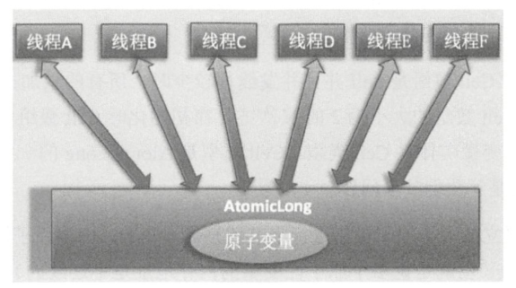
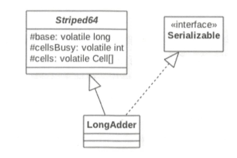

# 原子变量操作
JUC并发包中包含有Atomiclnteger、AtomicLong和AtomicBoolean等原子性操作类，它们的原理类似，本章讲解AtomicLong类。**AtomicLong是原子性递增或者递减类**，其内部使用Unsafe来实现。在多线程中，如果定义共享变量并多线程处理，就要使用上述类型参数，保证运行的原子性。或者用普通类，实现计数等类似功能需要使用一定的同步措施。

# JKD8新增的原子操作类LongAdder
## LongAdder简单介绍
AtomicLong通过CAS提供了非阻塞的原子性操作，相比使用阻塞算法的同步器来说它的性能己经很好了，但是JDK开发组并不满足于此。使用AtomicLong时，在高并发下大量线程会同时去竞争更新同一个原子变量，但是由于同时只有一个线程的CAS操作会成功，这就造成了大量线程竞争失败后，会通过无限循环不断进行自旋尝试CAS的操作，而这会白白浪费CPU资源。

因此JDK8新增了一个原子性递增或者递减类LongAdder用来克服在高并发下使用AtomicLong的缺点。既然AtomicLong的性能瓶颈是由于过多线程同时去竞争一个变量的更新而产生的，那么如果把一个变量分解为多个变量，让同样多的线程去竞争多个资源，是不是就解决了性能问题？是的，LongAdder就是这个思路。下面通过图来理解两者设计的不同之处。

使用LongAdder时，则是在内部维护多个Cell变量，每个Cell里面有一个初始值为0的long型变量，这样，在同等并发量的情况下，争夺单个变量更新操作的线程量会减少，这变相地减少了争夺共享资源的并发量。另外，多个线程在争夺同一个Cell原子变量时如果失败了，它并不是在当前Cell变量上一直自旋CAS重试，而是尝试在其他Cell的变量上进行CAS尝试，这个改变增加了当前线程重试CAS成功的可能性。最后，在获取LongAdder当前值时，是把所有Cell变量的value值累加后再加上base返回的。

## LongAdder代码分析

为了解决高并发下多线程对一个变量CAS争夺失败后进行自旋而造成的降低并发性能问题，LongAdder在内部维护多个Cell元素（一个动态的Cell数组）来分担对单个变量进行争夺的开销。下面围绕以下话题从源码角度来分析LongAdder的实现：（1)LongAdder的结构是怎样的？(2）当前线程应该出问Cell数组里面的哪一个Cell元素？(3)如何初始化Cell数组？C4)Cell数组如何扩容？(5）线程访问分配的Cell元素有冲突后如何处理？(6）如何保证线程操作被分配的Cell元素的原子性？

LongAdder的类图：

由该图可知，LongAdder类继承自Striped64类，在Striped64内部维护着三个变量。LongAdder的真实值其实是base的值与Cell数组里面所有Cell元素中的value值的累加，base是个基础值，默认为0。cellsBusy用来实现自旋锁，状态值只有0和l，当创建Cell元素，扩容Cell数组或者初始化Cell数组时，使用CAS操作该变量来保证同时只有一个线程可以进行其中之一的操作。

## 总结
本节介绍了JDK8中新增的LongAdder原子性操作类，该类通过内部cells数组分担了高并发下多线程同时对一个原子变量进行更新时的竞争量，让多个线程可以同时对cells数组里面的元素进行并行的更新操作。另外，数组元素Cell使用＠sun.misc.Contended注解进行修饰，这避免了cells数组内多个原子变量被放入同一个缓存行，也就是避免了伪共享，这对性能也是一个提升。

本章介绍了并发包中的原子性操作类，这些类都是使用非阻塞算法CAS实现的，这相比使用锁实现原子性操作在性能上有很大提高。首先讲解了最简单的AtomicLong类的实现原理，然后讲解了JDK8中新增的LongAdder类和LongAccumulator类的原理。学习完本章后，希望读者在实际项目环境中能因地制直地使用原子性操作类来提升系统性能。
