# LockSupport工具类
JDK中的11.jar包里面的LockSupport是个工具类，它的主要作用是挂起和唤醒线程，该工具类是创建锁和其他同步类的基础。LockSupport类与每个使用它的线程都会关联一个许可证，在默认情况下调用LockSupport类的方法的线程是不持有许可证的。LockSupport是使用Unsafe类实现的，下面介绍LockSupport中的几个主要函数。

## void park()方法
如果调用park方法的线程已经拿到了与LockSupport关联的许可证，则调用Locksupport.park（）时会马上返回，否则调用线程会被禁止参与线程的调度，也就是会被阻塞挂起。

如下代码直接在main函数里面调用park方法，最终只会输出beginpark！，然后当前线程被挂起，这是因为在默认情况下调用线程是不持有许可证的。

```
public class TestLockSupport {
    public static void main(String[] args) {
        System.out.println("begin park!");
        LockSupport.park();
        System.out.println("end park!");
    }
}
```

**在其他线程调用unpark(Thread thread）方法并且将当前线程作为参数时，调用park方法而被阻塞的线程会返回。另外，如果其他线程调用了阻塞线程的interrupt（）方法，设置了中断标志或者线程被虚假唤醒，则阻塞线程也会返回。所以在调用park方法时最好也使用循环条件判断方式。**需要注意的是，因调用park（）方法而被阻塞的线程被其他线程中断而返回时并不会抛出InterruptedException异常。

## void unpark(Thread thread)方法
当一个线程调用unpark时，如果参数thread线程没有持有thread与LockSupport类关联的许可证，则让thread线程持有。如果thread之前因调用park（）而被挂起，则调用unpark后，该线程会被唤醒。如果thread之前没有调用park，则调用unpark方法后，再调用park方法，其会立刻返回。修改代码如下。

```
public class TestLockSupport {
    public static void main(String[] args) throws InterruptedException {
        System.out.println("begin park!");
        
        //使当前线程获取到许可证
        LockSupport.unpark(Thread.currentThread());

        LockSupport.park();
        System.out.println("end park!");
    }
}
```
主线程然后执行unpark方法，参数为子线程，这样做的目的是让子线程持有许可证，然后子线程调用的park方法就返回了。使用unpark和park是成对出现的，不区分先后顺序。

park方法返回时不会告诉你因何种原因返回，所以调用者需要根据之前调用park方法的原因，再次检查条件是否满足，如果不满足则还需要再次调用park方法。

例如，根据调用前后中断状态的对比就可以判断是不是因为被中断才返回的。

为了说明调用park方法后的线程被中断后会运回，我们修改上面的例子代码，删除LockSupport.unpark(thread）；然后添加thread.interrupt（）；具体代码如下。
```
public class TestLockSupport {
    public static void main(String[] args) throws InterruptedException {
        Thread thread = new Thread(new Runnable() {
            @Override
            public void run() {
                System.out.println("child thread begin park!");
                while (!Thread.currentThread().isInterrupted()) {
                    LockSupport.park();
                }
//                LockSupport.park();
                System.out.println("child thread unpark!");
            }
        });

        //启动子线程
        thread.start();

        Thread.sleep(1000);
        
        
        System.out.println("main thread begin unpark!");
        //中断子线程
        thread.interrupt();
//        LockSupport.unpark(thread);
    }
}
```
在如上代码中，只有中断子线程，子线程才会运行结束，如果子线程不被中断，即使你调用unpark(thread）方法子线程也不会结束。**在使用LockSupport.park()方法阻塞线程后，使用interrupt（）方法、设置了中断标志或者线程被虚假唤醒，则阻塞线程也会返回。**

## void parkNanos(long nanos)方法
和park方法类似，如果调用park方法的线程已经拿到了与LockSupport关联的许可证，则调用LockSupport.parkNanos(longnanos）方法后会马上返回。该方法的不同在于，如果没有拿到许可证，则调用线程会被挂起nanos时间后修改为自动返回。

```
public class TestPark {

    public void testPark(){
        LockSupport.park();//1
    }

    public static void main(String[] args) {
        TestPark testPark = new TestPark();
        testPark.testPark();
    }

}
```
运行jstack pid看到的信息，可以看到是那出错，但是不明显

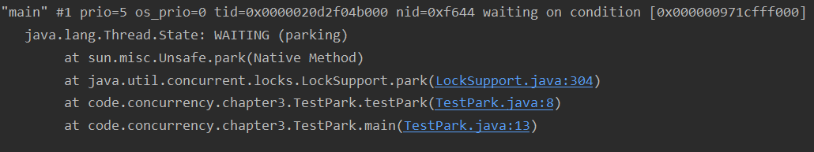

将代码（1）改为LockSupport.park(this）后运行代码，输出结果为：

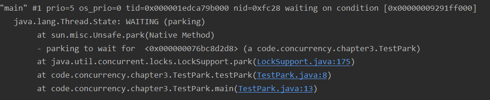

使用带blocker参数的park方法，线程堆栈可以提供更多有关阻塞对象的信息。

## park(Object bloker)方法
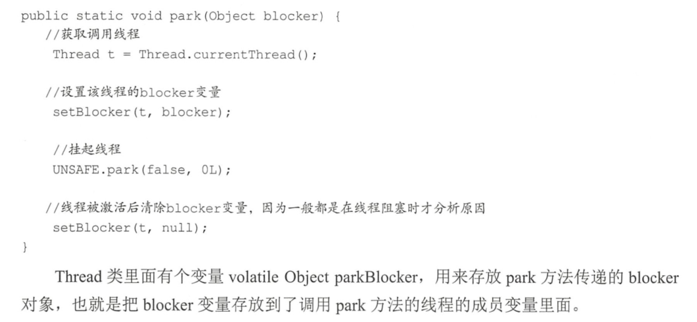

## void parkNanos(Object bloker,long nanos)方法
相比park（Object bloker）方法多了个超时时间

## void parkUntil(Object bloker,long deadline)方法
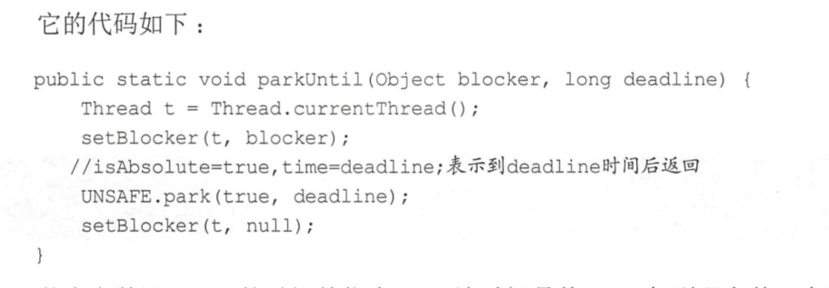

其中参数deadline的时间单位为ms，该时间是从1970年到现在某一个时间点的毫秒值。这个方法和parkNanos(Objectblocker,longnanos）方法的区别是，后者是从当前算等待nanos秒时间，而前者是指定一个时间点，比如需要等到2017.12.11日12:00:00，则把这个时间点转换为从1970年到这个时间点的总毫秒数。

# 抽象同步队列AQS概述
## AQS —— 锁的底层支持
AbstractQueuedSynchronizer抽象同步队列简称AQS，它是实现同步器的基础组件，并发包中锁的底层就是使用AQS实现的。另外，大多数开发者可能永远不会直接使用AQS，但是知道其原理对于架构设计还是很有帮助的。下面看下AQS的类图结构

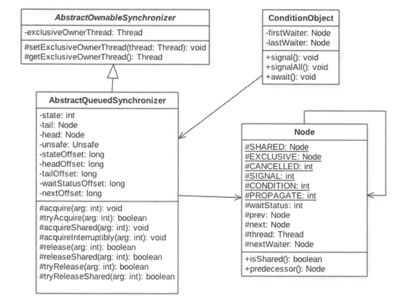

AQS是一个FIFO的双向队列，其内部通过节点head和tail记录队首和队尾元素，队列元素的类型为Node。其中Node中的thread变量用来存放进入AQS队列里面的线程：Node节点内部的SHARED用来标记该线程是获取共享资源时被阻塞挂起后放入AQS队列的，EXCLUSIVE用来标记线程是获取独占资源时被挂起后放入AQS队列的；waitStatus记录当前线程等待状态，可以为CANCELLED（线程被取消了）、SIGNAL（线程需要被唤醒）、CONDITION（线程在条件队列里面等待〉、PROPAGATE（释放共享资源时需要通知其他节点〕；prev记录当前节点的前驱节点，next记录当前节点的后继节点。

在AQS中维持了一个单一的状态信息state，可以通过getState、setState、compareAndSetState函数修改其值。对于ReentrantLock的实现来说，state可以用来表示当前线程获取锁的可重入次数；对于读写锁ReentrantReadWriteLock来说，state的高16位表示读状态，也就是获取该读锁的次数，低16位表示获取到写锁的线程的可重入次数；对于semaphore来说，state用来表示当前可用信号的个数：对于CountDownlatch来说，state用来表示计数器当前的值。

使用独占方式获取的资源是与具体线程绑定的，就是说如果一个线程获取到了资源，就会标记是这个线程获取到了，其他线程再尝试操作state获取资源时会发现当前该资源不是自己持有的，就会在获取失败后被阻塞。比如独占锁ReentrantLock的实现，当一个线程获取了ReerrantLock的锁后，在AQS内部会首先使用CAS操作把state状态值从0变为1，然后设置当前锁的持有者为当前线程，当该线程再次获取锁时发现它就是锁的持有者，则会把状态值从l变为2，也就是设置可重入次数，而当另外一个线程获取锁时发现自己并不是该锁的持有者就会被放入AQS阻塞队列后挂起。

对应共享方式的资源与具体线程是不相关的，当多个线程去请求资源时通过CAS方式竞争获取资源，当一个线程获取到了资源后，另外一个线程再次去获取时如果当前资源还能满足它的需要，则当前线程只需要使用CAS方式进行获取即可。

**在独占方式下，获取与释放资源的流程如下：**
1. 当一个线程调用acquire(intarg）方法获取独占资源时，会首先使用tryAcquire方法尝试获取资源，具体是设置状态变量state的值，成功则直接返回，失败则将当前线程封装为类型为Node.EXCLUSIVE的Node节点后插入到AQS阻塞队列的尾部，并调用LockSupport.park(this）方法挂起自己。

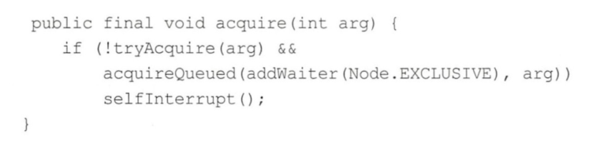
2. 当一个线程调用release(int arg）方法时会尝试使用tryRelease操作释放资源，这里是设置状态变量state的值，然后调用LockSupport.unpark(thread）方法激活AQS队列里面被阻塞的一个线程（thread）。被激活的线程则使用tryAcquire尝试，看当前状态变量state的值是否能满足自己的需要，满足则该线程被激活，然后继续向下运行，否则还是会被放入AQS队列并被挂起。

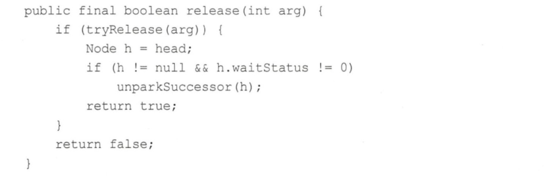

   1. 需要注意的是，AQS类并没有提供可用的句Acquire和町Release方法，正如AQS是锁阻塞和同步器的基础框架一样，tryAcquire和tryRelease需要由具体的子类来实现。子类在实现tryAcquire和tryRelease时要根据具体场景使用CAS算法尝试修改state状态值，成功则返回true，否则返回false。子类还需要定义，在调用acquire和release方法时state状态值的增减代表什么含义。
   2. 比如继承自AQS实现的独占锁ReentrantLock，定义当status为0时表示锁空闲，为l时表示锁己经被占用。在重写町1Acquire时，在内部需要使用CAS算法查看当前state是否为0，如果为0则使用CAS设置为1，并设置当前锁的持有者为当前线程，而后返回true，如果CAS失败则返回false。
   3. 比如继承自AQS实现的独占锁在实现tryReleas巳肘，在内部需要使用CAS算法把当前state的值从1修改为0，并设置当前锁的持有者为null，然后返回true，如果CAS失败则返回false。

---
**在共享方式下，获取与释放资源的流程如下：**

1. 当线程调用acquireShared(intarg）获取共享资源时，会首先使用trγAcq山reShared尝试获取资源，具体是设置状态变量state的值，成功则直接返回，失败则将当前线程封装为类型为Node.SHARED的Node节点后插入到AQS阻塞队列的尾部，并使用LockSupport.park(this）方法挂起自己。
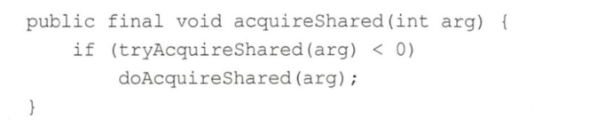
2. 当一个线程调用releaseShared(int arg）时会尝试使用tryReleaseShared操作释放资源，这里是设置状态变量state的值，然后使用LockSupport.unpark(thread）激活AQS队列里面被阻塞的一个线程（thread）。被激活的线程则使用tryReleaseShared查看当前状态变量state的值是否能满足自己的需要，满足则该线程被撤活，然后继续向下运行，否则还是会被放入AQS队列并被挂起。

   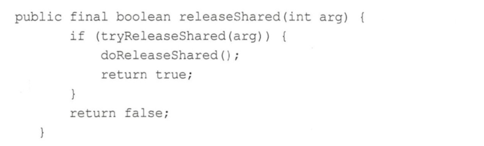

   1. 同样需要注意的是，AQS类并没有提供可用的t可AcquireShared和tryReleaseShared方法，正如AQS是锁阻塞和同步器的基础框架一样，tryAcquireShared和tryReleaseShared需要由具体的子类来实现。子类在实现t叩AcquireShared和tryReleaseShared时要根据具体场景使用CAS算法尝试修改state状态值，成功则返回true，否则返回false。
   2. 比如继承自AQS实现的读写锁ReentrantReadWriteLock里面的读锁在重写tryAcquireShared时，首先查看写锁是否被其他线程持有，如果是则直接返回false，否则使用CAS递增state的高16位（在ReentrantReadWriteLock中，state的高16位为获取读锁的次数）。

---
**如何维护AQS提供的队列，主要看入队操作**
- 入队操作：当一个线程获取锁失败后该线程会被转换为Node节点，然后就会使用enq(final Node node）方法将该节点插入到AQS的阻塞队列。

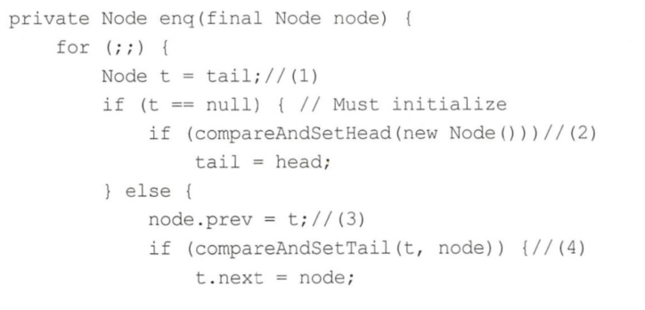


## AQS——条件变量的支持
notify和wait，是配合synchronized内置锁实现线程间同步的基础设施一样，条件变量的signal和await方法也是用来配合锁（使用AQS实现的锁〉实现线程间同步的基础设施。

它们的不同在于，synchronized同时只能与一个共享变量的notify或wait方法实现同步，而AQS的一个锁可以对应多个条件变量。

在调用共享变量的notify和wait方法前必须先获取该共享变量的内置锁，同理，在调用条件变量的signal和await方法前也必须先获取条件变量对应的锁。

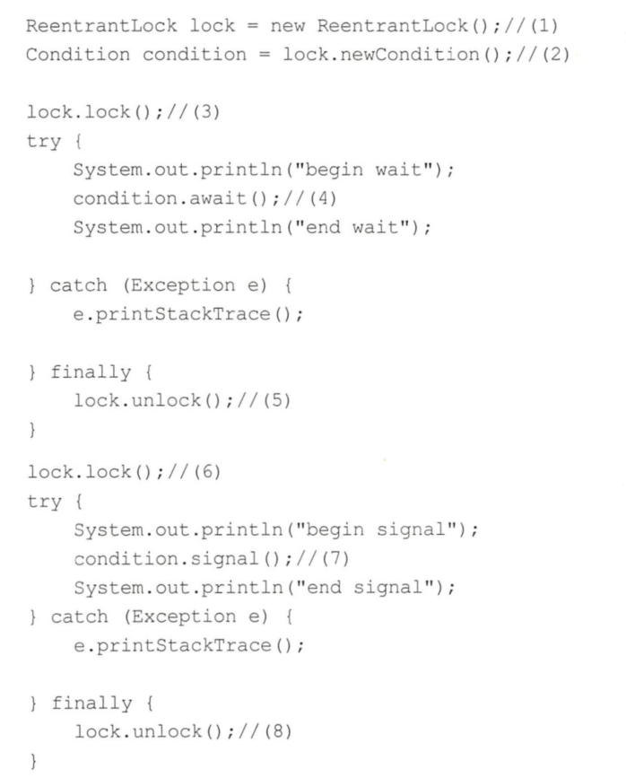

## 基于AQS实现自定义同步器


# 独占锁ReentrantLock的原理

## 类图结构
ReentrantLock是可重入的独占锁，同时只能有一个线程可以获取该锁，其他获取该锁的线程会被阻塞而被放入该锁的AQS阻塞队列里面。首先看下ReentrantLock的类图以便对它的实现有个大致了解，如下图所示：

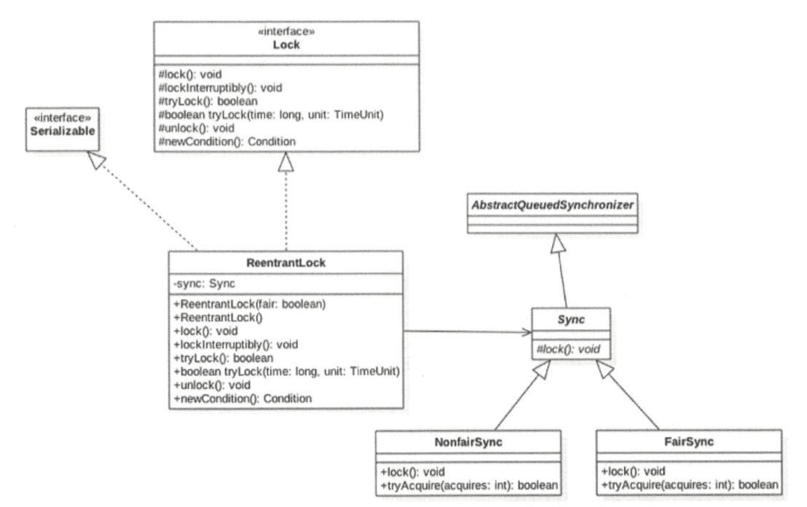

由类图可以看到，ReentrantLock最终还是使用AQS来实现的，并且根据参数来决定其内部是一个公平还是非公平锁，默认是非公平锁。

```
public ReentrantLock() {
    sync = new NonfairSync();
}

/**
 * Creates an instance of {@code ReentrantLock} with the
 * given fairness policy.
 *
 * @param fair {@code true} if this lock should use a fair ordering policy
 */
public ReentrantLock(boolean fair) {
    sync = fair ? new FairSync() : new NonfairSync();
}
```
其中Sync类直接继承自AQS，它的子类NonfairSync和FairSync分别实现了获取锁的非公平与公平策略。

在这里，AQS的state状态值表示线程获取该锁的可重入次数，在默认情况下，state的值为0表示当前锁没有被任何线程持有。当一个线程第一次获取该锁时会尝试使用CAS设置state的值为1，如果CAS成功则当前线程获取了该锁，然后记录该锁的持有者为当前线程。在该线程没有释放锁的情况下第二次获取该锁后，状态值被设置为2，这就是可重入次数。在该线程释放该锁时，会尝试使用CAS让状态值减1，如果减1后状态值为0,则当前线程释放该锁。

## 获取锁
### void lock()方法
当一个线程调用该方法时，说明该线程希望获取该锁。如果锁当前没有被其他线程占用并且当前线程之前没有获取过该锁，则当前线程会获取到该锁，然后设置当前锁的拥有者为当前线程，并设置AQS的状态值为l，然后直接返回。如果当前线程之前己经获取过该锁，则这次只是简单地把AQS的状态值加l后返回。如果该锁己经被其他线程持有，则调用该方法的线程会被放入AQS队列后阻塞挂起。
```
public void lock(){
    sync.lock();
}
```
如果这时候有其他线程调用lock方法企图获取该锁，CAS会失败，然后会调用AQS的acquire方法。注意，传递参数为1。

###  void lockInterruptibly()方法

该方法与lock（）方法类似，它的不同在于，它对中断进行响应，就是当前线程在调用该方法时，如果其他线程调用了当前线程的interrupt（）方法，则当前线程会抛出InterruptedException异常，然后返回。

### boolean tryLock()方法
尝试获取锁，如果当前该锁没有被其他线程持有，则当前线程获取该锁井返回true,否则返回false。注意，该方法不会引起当前线程阻塞。

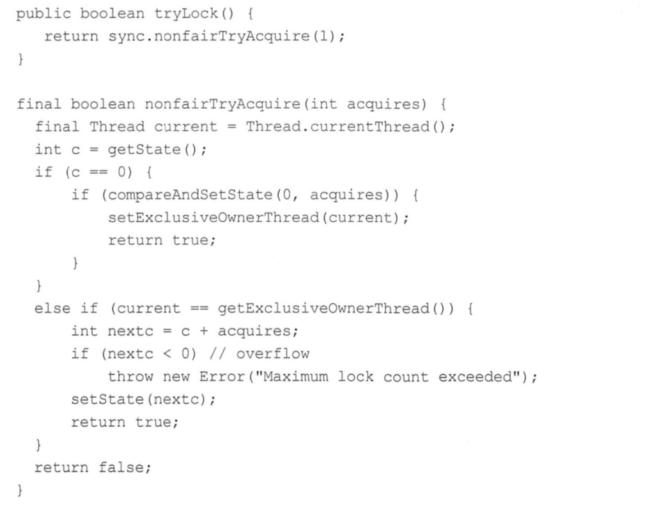

如上代码与非公平锁的tryAcquire（）方法代码类似，所以tryLock（）使用的是非公平策略。

### boolean tryLock(long timeout, TimeUnit unit)方法
尝试获取锁，与tryLock（）的不同之处在于，它设置了超时时间，如果超时时间到没有获取到该锁则返回false。
### void unlock()方法
尝试释放锁，如果当前线程持有该锁，则调用该方法会让该线程对该线程持有的AQS状态值减1如果减去l后当前状态值为0，则当前线程会释放该锁，否则仅仅减1而己。如果当前线程没有持有该锁而调用了该方法则会抛出IllegalMonitorStateException异常，代码如下。

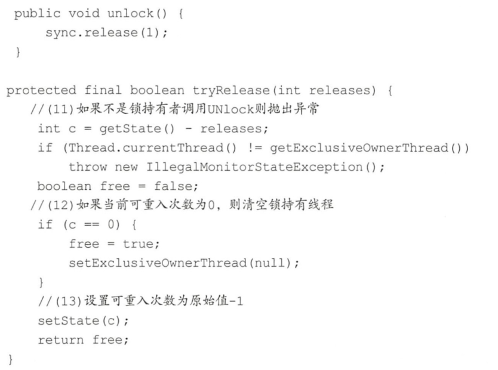

如代码（11）所示，如果当前线程不是该锁持有者则直接抛出异常，否则查看状态值是否为0，为0则说明当前线程要放弃对该锁的持有权，则执行代码(12）把当前锁持有者设置为null。如果状态值不为0，则仅仅让当前线程对该锁的可重入次数减1。

## 案例介绍
```
public class ReentrantLockList {
    
    private ArrayList<String> array = new ArrayList<>();
    
    private volatile ReentrantLock lock = new ReentrantLock();
    
    public void add(String e){
        lock.lock();
        try {
            array.add(e);
        }finally {
            lock.unlock();
        }
    }
    
    public void remove(String e){
        lock.lock();
        try {
            array.remove(e);
        }finally {
            lock.unlock();
        }
    }
    
    public String get(int index){
        lock.lock();
        try {
            return array.get(index);
        }finally {
            lock.unlock();
        }
    }
}
```
如上代码通过在操作array元素前进行加锁保证同一时间只有一个线程可以对array数组进行修改，但是也只能有一个线程对array元素进行访问。

# 读写锁RenntrantReadWriteLock的原理
解决线程安全问题使用ReentrantLock就可以，但是ReentrantLock是独占锁，某时只有一个线程可以获取该锁，而实际中会有写少读多的场景，显然ReentrantLock满足不了这个需求，所以ReentrantReadWriteLock应运而生。ReentrantReadWriteLock采用读写分离的策略，允许多个线程可以同时获取读锁。

## 类图结构
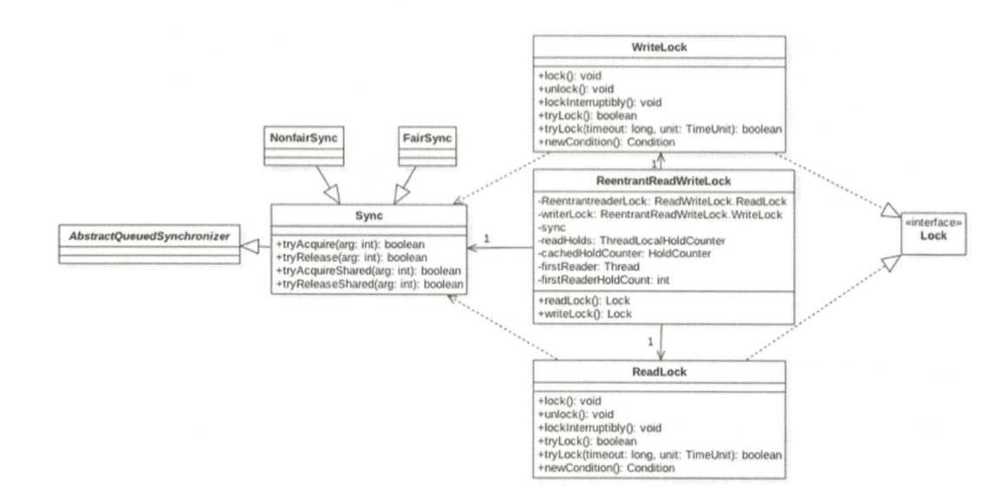

读写锁的内部维护了一个ReadLock和一个WriteLock，它们依赖Sync实现具体功能。而Sync继承自AQS，并且也提供了公平和非公平的实现。下面只介绍非公平的读写锁实现。我们知道AQS中只维护了一个state状态，而ReentrantReadWriteLock则需要维护读状态和写状态，一个state怎么表示写和读两种状态呢？ReentrantReadWriteLock巧妙地使用state的高16位表示读状态，也就是获取到读锁的次数；使用低16位表示获取到写锁的线程的可重入次数。

## 写锁的获取与释放
### void lock()

写锁是个独占锁，某时只有一个线程可以获取该锁。如果当前没有线程获取到读锁和写锁，则当前线程可以获取到写锁然后返回。如果当前己经有线程获取到读锁和写锁，则当前请求写锁的线程会被阻塞挂起。另外，写锁是可重入锁，如果当前线程己经获取了该锁，再次获取只是简单地把可重入次数加l后直接返回。

### void lockInterruptibly()
类似于lock（）方法，它的不同之处在于，它会对中断进行响应，也就是当其他线程调用了该线程的interrupt（）方法中断了当前线程时，当前线程会抛出异常InterruptedException异常。

### boolean tryLock()
尝试获取写锁，如果当前没有其他线程持有写锁或者读锁，则当前线程获取写锁会成功，然后返回true。如果当前己经有其他线程持有写锁或者读锁则该方法直接返回false,且当前线程并不会被阻塞。如果当前线程已经持有了该写锁则简单增加AQS的状态值后直接返回true。

### boolean tryLock(long timeout, TimeUnit unit)
与tryAcquire()的不同之处在于，多了超时时间参数，如果尝试获取写锁失败则会把当前线程挂起指定时间，待超时时间到后当前线程被激活，如果还是没有获取到写锁则返回false。另外，该方法会对中断进行响应，也就是当其他线程调用了该线程的interrupt()方法中断了当前线程时，当前线程会抛出InterruptedException异常。

### void unlock()
尝试释放锁，如果当前线程持有该锁，调用该方法会让该线程对该线程持有的AQS状态值减1，如果减去l后当前状态值为0则当前线程会释放该锁，否则仅仅减l而己。如果当前线程没有持有该锁而调用了该方法则会抛出IllegalMonitorStateException异常，代码如下。

## 读锁的获取与释放
### void lock()
获取读锁，**如果当前没有其他线程持有写锁，则当前线程可以获取读锁**，AQS的状态值state的高16位的值会增加l，然后方法返回。否则如果其他一个线程持有写锁，则当前线程会被阻塞。

### void lockInterruptibly()
类似于lock（）方法，它的不同之处在于，它会对中断进行响应，也就是当其他线程调用了该线程的inte1TUpt（）方法中断了当前线程时，当前线程会抛出异常InterruptedException异常。

### boolean tryLock()
尝试获取读锁，如果当前没有其他线程持有写锁，则当前线程获取读锁会成功，然后返回true。如果当前己经有其他线程持有写锁则该方法直接返回false，但当前线程并不会被阻塞。如果当前线程己经持有了该读锁则简单增加AQS的状态值高16位后直接返回true。其代码类似tryLock的代码，这里不再讲述。

### boolean tryLock(long timeout, TimeUnit unit)
与tryAcquire(）的不同之处在于，多了超时时间参数，如果尝试获取写锁失败则会把当前线程挂起指定时间，待超时时间到后当前线程被激活，如果还是没有获取到写锁则返回false。另外，该方法会对中断进行响应，也就是当其他线程调用了该线程的interrupt()方法中断了当前线程时，当前线程会抛出InterruptedException异常。

### void unlock()
尝试释放锁，如果当前线程持有该锁，调用该方法会让该线程对该线程持有的AQS状态值减1，如果减去l后当前状态值为0则当前线程会释放该锁，否则仅仅减l而己。如果当前线程没有持有该锁而调用了该方法则会抛出IllegalMonitorStateException异常，代码如下。

## 案例介绍
```
public class ReentrantLockList {

    private ArrayList<String> array = new ArrayList<>();

//    private volatile ReentrantLock lock = new ReentrantLock();
    private final ReentrantReadWriteLock lock = new ReentrantReadWriteLock();

    private final Lock readLock = lock.readLock();
    private final Lock writeLock = lock.writeLock();
    
    public void add(String e){
        writeLock.lock();
        try {
            array.add(e);
        }finally {
            writeLock.unlock();
        }
    }

    public void remove(String e){
        writeLock.lock();
        try {
            array.remove(e);
        }finally {
            writeLock.unlock();
        }
    }

    public String get(int index){
        readLock.lock();
        try {
            return array.get(index);
        }finally {
            readLock.unlock();
        }
    }
}
```
以上代码调用get方法时使用的是读锁，这样运行多个读线程来同时访问list的元素，这在读多写少的情况下性能会更好。

# JDK8中新增的StampedLock锁探究
StampedLock是并发包里面JDK8版本新增的一个锁，该锁提供了三种模式的读写控制，当调用获取锁的系列函数时－，会返回一个long型的变量，我们称之为戳记(stamp),这个戳记代表了锁的状态。其中try系列获取锁的函数，当获取锁失败后会返回为0的stamp值。当调用释放锁和转换锁的方法时需要传入获取锁时返回的stamp值。

StampedLock还支持这三种锁在一定条件下进行相互转换。例如long tryConvertToWriteLock（Long stamp）期望把stamp标示的锁升级为写锁，这个函数会在下面几种情况下返回一个有效的stamp。
- 当前锁已经是写锁模式了
- 当前锁处于读锁模式，并且没有其他线程是读锁模式
- 当前处于乐观读模式，并且当前写锁可用

## 写锁writeLock
是一个排它锁或者独占锁，某时只有一个线程可以获取该锁，当二个线程获取该锁后，其他请求读锁和写锁的线程必须等待，这类似于ReentrantReadWriteLock的写锁（不同的是这里的写锁是不可重入锁）；当目前没有线程持有读锁或者写锁时才可以获取到该锁。请求该锁成功后会返回一个stamp变量用来表示该锁的版本，当释放该锁时需要调用unlockWrite方法并传递获取锁时的stamp参数。并且它提供了非阻塞的tryWriteLock方法。

## 悲观读锁readLock
是一个共享锁，在没有线程获取独占写锁的情况下，多个线程可以同时获取该锁。如果己经有线程持有写锁，则其他线程请求获取该读锁会被阻塞，这类似于ReentrantReadWriteLock的读锁（**不同的是这里的读锁是不可重入锁**〉。这里说的悲观是指在具体操作数据前其会悲观地认为其他线程可能要对自己操作的数据进行修改，所以需要先对数据加锁，这是在读少写多的情况下的一种考虑。请求该锁成功后会返回一个stamp变量用来表示该锁的版本，当释放该锁时需要调用unlockRead方法并传递stamp参数。并且它提供了非阻塞的tryReadLock方法。

## 乐观读锁tryOptimisticRead
它是相对于悲观锁来说的，在操作数据前并没有通过CAS设置锁的状态，仅仅通过位运算测试。如果当前没有线程持有写锁，则简单地返回一个非0的stamp版本信息。获取该stamp后在具体操作数据前还需要调用validate方法验证该stamp是否己经不可用，也就是看当调用trγOptimisticRead返回stamp后到当前时间期间是否有其他线程持有了写锁，如果是则validate会返回0,否则就可以使用该stamp版本的锁对数据进行操作。由于tryOptimisticRead并没有使用CAS设置锁状态，所以不需要显式地释放该锁。该锁的一个特点是适用于读多写少的场景，因为获取读锁只是使用位操作进行检验，不涉及CAS操作，所以效率会高很多，但是同时由于没有使用真正的锁，在保证数据一致性上需要复制一份要操作的变量到方法钱，并且在操作数据时可能其他写线程己经修改了数据，而我们操作的是方法战里面的数据，也就是一个快照，所以最多返回的不是最新的数据，但是一致性还是得到保障的。

## 案例介绍
```
public class Point {
    private double x, y;

    private final StampedLock sl = new StampedLock();

    //排它锁
    void move(double deltaX,double deltaY){
        long stamp = sl.writeLock();
        try {
            x += deltaX;
            y += deltaY;
        }finally {
            sl.unlockWrite(stamp);
        }
    }
    //乐观读锁（tryOptimisticRead）
    double distanceFromOrigin(){
        //尝试获取乐观读锁
        long stamp = sl.tryOptimisticRead();
        //将全部变量复制到方法体栈内
        double currentX = x, currentY = y;
        //检查在（1）处获取了读锁戳记后，锁有没被其他线程排他性抢占
        if (!sl.validate(stamp)){
            stamp = sl.readLock();
        }
        try {
            // 将全部变量复制到方法体栈内
            currentX = x;
            currentY = y;
        }finally {
            sl.unlockRead(stamp);
        }
        return Math.sqrt(currentX*currentX + currentY* currentY);
    }
    
    //使用悲观锁获取读锁，并尝试转换为写锁
    void moveIfaTOrigin(double newX, double newY){
        //这里可以使用乐观读锁替换
        long stamp = sl.readLock();
        try {
            //如果当前点在原点则移动
            while (x == 0.0 && y == 0.0){
                //尝试将获取的读锁升级为写锁
                long ws = sl.tryConvertToWriteLock(stamp);
                //升级成功，则更新戳记，并设置坐标值，然后退出循环
                if (ws != 0L){
                    stamp = ws;
                    x = newX;
                    y = newY;
                    break;
                }else {
                    //读锁升级写锁失败则释放读锁，显示获取独占写锁，然后循环重试
                    sl.unlockRead(stamp);
                    stamp = sl.writeLock();
                }
            }
        } finally {
            sl.unlockRead(stamp);
        }
    }
}
```


