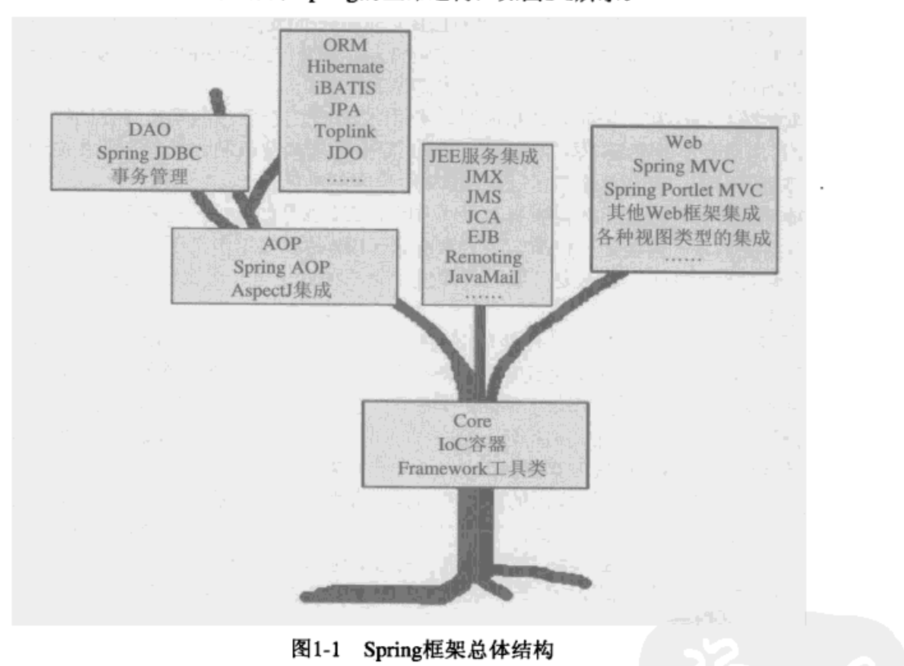

# spring框架概述

整个spring框架构建在Core核心模块之上，它是整个框架的基础。在该模块中，Spring为我们提供了Spring的IoC容器（IoC Container）实现，用于帮助我们以依赖注入的方式管理对象之间的依赖关系。

​	沿着树左侧看到AOP模块，该模块提供了一个请便但功能强大的AOP框架，让我们可以以AOP的形式增强各种POJO的能力，进而补足OOP/OOSD之缺憾。

​	继续向上，Spring框架在Core核心模块和AOP模块的基础上， 为我们提供了晚辈的数据访问和十五管理的抽象和集成服务。在数据访问支持方面，spring对JDBC API 的最佳实践极大地简化了该API地使用。

​		为了简化各种Java EE服务的使用，Spring框架为我们提供了针对这些Java EE服务的集成服务。

​		最后web模块，在该模块中，spring框架提供了一套自己的web mvc框架，职责分明的角色划分让这套框架看起来十分地”醒目“，

​		就像一棵树一样，上层地模块需依赖下层地模块才能正常工作，这就是这些模块之间是相互依赖地。不过处于统一水平线地各个模块之间却可以认为是相互独立地，彼此没有什么瓜葛。

**注意**：不要将spring看作是一个IoC容器，也不要只将Spring与AoP挂钩，Spring提供的远比这些东西要多。Spring不仅仅是一个简化javaEE开发的轻量级的框架，它更是一个简化任何Java应用的开发框架，如果愿意，甚至可以在Java的三个平台上应用spring框架，即使当前的Spring框架还不支持相应平台或者相应场景的应用开发，但是只要掌握了Spring的理念和方法，同样可以让新的”Spring“在相应的场景中发挥作用。

# Spring大观园

Spring框架的家族成员：

- Spring Web Flow(SWF)。Spring Web Flow 构建与Spring Web MVC框架之上，旨在简化拥有复杂用户交互逻辑的Web应用程序的开发。通过Spring Web Flow的扩展支持，可以在基于Spring Web MVC的Web应用程序中以更简单的方式，创建更加复杂的业务交互流程。同时Spring Web Flow还让Ajax和JSF享受一等公民的待遇，所有这些将帮助我们更快更好地满足各种用户的实际需求。
- Spring Web Service。Spring Web Service是一套采用契约优先开发模式，创建文档驱动（Documnet-driven）Web服务的Web服务开发框架。它除了对Web服务中涉及的XML的映射关系管理提供了详尽的支持，还与Spring框架以及其他子项目（比如Spring Security）紧密结合，帮助以更加灵活高效的方式打造Web服务应用服务。
- Spring Security（原来的Acegi Security）。Spring Security由原来的Acegi Security发展而来，主要基于Spring框架的企业级应用程序提供安全解决方案。
- Spring Dynamic Modules for OSGi Service Platforms。Spring-DM是融合了Spring框架以及OSGi两家优良基因后的产物，它集Spring框架各种服务和OSGi的动态性， 模块化等特性于一身，可以帮助我们以一种全新的方式来打造新一代的企业级应用程序。
- Spring Batch。当意识到企业应用中批处理业务所占的市场份额不容小觑之后，Spring Batch开始浮出水面，它是构建在Spring框架之上的一套轻量级批处理开发框架，由SpringSource和Accenture合力打造。
- Spring Integration。Spring Integration面向创建基于Spring开发框架的企业集成解决方案。它在现有Spring框架对企业方案集成的基础上，提出了更高层次的抽象方案，使得业务和集成逻辑得以松散耦合，很好地分离企业集成过程中的不同关注点。
- Spring LDAP。Spring LDAP传承了Spring框架中应用模板方法模式的优良传统。
- Spring IDE。属于开发插件，使得开发更加得心应手。
- Spring Modules。为了避免Spring框架对各种其他项目的集成和支持造成Spring框架本身的臃肿等一系列问题，Spring Modules将那些可选的工具和附加类库剥离出Spring核心框架，纳入自身进行统一管理。
- Spring JavaConfig。Spring框架体提供的依赖注入支持，最初是使用XML表达式依赖注入关系的。Spring JavaConfig就为Spring框架提出了一套基于注解的依赖注入解决方案。它可以看作是Spring2.5中基于注解的依赖注入正式方案之外的另一种选择。
- Spring Rich Client。为使用Swing进行GUI开发的应用提供的一套开发框架。
- Spring BeanDoc。 Spring BeanDoc可以根据Spring应用程序使用的配置文件中的相应信息，创建对应的文档和图表，帮助我们以更加直观的方式来里了解Spring应用的整体结构。

